# 电信套餐AI智能客服系统 - 完整设计说明书

## 1. 系统概述

### 1.1 项目背景

本系统是一个基于大语言模型的电信套餐智能客服系统，支持套餐查询、推荐、办理等核心业务场景。

**核心特性**：

- 🤖 基于DeepSeek的自然语言理解
- 💬 支持复杂多轮对话
- 🎯 智能意图识别与槽位填充
- 🔄 完整的对话状态管理
- ✅ 高风险操作确认机制
- 🌐 WebSocket实时通信

### 1.2 业务场景

| 场景     | 描述             | 示例                  |
| -------- | ---------------- | --------------------- |
| 套餐查询 | 根据条件筛选套餐 | "有100元以内的套餐吗" |
| 套餐推荐 | 智能推荐合适套餐 | "推荐性价比高的套餐"  |
| 套餐办理 | 办理套餐变更     | "我要办理经济套餐"    |
| 使用查询 | 查询流量/余额    | "我用了多少流量"      |
| 业务咨询 | 政策规则说明     | "怎么办理套餐"        |

### 1.3 可用套餐

| 名称     | 流量(G/月) | 价格(元/月) | 适用人群 |
| -------- | ---------- | ----------- | -------- |
| 经济套餐 | 10         | 50          | 无限制   |
| 畅游套餐 | 100        | 180         | 无限制   |
| 无限套餐 | 1000       | 300         | 无限制   |
| 校园套餐 | 200        | 150         | 在校生   |

## 2. 系统架构

### 2.1 整体架构图

```tex
┌─────────────────────────────────────────────────────┐
│                 Web前端层                            │
│         HTML5 + JavaScript + WebSocket              │
└─────────────────────────────────────────────────────┘
                       ↕ WebSocket
┌─────────────────────────────────────────────────────┐
│              FastAPI Web服务层                       │
│  ┌────────────┐  ┌────────────┐  ┌────────────┐   │
│  │ HTTP API   │  │ WebSocket  │  │ 路由管理   │   │
│  └────────────┘  └────────────┘  └────────────┘   │
└─────────────────────────────────────────────────────┘
                       ↕
┌─────────────────────────────────────────────────────┐
│              对话引擎层（核心）                       │
│  ┌────────────────────────────────────────────┐    │
│  │   TelecomChatbotPolicy   │    │
│  │   - 整合NLU + DST + Policy + NLG          │    │
│  │   - 对话流程控制                           │    │
│  │   - 异常处理                               │    │
│  └────────────────────────────────────────────┘    │
└─────────────────────────────────────────────────────┘
                       ↕
┌─────────────────────────────────────────────────────┐
│                   NLU模块                            │
│  ┌────────────────────────────────────────────┐    │
│  │       NLUEngine (意图识别)                  │    │
│  │  - 大模型Function Calling                  │    │
│  │  - 实体抽取                                 │    │
│  │  - 槽位验证                                 │    │
│  └────────────────────────────────────────────┘    │
└─────────────────────────────────────────────────────┘
                       ↕
┌─────────────────────────────────────────────────────┐
│                   DST模块                            │
│  ┌────────────────────────────────────────────┐    │
│  │    DialogStateTracker (状态跟踪)           │    │
│  │  - SlotManager (槽位管理)                  │    │
│  │  - ContextManager (上下文管理)             │    │
│  │  - StateStore (Redis持久化)                │    │
│  └────────────────────────────────────────────┘    │
└─────────────────────────────────────────────────────┘
                       ↕
┌─────────────────────────────────────────────────────┐
│                 Policy模块                           │
│  ┌────────────────────────────────────────────┐    │
│  │      PolicyEngine (策略决策)               │    │
│  │  - 动作决策                                 │    │
│  │  - ConfirmationManager (确认管理)          │    │
│  │  - RecommendationEngine (推荐引擎)         │    │
│  └────────────────────────────────────────────┘    │
└─────────────────────────────────────────────────────┘
                       ↕
┌─────────────────────────────────────────────────────┐
│                  NLG模块                             │
│  ┌────────────────────────────────────────────┐    │
│  │       NLGGenerator (回复生成)              │    │
│  │  - 模板化生成                               │    │
│  │  - LLM生成                                  │    │
│  │  - 混合策略                                 │    │
│  └────────────────────────────────────────────┘    │
└─────────────────────────────────────────────────────┘
                       ↕
┌─────────────────────────────────────────────────────┐
│                 执行层                               │
│  ┌──────────┐  ┌──────────┐  ┌──────────┐         │
│  │ MySQL    │  │ Redis    │  │ 外部API  │         │
│  │ 业务数据 │  │ 会话状态 │  │ (预留)   │         │
│  └──────────┘  └──────────┘  └──────────┘         │
└─────────────────────────────────────────────────────┘
```

### 2.2 代码分层结构

```tex
telecom-ai-customer-service/
│
├── api/                    # 📡 Web服务层
│   ├── main.py            # FastAPI应用入口
│   ├── routers/           # 路由模块
│   │   ├── chat.py       # HTTP聊天接口
│   │   └── websocket.py  # WebSocket接口
│   └── static/
│       └── index.html     # 前端页面
│
├── core/                   # 🧠 核心对话引擎层
│   ├── nlu/               # 意图识别模块
│   │   ├── nlu_engine.py
│   │   └── function_definitions.py
│   ├── dst/               # 状态跟踪模块
│   │   ├── dialog_state_tracker.py
│   │   ├── slot_manager.py
│   │   ├── context_manager.py
│   │   └── state_store.py
│   ├── policy/            # 策略决策模块
│   │   ├── policy_engine.py
│   │   ├── policy_rules.py
│   │   └── confirmation_manager.py
│   ├── nlg/               # 语言生成模块
│   │   ├── nlg_generator.py
│   │   └── templates.py
│   ├── recommendation/    # 推荐引擎
│   └── chatbot_policy.py  # 🎯 主对话系统
│
├── executor/               # ⚙️ 执行层
│   └── db_executor.py     # 数据库执行器
│
├── database/               # 💾 数据层
│   ├── db_manager.py      # MySQL管理
│   ├── redis_manager.py   # Redis管理
│   └── schema.sql         # 数据库表结构
│
├── config/                 # ⚙️ 配置层
│   ├── settings.py        # 系统配置
│   └── prompts.py         # Prompt模板
│
└── utils/                  # 🔧 工具层
    ├── logger.py
    ├── validators.py
    └── cache.py
```

**各层职责**：

| 层级       | 职责                         | 关键模块             |
| ---------- | ---------------------------- | -------------------- |
| Web服务层  | HTTP/WebSocket接口、路由管理 | FastAPI, WebSocket   |
| 对话引擎层 | 对话流程控制、模块协调       | TelecomChatbotPolicy |
| NLU层      | 意图识别、实体抽取           | NLUEngine            |
| DST层      | 状态跟踪、上下文管理         | DialogStateTracker   |
| Policy层   | 策略决策、确认管理           | PolicyEngine         |
| NLG层      | 回复生成                     | NLGGenerator         |
| 执行层     | 业务逻辑执行                 | DatabaseExecutor     |
| 数据层     | 数据持久化                   | MySQL, Redis         |

### 2.3 模块依赖关系图

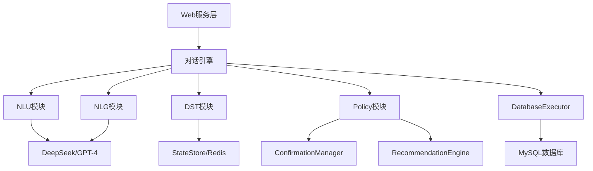

## 3. 核心模块设计

### 3.1 NLU模块 (Natural Language Understanding)

**核心职责**：将用户自然语言转换为结构化意图和参数

#### 3.1.1 功能组件

```
NLUEngine
├── 意图识别 (Intent Classification)
│   └── 使用大模型Function Calling
├── 实体抽取 (Entity Extraction)
│   └── 价格、流量、手机号等
├── 槽位验证 (Slot Validation)
│   └── 检查必填参数完整性
└── 上下文理解 (Context Understanding)
    └── 结合历史对话理解意图
```

#### 3.1.2 核心流程图

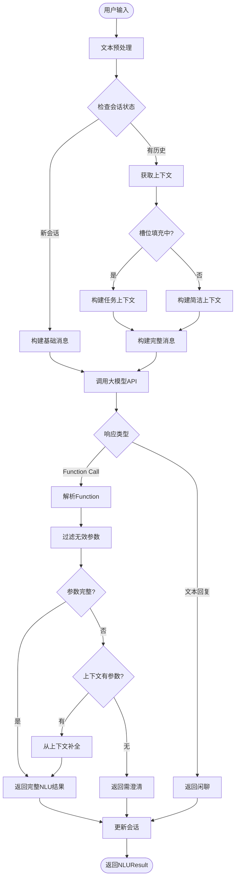

#### 3.1.3 核心代码

```python
class NLUEngine:
    """NLU引擎"""
    
    def understand(self, user_input: str, session_id: str) -> NLUResult:
        """理解用户输入"""
        # 1. 预处理
        processed = self._preprocess(user_input)
        
        # 2. 获取上下文
        context = self._get_session_context(session_id)
        
        # 3. 构建消息（智能上下文）
        messages = self._build_messages(processed, context)
        
        # 4. 调用大模型
        response = self.client.chat.completions.create(
            model=self.model,
            messages=messages,
            tools=FUNCTION_DEFINITIONS,
            tool_choice="required"
        )
        
        # 5. 解析响应
        nlu_result = self._parse_response(response, context)
        
        # 6. 更新会话
        self._update_session(session_id, user_input, nlu_result, context)
        
        return nlu_result
```

#### 3.1.4 关键特性

✅ **智能上下文管理**

- 槽位填充场景：详细任务上下文
- 非槽位场景：简洁上下文提示

✅ **参数过滤与验证**

- 过滤大模型幻觉参数
- 仅保留用户明确提到的信息

✅ **多轮对话支持**

- 会话状态跟踪
- 意图切换检测


### 3.2 DST模块 (Dialog State Tracking)

**核心职责**：跟踪对话状态，管理槽位和上下文

**六大核心概念:**

1. **DialogState (对话状态)** - 对话的完整快照
2. **Slot (槽位)** - 信息收集的基本单元
3. **Context (上下文)** - 对话的历史和环境
4. **StateStore (状态存储)** - Redis持久化层
5. **SlotManager (槽位管理器)** - 槽位智能管理
6. **ContextManager (上下文管理器)** - 上下文生命周期

#### 3.2.1 功能组件

```tex
DialogStateTracker
├── SlotManager (槽位管理器)
│   ├── 槽位填充策略
│   ├── 槽位继承规则
│   └── 槽位验证
├── ContextManager (上下文管理器)
│   ├── 上下文提取
│   ├── 上下文清理
│   └── 上下文优先级
└── StateStore (状态存储)
    ├── Redis持久化
    ├── 内存降级
    └── 会话过期管理
```

#### 3.2.2 核心流程图

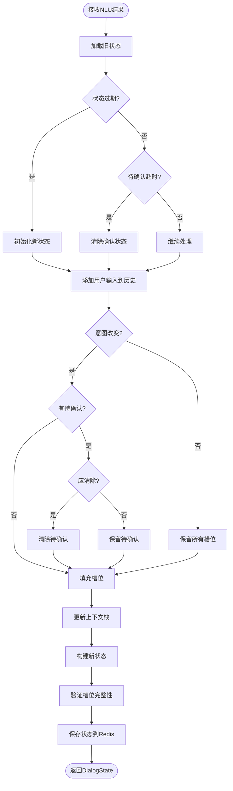

#### 3.2.3 槽位继承策略

```python
class SlotManager:
    """槽位管理器"""
    
    def fill_slots(self, current_slots, new_slots, 
                    current_intent, new_intent):
        """槽位填充策略"""
        intent_changed = (current_intent != new_intent)
        
        if not intent_changed:
            # 意图不变：完全合并
            return {**current_slots, **new_slots}
        
        elif self._is_same_domain(current_intent, new_intent):
            # 相同领域：保留用户信息 + 部分业务槽位
            preserved = {
                k: v for k, v in current_slots.items()
                if k in self.USER_INFO_SLOTS or self._should_preserve(k)
            }
            return {**preserved, **new_slots}
        
        else:
            # 不同领域：仅保留用户信息
            user_slots = {
                k: v for k, v in current_slots.items()
                if k in self.USER_INFO_SLOTS
            }
            return {**user_slots, **new_slots}
```

#### 3.2.4 关键特性

✅ **Redis持久化**

- 支持应用重启后恢复
- 自动过期管理（30分钟）
- 降级到内存存储

✅ **智能槽位管理**

- 用户信息跨意图继承
- 业务槽位按领域继承
- 意图切换自动清理

✅ **确认状态管理**

- 支持待确认操作保存
- 超时自动清除（5分钟）
- 意图切换智能判断

### 3.3 Policy模块 (对话策略)

**核心职责**：根据对话状态决策系统动作

**系统动作分类:** 

| 动作类型      | 说明             | 示例                     |
| ------------- | ---------------- | ------------------------ |
| **REQUEST**   | 请求用户提供信息 | "请问您的手机号是多少？" |
| **INFORM**    | 告知用户信息     | "为您找到3个套餐..."     |
| **CONFIRM**   | 确认用户意图     | "您是要办理经济套餐吗？" |
| **APOLOGIZE** | 致歉             | "抱歉，暂时无法处理..."  |
| **EXECUTE**   | 执行业务操作     | 调用数据库/API           |

**

#### 3.3.1 功能组件

```python
PolicyEngine
├── 动作决策 (Action Decision)
│   ├── REQUEST (请求用户信息)
│   ├── CONFIRM (确认操作)
│   ├── INFORM (告知结果)
│   └── APOLOGIZE (错误处理)
├── ConfirmationManager (确认管理)
│   ├── 高风险操作识别
│   ├── 确认请求生成
│   └── 确认响应处理
└── PolicyRules (策略规则)
    ├── 确认规则
    ├── 推荐规则
    └── 引导规则
```

#### 3.3.2 核心决策流程

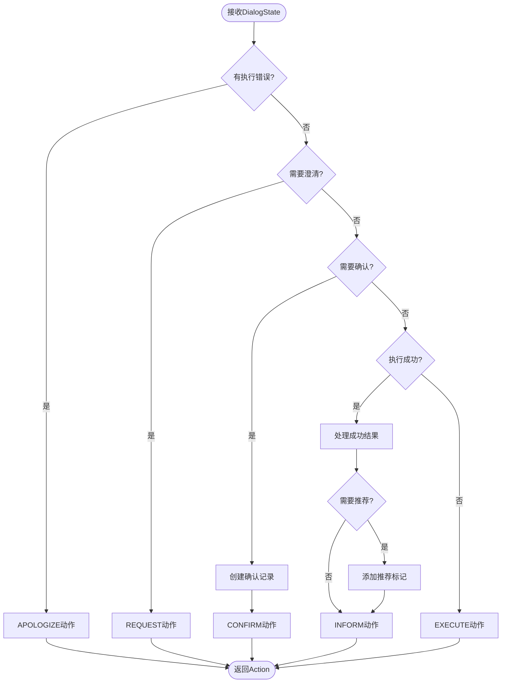

#### 3.3.3 确认策略

```python
class PolicyEngine:
    """策略引擎"""
    
    def _needs_confirmation(self, state: DialogState) -> bool:
        """判断是否需要确认"""
        # 规则1: 已在待确认状态，不重复确认
        if state.pending_confirmation:
            return False
        
        # 规则2: 高风险操作需要确认
        if state.current_intent in ["change_package", "cancel_service"]:
            return True
        
        # 规则3: 高价套餐需要确认
        price = state.slots.get("price")
        if price and float(price) > 200:
            return True
        
        return False
```

#### 3.3.4 关键特性

✅ **智能决策**

- 异常优先处理
- 槽位填充优先
- 确认流程保护

✅ **确认机制**

- 高风险操作强制确认
- 高价套餐提示确认
- 确认状态持久化

✅ **推荐触发**

- 多结果时主动推荐
- 价格敏感用户引导
- 学生身份推荐校园套餐

### 3.4 NLG模块 (Natural Language Generation)

**核心职责**：生成自然流畅的回复文本

#### 3.4.1 功能组件

```tex
NLGGenerator
├── 策略选择
│   ├── 模板化生成 (快速)
│   ├── LLM生成 (灵活)
│   └── 混合策略 (平衡)
├── 模板系统
│   ├── REQUEST模板
│   ├── CONFIRM模板
│   ├── INFORM模板
│   └── APOLOGIZE模板
└── 后处理
    ├── 长度控制
    ├── 格式化
    └── 引导语添加
```

#### 3.4.2 生成策略选择

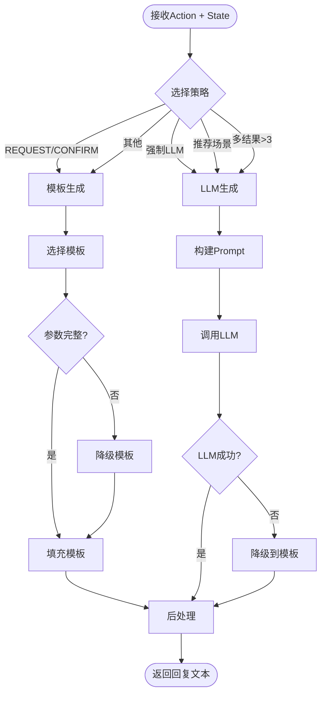

#### 3.4.3 混合策略示例

```python
class NLGGenerator:
    """NLG生成器"""
    
    def generate(self, action: Action, state: DialogState) -> str:
        """生成回复"""
        # 选择策略
        strategy = self._choose_strategy(action, state)
        
        if strategy == "template":
            response = self._generate_from_template(action, state)
        elif strategy == "llm":
            response = self._generate_from_llm(action, state)
        else:
            response = self._generate_hybrid(action, state)
        
        # 后处理
        return self.formatter.post_process(response, state)
    
    def _choose_strategy(self, action, state):
        """选择生成策略"""
        # REQUEST和CONFIRM总是用模板
        if action.action_type in ["REQUEST", "CONFIRM"]:
            return "template"
        
        # 推荐场景用LLM
        if action.parameters.get("should_recommend"):
            return "llm"
        
        # 多结果对比用LLM
        if action.parameters.get("count", 0) > 3:
            return "llm"
        
        return "template"
```

#### 3.4.4 关键特性

✅ **三种生成策略**

- 模板：快速、稳定、可控
- LLM：灵活、自然、个性化
- 混合：平衡效果和成本

✅ **降级机制**

- 模板参数缺失时使用简化模板
- LLM失败时降级到模板
- 保证系统稳定性

✅ **后处理优化**

- 长度控制（最多500字）
- 格式化（emoji间隔）
- 引导语添加


## 4. 数据流转与时序

### 4.1 完整对话流程图

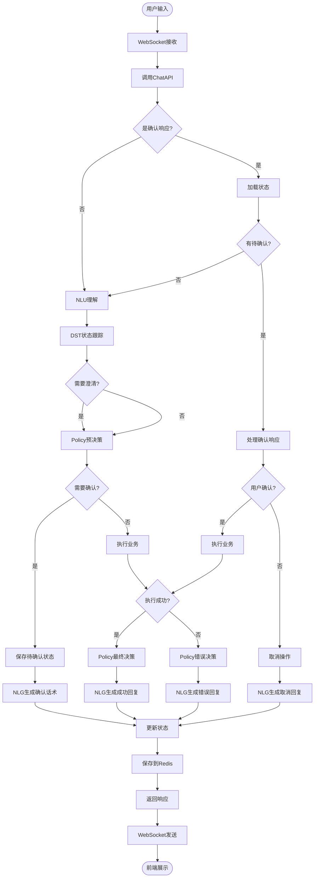

#### 4.2 整体对话时序图

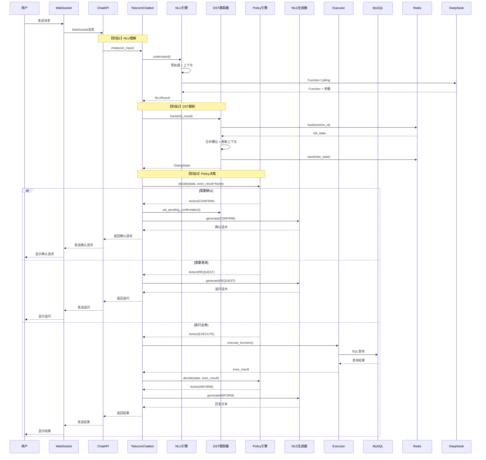

## 5. 常见对话场景

### 5.1 场景1：简单套餐查询

**对话示例**：

```
用户: 有100元以内的套餐吗
系统: 为您找到1个合适的套餐：

【经济套餐】
💰 月费: 50元
📊 流量: 10GB/月
📞 通话: 100分钟/月
👥 适用: 无限制
📝 适合轻度上网用户,性价比高

如需办理或了解详情,请告诉我套餐名称和您的手机号码。
```

**时序图**：

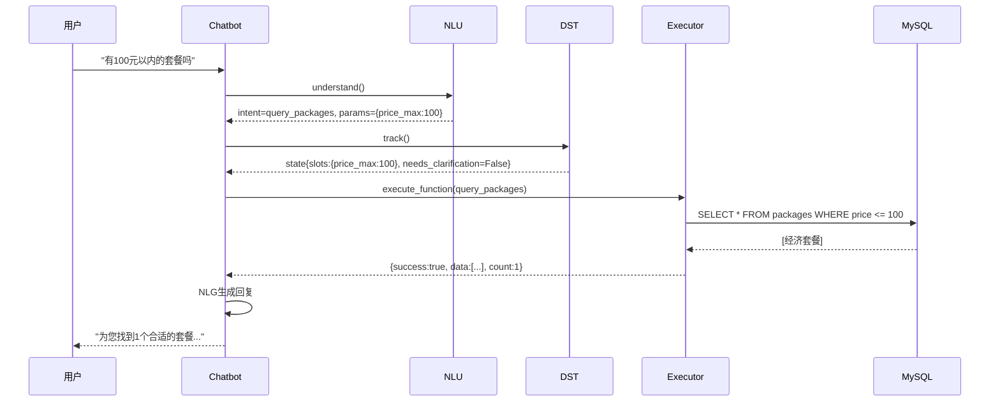

### 5.2 场景2：多轮槽位填充

**对话示例**：

```
用户: 我要办理经济套餐
系统: 请问您的手机号是多少呢？

用户: 13800138000
系统: 请确认：为手机号 13800138000 办理【经济套餐】套餐，是否确认？

用户: 确认
系统: 已成功为您办理【经济套餐】，次月生效！
```

**时序图**：

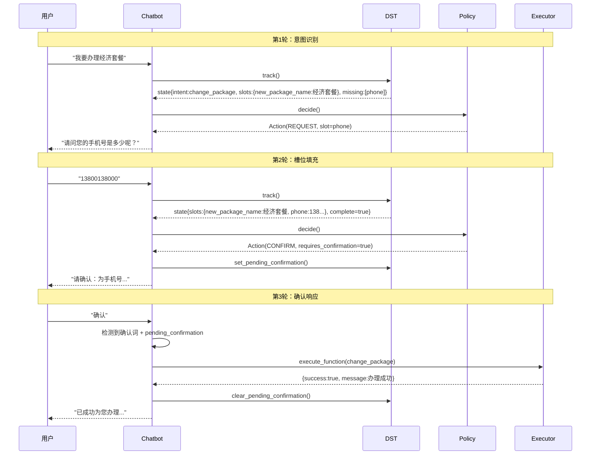

### 5.3 场景3：意图切换与上下文继承

**对话示例**：

```tex
用户: 有便宜的套餐吗
系统: 为您找到4个合适的套餐... [展示列表]

用户: 流量要50G以上
系统: 为您找到2个合适的套餐... [筛选后列表]

用户: 查下我的当前套餐
系统: 请问您的手机号是多少呢？

用户: 13800138000
系统: 📱 您当前使用的是【经济套餐】...
```

**关键点**：

- ✅ 第2轮：意图不变（query_packages），槽位继承（sort_by） + 新增（data_min）
- ✅ 第3轮：意图切换（query_current_package），清空业务槽位，保留用户信息
- ✅ 第4轮：槽位填充（phone），自动继承到后续对话

**时序图**：

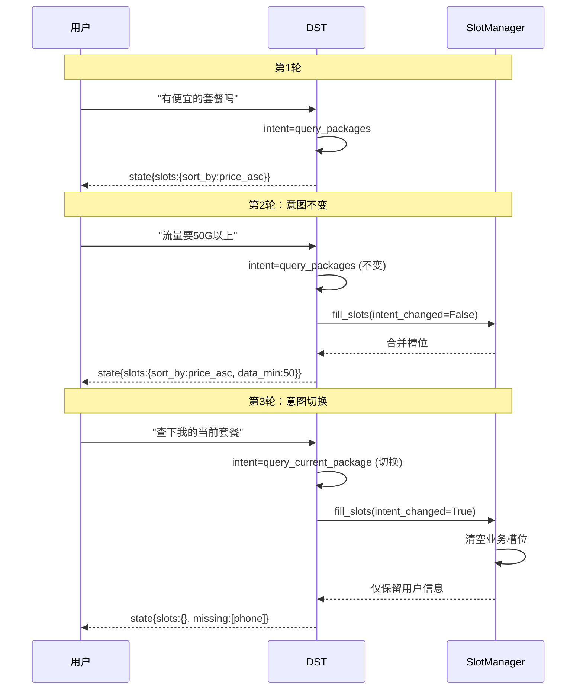

### 5.4 场景4：确认流程完整示例

**对话示例**：

```
用户: 帮我办理畅游套餐，手机号13800138000
系统: 请确认：为手机号 13800138000 办理【畅游套餐】(180元/月)，是否确认？

用户: 确认
系统: 已成功为您办理【畅游套餐】，次月生效！
```

**确认流程图**：

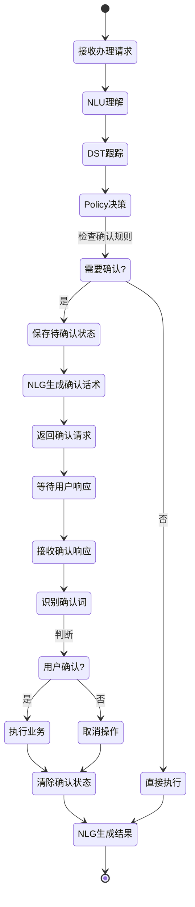

### 5.5 场景5：推荐触发场景

**对话示例**：

```
用户: 推荐一个套餐
系统: 为您找到4个合适的套餐：

[展示4个套餐列表]

💡 根据您的需求，推荐【畅游套餐】
推荐理由：流量充足、性价比很高

如需办理，请告诉我您的手机号码。
```

**推荐流程**：

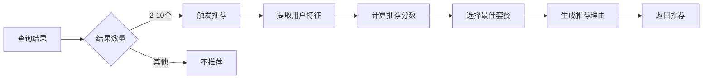

## 6. 技术实现要点

### 6.1 核心技术栈

| 技术      | 版本          | 用途       |
| --------- | ------------- | ---------- |
| Python    | 3.13          | 主开发语言 |
| FastAPI   | 最新          | Web框架    |
| DeepSeek  | deepseek-chat | 大语言模型 |
| MySQL     | 8.0           | 业务数据库 |
| Redis     | 7.0           | 会话存储   |
| WebSocket | -             | 实时通信   |

### 6.2 关键配置

```python
# config/settings.py
class Settings(BaseSettings):
    # 大模型配置
    LLM_PROVIDER: str = "deepseek"
    DEEPSEEK_API_KEY: str
    DEEPSEEK_MODEL: str = "deepseek-chat"
    
    # 数据库配置
    DB_HOST: str = "localhost"
    DB_PORT: int = 3306
    DB_NAME: str = "telecom_chatbot"
    
    # Redis配置
    REDIS_HOST: str = "localhost"
    REDIS_PORT: int = 6379
    
    # 会话配置
    SESSION_TIMEOUT: int = 1800  # 30分钟
    MAX_CONTEXT_TURNS: int = 10
    
    # 确认配置
    CONFIRMATION_TIMEOUT_MINUTES: int = 5
```

### 6.3 性能优化

#### 6.3.1 缓存策略

```python
class ResponseCache:
    """响应缓存"""
    
    def __init__(self, ttl=300, max_size=1000):
        self.cache = {}
        self.ttl = ttl  # 5分钟
        self.max_size = max_size
    
    def get(self, cache_key: str) -> Optional[str]:
        """获取缓存"""
        if cache_key in self.cache:
            cached = self.cache[cache_key]
            if time.time() - cached["time"] < self.ttl:
                return cached["response"]
        return None
```

**缓存策略**：

- ✅ 对REQUEST/CONFIRM类动作缓存（确定性回复）
- ❌ 对INFORM类动作不缓存（数据实时性）
- 🔄 TTL=5分钟，超时自动失效

#### 6.3.2 数据库连接池

```python
from sqlalchemy import create_engine, QueuePool

engine = create_engine(
    database_url,
    poolclass=QueuePool,
    pool_size=5,
    max_overflow=10,
    pool_recycle=3600
)
```


## 7. 优化与建议

### 7.1 当前方案不足

#### 7.1.1 架构层面

| 问题       | 描述                     | 影响                   |
| ---------- | ------------------------ | ---------------------- |
| 单体架构   | 所有模块耦合在一个应用中 | 扩展性差，难以水平扩展 |
| 无服务治理 | 缺少服务注册/发现机制    | 多实例部署困难         |
| 无负载均衡 | 单点故障风险             | 高并发场景性能瓶颈     |
| 日志分散   | 无统一日志收集           | 问题排查困难           |

#### 7.1.2 功能层面

| 问题         | 描述                   | 影响                 |
| ------------ | ---------------------- | -------------------- |
| RAG未实现    | 业务咨询功能预留未开发 | 无法回答复杂业务问题 |
| 无用户画像   | 缺少用户历史行为分析   | 推荐效果一般         |
| 单一推荐策略 | 仅基于规则推荐         | 推荐精准度有限       |
| 无A/B测试    | 无法评估策略效果       | 优化迭代困难         |

#### 7.1.3 工程层面

| 问题       | 描述                   | 影响             |
| ---------- | ---------------------- | ---------------- |
| 无监控告警 | 缺少Prometheus/Grafana | 无法及时发现问题 |
| 无链路追踪 | 缺少Jaeger/SkyWalking  | 性能瓶颈定位困难 |
| 测试覆盖低 | 单元测试不完善         | 回归风险高       |
| 无灰度发布 | 直接全量上线           | 风险高           |

#### 7.1.4 NLU模块核心问题 ⭐ **（重点）**

##### 问题1：过度依赖LLM

**现状**：

```python
# 当前方案：100%依赖LLM Function Calling
response = llm.chat.completions.create(
    model="deepseek-chat",
    messages=[...],
    tools=FUNCTION_DEFINITIONS,  # 6个Function全量提供
    tool_choice="required"        # 强制调用
)
```

**问题分析**：

| 维度     | 现状                 | 问题           |
| -------- | -------------------- | -------------- |
| 响应时间 | 500-1000ms           | 用户体验差     |
| API成本  | $1000/月（高频调用） | 运营成本高     |
| 准确率   | 80-85%               | 长尾场景误判多 |
| 可控性   | 低（黑盒模型）       | 难以调试优化   |
| 稳定性   | 依赖外部API          | 服务可用性风险 |

##### 问题2：实体识别能力不足

**现状**：

- 仅支持4个套餐的精确匹配
- 用户输入"畅想套餐"识别失败
- 无法处理同义词、拼写错误

**影响**：

```
用户: "我要办理畅想套餐"  ❌
└─> 无法识别（实际应为"畅游套餐"）

用户: "有没有100快的"  ❌
└─> 无法识别（快 → 块 → 元）

用户: "学生优惠套餐"  ❌
└─> 无法识别（应为"校园套餐"）
```

##### 问题3：无层级意图分类

**现状**：

- 直接从6个Function中选择
- 无一级分流机制
- 每次都要处理全部可能性

**效率问题**：

```
当前：6个Function全量判断
优化：先一级分类(3-4类) → 再二级分类(2-3个)
效率提升：O(6) → O(3+2) = 提升20%+
```

### 7.2 优化

#### 7.2.1 成熟NLU系统完整方案 ⭐

#### 1. 核心设计原则

```
┌─────────────────────────────────────────────────────┐
│              成熟NLU系统的三大原则                    │
├─────────────────────────────────────────────────────┤
│                                                      │
│  1️⃣ 分层降维 (Divide & Conquer)                     │
│     复杂问题 → 多个简单问题                          │
│     100个意图 → 10×10分组                            │
│     复杂度: O(n²) → O(2n)                            │
│                                                      │
│  2️⃣ 混合架构 (Hybrid Approach)                      │
│     规则处理高频(80%) → 快速、准确                   │
│     模型处理复杂(15%) → 可控、优化                   │
│     LLM兜底(5%) → 灵活、覆盖长尾                     │
│                                                      │
│  3️⃣ 各司其职 (Specialized Components)               │
│     每个模块做擅长的事                               │
│     不强求端到端大模型                               │
│                                                      │
└─────────────────────────────────────────────────────┘
```

##### 2. 完整架构图

```
┌─────────────────────────────────────────────────────┐
│                   用户输入层                          │
│              "我要办理畅想套餐"                       │
└─────────────────────────────────────────────────────┘
                       ↓
┌─────────────────────────────────────────────────────┐
│              预处理层 (10ms)                          │
│  ┌──────────┐  ┌──────────┐  ┌──────────┐         │
│  │ ASR纠错  │→│  分词    │→│  归一化  │         │
│  └──────────┘  └──────────┘  └──────────┘         │
└─────────────────────────────────────────────────────┘
                       ↓
┌─────────────────────────────────────────────────────┐
│        🚀 一级意图分类 (50ms) - 快速分流              │
│  ┌────────────────────────────────────────────┐    │
│  │  FastText/BERT分类器 (10-20个大类)          │    │
│  │  - query     (查询类)                       │    │
│  │  - transaction (办理类) ✓                   │    │
│  │  - consultation (咨询类)                    │    │
│  │  - complaint (投诉类)                       │    │
│  └────────────────────────────────────────────┘    │
└─────────────────────────────────────────────────────┘
                       ↓
┌─────────────────────────────────────────────────────┐
│     🎯 实体识别 + 链接 (30ms) - 处理海量实体          │
│  ┌────────────────────────────────────────────┐    │
│  │  NER模型 (BiLSTM-CRF) + 向量检索             │    │
│  │  "畅想" → Embedding → 相似度搜索             │    │
│  │          → "畅游套餐" (0.95相似度)           │    │
│  └────────────────────────────────────────────┘    │
│  支持：1万+ 套餐、模糊匹配、拼写纠错                  │
└─────────────────────────────────────────────────────┘
                       ↓
┌─────────────────────────────────────────────────────┐
│      🧠 二级意图识别 (100ms) - 精准分类               │
│  ┌────────────────────────────────────────────┐    │
│  │  策略1: 规则匹配 (80%场景, 5ms)              │    │
│  │  - 高频模式: "办理+套餐名" → change_package   │    │
│  └────────────────────────────────────────────┘    │
│            ↓ 未命中                                  │
│  ┌────────────────────────────────────────────┐    │
│  │  策略2: 分类器 (15%场景, 50ms)               │    │
│  │  - 相同大类下的细分类: BERT微调模型           │    │
│  └────────────────────────────────────────────┘    │
│            ↓ 未命中                                  │
│  ┌────────────────────────────────────────────┐    │
│  │  策略3: LLM Function Calling (5%场景, 500ms) │    │
│  │  - 动态选择5-10个相关Function                │    │
│  │  - 复杂场景兜底                              │    │
│  └────────────────────────────────────────────┘    │
└─────────────────────────────────────────────────────┘
                       ↓
┌─────────────────────────────────────────────────────┐
│           📝 槽位填充 + 验证 (50ms)                   │
│  ┌────────────────────────────────────────────┐    │
│  │  - 参数完整性检查                            │    │
│  │  - 上下文补全                                │    │
│  │  - 多轮对话管理 (DST)                        │    │
│  └────────────────────────────────────────────┘    │
└─────────────────────────────────────────────────────┘
                       ↓
┌─────────────────────────────────────────────────────┐
│           🎭 对话策略 + NLG (100ms)                   │
│  ┌────────────────────────────────────────────┐    │
│  │  Policy: 确认/执行/追问/推荐                 │    │
│  │  NLG: 模板(80%) + LLM(20%)                  │    │
│  └────────────────────────────────────────────┘    │
└─────────────────────────────────────────────────────┘
                       ↓
                  结构化输出
            {intent, entities, action}
```

##### 3. 详细数据流程

**完整流程（以"我要办理畅想套餐"为例）**：

| 阶段        | 输入                 | 处理         | 输出                 | 时间  |
| ----------- | -------------------- | ------------ | -------------------- | ----- |
| 0. 预处理   | "我要办理畅想套餐"   | 分词、归一化 | "我要/办理/畅想套餐" | 10ms  |
| 1. 一级意图 | 处理后文本           | FastText分类 | transaction          | 20ms  |
| 2. 实体识别 | "畅想套餐"           | 向量检索     | "畅游套餐"(0.95)     | 30ms  |
| 3. 二级意图 | transaction + "办理" | 规则匹配     | change_package       | 5ms   |
| 4. 槽位填充 | 已知: 套餐名         | 参数验证     | 缺失: phone          | 10ms  |
| 5. 对话管理 | 状态 + 意图          | DST + Policy | REQUEST(phone)       | 20ms  |
| 6. NLG生成  | REQUEST(phone)       | 模板         | "请问您的手机号？"   | 5ms   |
| 总计        |                      |              |                      | 100ms |

##### 4. 关键决策流程图

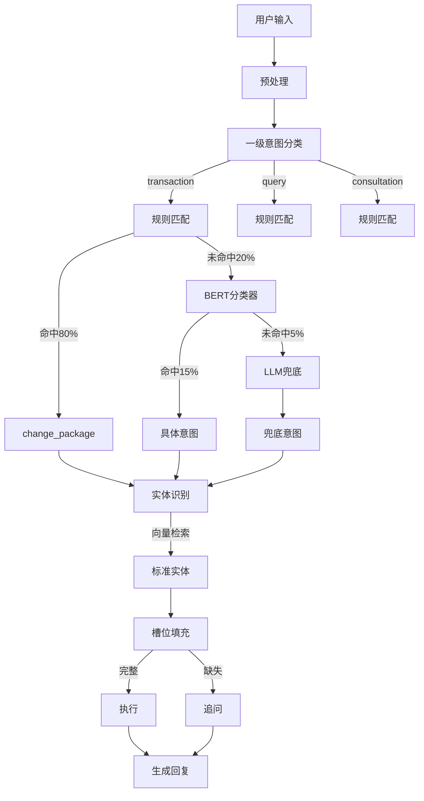

##### 5. 核心技术选型

| 模块     | 技术                   | 作用      | 性能    | 成本  |
| -------- | ---------------------- | --------- | ------- | ----- |
| 一级意图 | FastText / BERT        | 10-20分类 | 20-50ms | 低    |
| 二级意图 | 规则 → 分类器 → LLM    | 精准识别  | 5-500ms | 低→高 |
| 实体识别 | BiLSTM-CRF             | NER       | 30ms    | 中    |
| 实体链接 | Sentence-BERT + 向量DB | 1万+实体  | 30ms    | 中    |
| 向量检索 | Milvus / Qdrant        | 高速检索  | <10ms   | 低    |
| 对话管理 | DST (自研)             | 状态跟踪  | 20ms    | 低    |
| NLG      | 模板 + LLM             | 生成回复  | 5-100ms | 低→中 |

##### 6. 准确率

**总体准确率：95%+**

```
┌─────────────────────────────────┐
│ 规则匹配:     80% → 98%准确率    │ ← 高频场景
├─────────────────────────────────┤
│ BERT分类器:   15% → 92%准确率    │ ← 中等复杂
├─────────────────────────────────┤
│ LLM兜底:       5% → 85%准确率    │ ← 长尾场景
└─────────────────────────────────┘

加权平均: 0.8×0.98 + 0.15×0.92 + 0.05×0.85 = 96.5%
```

##### 7. 成本对比

**纯LLM方案 vs 混合架构**：

| 指标     | 纯LLM（当前） | 混合架构（优化） | 改善  |
| -------- | ------------- | ---------------- | ----- |
| 准确率   | 80-85%        | 95-98%           | +15%  |
| 响应时间 | 500ms         | 100ms            | -80%  |
| API成本  | $1000/月      | $200/月          | -80%  |
| 可控性   | 低（黑盒）    | 高（可调试）     | +++++ |
| 稳定性   | 依赖外部API   | 自主可控         | +++++ |

##### 8. 核心代码框架

```python
class MatureNLUEngine:
    """成熟的NLU引擎 - 混合架构"""
    
    def __init__(self):
        # 核心组件
        self.level1_classifier = FastTextClassifier()    # 一级分类
        self.rule_engine = RuleEngine()                  # 规则引擎
        self.level2_classifier = BERTClassifier()        # 二级分类
        self.entity_linker = EntityLinker()              # 实体链接
        self.llm_fallback = LLMEngine()                  # LLM兜底
    
    def understand(self, user_input: str) -> NLUResult:
        """
        完整的理解流程
        
        流程: 预处理 → 一级分类 → 实体识别 → 二级分类 → 槽位填充
        策略: 规则(80%) → 分类器(15%) → LLM(5%)
        """
        # 1. 预处理
        text = self.preprocess(user_input)
        
        # 2. 一级意图分类（快速分流）
        level1 = self.level1_classifier.predict(text)  # transaction
        
        # 3. 实体识别 + 链接（处理1万+实体）
        entities = self.entity_linker.extract(text)    # {"套餐": "畅游套餐"}
        
        # 4. 二级意图识别（三级降级）
        # 尝试1: 规则匹配
        intent = self.rule_engine.match(text, level1, entities)
        if intent:  # 80%命中
            return NLUResult(
                intent=intent, 
                entities=entities, 
                source="rule",
                latency=5
            )
        
        # 尝试2: BERT分类器
        intent, confidence = self.level2_classifier.predict(text, level1)
        if intent and confidence > 0.8:  # 15%命中
            return NLUResult(
                intent=intent, 
                entities=entities, 
                source="classifier",
                latency=50
            )
        
        # 尝试3: LLM兜底
        result = self.llm_fallback.predict(text, level1, entities)  # 5%命中
        return NLUResult(
            intent=result.intent, 
            entities=entities, 
            source="llm",
            latency=500
        )


class RuleEngine:
    """规则引擎 - 处理80%高频场景"""
    
    def __init__(self):
        self.rules = self._load_rules()
    
    def match(self, text: str, level1: str, entities: dict) -> Optional[str]:
        """规则匹配"""
        # 规则1: "办理" + 套餐名 → change_package
        if level1 == "transaction":
            if "办理" in text and entities.get("套餐"):
                return "change_package"
            if "换" in text and entities.get("套餐"):
                return "change_package"
        
        # 规则2: "查询" + "当前" → query_current_package
        if level1 == "query":
            if any(w in text for w in ["我的", "当前", "现在的"]):
                return "query_current_package"
        
        # 规则3: "推荐" → query_packages
        if "推荐" in text or "有什么" in text:
            return "query_packages"
        
        return None


class EntityLinker:
    """实体链接 - 向量检索"""
    
    def __init__(self):
        self.vectorstore = MilvusClient()
        self.embedding_model = SentenceBERT()
        
        # 预先加载所有套餐的向量
        self.package_vectors = self._load_package_embeddings()
    
    def extract(self, text: str) -> dict:
        """提取并链接实体"""
        entities = {}
        
        # 1. NER识别候选实体
        candidates = self.ner_model.extract(text)
        
        # 2. 向量检索标准化
        for candidate in candidates:
            # 向量化
            query_vec = self.embedding_model.encode(candidate)
            
            # 检索最相似的标准实体
            results = self.vectorstore.search(
                query_vec,
                top_k=1,
                threshold=0.85  # 相似度阈值
            )
            
            if results:
                entities["套餐"] = results[0].entity
                entities["similarity"] = results[0].score
        
        return entities
```

##### 9. 实体向量检索示例

```python
class PackageVectorStore:
    """套餐向量库"""
    
    def __init__(self):
        self.client = MilvusClient()
        self.embedding_model = SentenceBERT()
        
        # 初始化套餐数据
        self.packages = [
            {"id": 1, "name": "经济套餐", "aliases": ["经济", "省钱", "便宜"]},
            {"id": 2, "name": "畅游套餐", "aliases": ["畅游", "畅想", "畅玩"]},
            {"id": 3, "name": "无限套餐", "aliases": ["无限", "不限", "无限量"]},
            {"id": 4, "name": "校园套餐", "aliases": ["校园", "学生", "学生优惠"]}
        ]
        
        self._build_index()
    
    def _build_index(self):
        """构建向量索引"""
        for pkg in self.packages:
            # 主名称 + 所有别名
            texts = [pkg["name"]] + pkg["aliases"]
            
            for text in texts:
                vector = self.embedding_model.encode(text)
                self.client.insert({
                    "vector": vector,
                    "package_id": pkg["id"],
                    "package_name": pkg["name"],
                    "text": text
                })
    
    def search(self, query: str, top_k: int = 1):
        """搜索最相似的套餐"""
        query_vector = self.embedding_model.encode(query)
        
        results = self.client.search(
            collection_name="packages",
            data=[query_vector],
            limit=top_k,
            output_fields=["package_name", "text"]
        )
        
        return results


# 使用示例
store = PackageVectorStore()

# 用户输入"畅想套餐"
result = store.search("畅想")
# 输出: {"package_name": "畅游套餐", "similarity": 0.95}

# 用户输入"学生优惠"
result = store.search("学生优惠")
# 输出: {"package_name": "校园套餐", "similarity": 0.92}
```

#### 7.2.2 RAG识别系统

```
┌─────────────────────────────────────────────────────┐
│              RAG (检索增强生成) 系统                  │
├─────────────────────────────────────────────────────┤
│                                                      │
│  1. 知识库构建                                        │
│     ├── 文档采集 (FAQ、政策文档、操作手册)           │
│     ├── 文档解析 (PDF/Word/HTML → Text)              │
│     ├── 分块处理 (Chunk Size: 500-1000 tokens)       │
│     └── 向量化 (Embedding Model: text-embedding-3)   │
│                                                      │
│  2. 向量存储                                          │
│     ├── Milvus (向量数据库)                          │
│     ├── 索引策略 (HNSW/IVF)                          │
│     └── 元数据管理 (文档来源、版本、时间戳)          │
│                                                      │
│  3. 检索模块                                          │
│     ├── 向量检索 (Cosine Similarity)                 │
│     ├── 重排序 (Rerank Model)                        │
│     ├── 混合检索 (向量 + BM25)                       │
│     └── Top-K 结果过滤                                │
│                                                      │
│  4. 生成模块                                          │
│     ├── Prompt工程 (上下文注入)                      │
│     ├── LLM生成 (DeepSeek/GPT-4)                     │
│     ├── 答案验证 (事实性检查)                        │
│     └── 引用标注 (Citation)                          │
│                                                      │
└─────────────────────────────────────────────────────┘
```

**RAG实现示例**：

```python
class RAGEngine:
    """RAG引擎"""
    
    def __init__(self):
        self.vectorstore = MilvusClient()
        self.embedding_model = OpenAIEmbeddings()
        self.llm = ChatOpenAI(model="deepseek-chat")
    
    def retrieve(self, query: str, top_k: int = 3):
        """检索相关文档"""
        # 1. 查询向量化
        query_vector = self.embedding_model.embed_query(query)
        
        # 2. 向量检索
        results = self.vectorstore.search(
            query_vector,
            limit=top_k,
            metric_type="COSINE"
        )
        
        # 3. 重排序
        reranked = self.rerank(query, results)
        
        return reranked
    
    def generate(self, query: str, context: List[str]):
        """生成回答"""
        prompt = f"""基于以下参考资料回答问题:

【参考资料】
{chr(10).join(context)}

【问题】{query}

【回答】"""
        
        response = self.llm.invoke(prompt)
        return response.content
```

#### 7.2.3 用户画像系统

```
用户画像系统
├── 基础信息
│   ├── 注册时间
│   ├── 用户等级
│   └── 认证状态
├── 行为特征
│   ├── 对话频次
│   ├── 常用意图
│   ├── 活跃时段
│   └── 设备类型
├── 偏好标签
│   ├── 价格敏感度
│   ├── 流量需求量
│   ├── 套餐类型偏好
│   └── 服务质量要求
└── 预测模型
    ├── 流失风险预测
    ├── 套餐推荐模型
    └── 价值评分模型
```

#### 7.2.4 智能推荐系统

**推荐算法**：

| 算法     | 应用场景         | 实现方式      |
| -------- | ---------------- | ------------- |
| 协同过滤 | 基于相似用户推荐 | UserCF/ItemCF |
| 内容推荐 | 基于套餐属性匹配 | 特征匹配      |
| 深度学习 | 端到端推荐       | DNN/Wide&Deep |
| 强化学习 | 动态策略优化     | DQN/A3C       |

**推荐流程：**

```
用户请求
   ↓
召回层 (多路召回)
├── 热门套餐 (Top 100)
├── 协同过滤 (相似用户)
├── 内容推荐 (属性匹配)
└── 历史偏好
   ↓
粗排层 (快速筛选)
└── LR/GBDT 模型
   ↓
精排层 (精准排序)
└── DNN/Wide&Deep
   ↓
重排层 (业务规则)
├── 多样性
├── 新鲜度
└── 价格策略
   ↓
Top-K 推荐结果
```

### 7.3 优化实施计划

#### Phase 1: 快速MVP（1周）⭐ **立即可做**

**目标**：零训练成本，快速提升准确率

```
✅ 1. 规则引擎（80%高频场景）
   - 办理 + 套餐名 → change_package
   - 查询 + 我的/当前 → query_current_package
   - 推荐/有什么 → query_packages

✅ 2. 简单实体识别（精确+模糊）
   - 精确匹配：4个套餐名称
   - 模糊匹配：使用difflib相似度

✅ 3. LLM兜底
   - 规则未命中时使用现有LLM

✅ 4. 监控统计
   - 记录规则命中率
   - 统计响应时间
```

**预期效果**：

- 准确率：85% → 90%（+5%）
- 响应时间：500ms → 100ms（规则命中时）
- 成本：零额外成本
- 实施难度：低

**代码示例**：

```python
class QuickOptimizedNLU:
    """快速优化版NLU（Phase 1）"""
    
    def understand(self, text: str) -> NLUResult:
        # 1. 预处理
        text = text.strip().lower()
        
        # 2. 规则匹配（80%场景）
        intent = self._rule_match(text)
        if intent:
            return NLUResult(
                intent=intent,
                source="rule",
                latency=5
            )
        
        # 3. LLM兜底（20%场景）
        return self._llm_fallback(text)
    
    def _rule_match(self, text: str) -> Optional[str]:
        """规则匹配"""
        # 提取套餐名
        package = self._extract_package(text)
        
        # 规则1: 办理类
        if any(w in text for w in ["办理", "换", "更换", "变更"]):
            if package:
                return "change_package"
        
        # 规则2: 查询当前
        if any(w in text for w in ["我的", "当前", "现在"]):
            return "query_current_package"
        
        # 规则3: 查询套餐
        if any(w in text for w in ["推荐", "有什么", "查询"]):
            return "query_packages"
        
        return None
    
    def _extract_package(self, text: str) -> Optional[str]:
        """提取套餐名（精确+模糊）"""
        packages = ["经济套餐", "畅游套餐", "无限套餐", "校园套餐"]
        
        # 精确匹配
        for pkg in packages:
            if pkg in text:
                return pkg
        
        # 模糊匹配
        from difflib import get_close_matches
        words = text.split()
        for word in words:
            matches = get_close_matches(word, packages, n=1, cutoff=0.8)
            if matches:
                return matches[0]
        
        return None
```

#### Phase 2: 模型优化（1个月）

**目标**：训练分类模型，提升准确率和响应速度

```
✅ 1. 训练FastText一级分类器
   - 数据标注：1000条样本
   - 分类：query/transaction/consultation/complaint
   - 准确率目标：>95%

✅ 2. 训练BERT二级分类器
   - 每个大类下的细分类
   - 数据：500条/类
   - 准确率目标：>92%

✅ 3. 接入向量数据库
   - 部署Milvus/Qdrant
   - 套餐向量化存储
   - 支持模糊匹配

✅ 4. 完善实体链接
   - 同义词库构建
   - 拼写纠错
   - 别名映射
```

**预期效果**：

- 准确率：90% → 95%（+5%）
- 响应时间：100ms（平均）
- 规则覆盖：80%
- 模型覆盖：15%
- LLM覆盖：5%

**技术栈**：

- FastText：一级分类
- BERT：二级分类
- Sentence-BERT：实体向量化
- Milvus：向量检索

#### Phase 3: 生产级（3个月）

**目标**：端到端优化，达到生产级稳定性

```
✅ 1. 端到端优化
   - 模型压缩（ONNX/TensorRT）
   - 批量推理
   - 异步处理

✅ 2. A/B测试框架
   - 流量分组
   - 指标对比
   - 自动切换

✅ 3. 实时监控告警
   - 准确率监控
   - 响应时间监控
   - 成本监控

✅ 4. 持续学习机制
   - Bad Case收集
   - 自动标注
   - 增量训练
```

**预期效果**：

- 准确率：95% → 98%（+3%）
- 稳定性：99.9%
- P99延迟：<200ms
- 成本：$200/月

### 7.4 与当前系统对比

#### 7.4.1 架构对比

| 维度         | 当前系统    | 成熟系统        | 改进方向                      | 优先级 |
| ------------ | ----------- | --------------- | ----------------------------- | ------ |
| **意图识别** | 纯LLM       | 规则+分类器+LLM | 构建多级识别体系，LLM作为兜底 | ⭐⭐⭐⭐⭐  |
| **实体处理** | 枚举4个套餐 | 向量检索1万+    | 建立知识库和语义检索能力      | ⭐⭐⭐⭐⭐  |
| **响应时间** | 500ms       | 100ms           | 优化流程，减少LLM依赖         | ⭐⭐⭐⭐   |
| **准确率**   | 80%         | 95%+            | 提升意图识别和实体匹配精度    | ⭐⭐⭐⭐⭐  |
| **成本**     | $1000/月    | $200/月         | 减少API调用，本地化处理       | ⭐⭐⭐⭐⭐  |
| **可控性**   | 低（黑盒）  | 高（可调试）    | 建立可配置的规则引擎          | ⭐⭐⭐⭐⭐  |

#### 7.4.2 性能对比

| 指标                | 当前值   | 目标值（Phase 1） | 目标值（Phase 3） |
| ------------------- | -------- | ----------------- | ----------------- |
| **准确率**          | 80%      | 90%               | 98%               |
| **响应时间（P50）** | 500ms    | 100ms             | 50ms              |
| **响应时间（P99）** | 1000ms   | 500ms             | 200ms             |
| **API成本**         | $1000/月 | $500/月           | $200/月           |
| **规则覆盖率**      | 0%       | 80%               | 80%               |
| **LLM使用率**       | 100%     | 20%               | 5%                |

### 7.5 优化总结

#### 核心思想（一句话）

> **"让简单的简单，让复杂的可控"**
>
> - 80%高频场景用规则（快速、准确）
> - 15%中等场景用模型（准确、可控）
> - 5%长尾场景用LLM（灵活、兜底）

#### 架构精髓（三句话）

1. **分层降维**：复杂问题分解为多个简单问题
2. **混合架构**：规则+模型+LLM各司其职
3. **向量检索**：用Embedding处理海量实体


## 8. 部署指南

### 8.1 项目获取与配置

##### 8.1.1 克隆项目

```
# 1. 克隆代码仓库
git clone https://github.com/chaserZH/telecom-customer-service.git
cd telecom-ai-customer-service

# 2. 查看项目结构
```

项目结构：

```
telecom-ai-customer-service/
├── api/                    # Web服务
├── core/                   # 核心引擎
├── database/              # 数据库脚本
├── config/                # 配置文件
├── utils/                 # 工具函数
├── .env.example          # 环境变量模板
├── pyproject.toml        # Python依赖
├── docker-compose.yml    # Docker配置
└── README.md
```

### 8.2 配置环境变量

```
# 1. 复制环境变量模板
cp .env.example .env

# 2. 编辑环境变量
vim .env  # 或使用你喜欢的编辑器
```

**完整的.env配置示例**：

```python
# ==================== 应用配置 ====================
APP_NAME=电信套餐AI客服系统
VERSION=0.1.0
DEBUG=True

# ==================== 大模型配置 ====================
# 使用DeepSeek（推荐）
LLM_PROVIDER=deepseek

# DeepSeek API配置
DEEPSEEK_API_KEY=sk-your-deepseek-api-key-here
DEEPSEEK_BASE_URL=https://api.deepseek.com/v1
DEEPSEEK_MODEL=deepseek-chat

# OpenAI配置（可选，作为备用）
OPENAI_API_KEY=sk-your-openai-key-here
OPENAI_MODEL=gpt-4

# ==================== 数据库配置 ====================
DB_HOST=localhost          # Docker部署时使用: mysql
DB_PORT=3306
DB_USER=root
DB_PASSWORD=your_strong_password_here
DB_NAME=telecom_chatbot

# ==================== Redis配置 ====================
REDIS_HOST=localhost       # Docker部署时使用: redis
REDIS_PORT=6379
REDIS_DB=0
REDIS_PASSWORD=
REDIS_MAX_CONNECTIONS=50

# ==================== 会话配置 ====================
SESSION_TIMEOUT=1800       # 30分钟
MAX_CONTEXT_TURNS=10

# ==================== API配置 ====================
API_HOST=0.0.0.0
API_PORT=8000

# ==================== 确认配置 ====================
CONFIRMATION_TIMEOUT_MINUTES=5
CONFIRMATION_STRICT_MODE=False
CONFIRMATION_REMINDER=True
```

**配置说明**：

| 配置项           | 说明                                   | 必填 |
| ---------------- | -------------------------------------- | ---- |
| DEEPSEEK_API_KEY | DeepSeek API密钥                       | ✅ 是 |
| DB_PASSWORD      | MySQL数据库密码                        | ✅ 是 |
| DB_HOST          | 本地部署用`localhost`，Docker用`mysql` | ✅ 是 |
| REDIS_HOST       | 本地部署用`localhost`，Docker用`redis` | ✅ 是 |
| DEBUG            | 开发环境`True`，生产环境`False`        | ❌ 否 |

### 8.3 Docker部署方案（推荐）

#### 8.3.1 Docker Compose配置

**docker-compose.yml**（已包含在项目中）

#### 8.3.2 Dockerfile

**Dockerfile**（已包含在项目中）

#### 8.3.3 Docker部署步骤

```
# 1. 确保.env文件配置正确
cat .env | grep -E "DEEPSEEK_API_KEY|DB_PASSWORD"

# 2. 构建并启动所有服务
docker-compose up -d --build

# 3. 查看服务状态
docker-compose ps

# 预期输出：
# NAME              COMMAND                  STATUS        PORTS
# telecom_mysql     "docker-entrypoint.s…"   Up (healthy)  0.0.0.0:3306->3306/tcp
# telecom_redis     "docker-entrypoint.s…"   Up (healthy)  0.0.0.0:6379->6379/tcp
# telecom_web       "uvicorn api.main:ap…"   Up            0.0.0.0:8000->8000/tcp

# 4. 查看日志
docker-compose logs -f

# 5. 查看Web服务日志
docker-compose logs -f web

# 6. 进入容器调试
docker-compose exec web bash
```

#### 8.3.4 验证部署

###### 1. 检查状态

```
docker-compose ps

# 预期输出
NAME                      STATUS          PORTS
telecom_chatbot_app       Up 2 minutes    0.0.0.0:8000->8000/tcp
telecom_chatbot_mysql     Up 2 minutes (healthy)    0.0.0.0:3306->3306/tcp
telecom_chatbot_redis     Up 2 minutes (healthy)    0.0.0.0:6379->6379/tcp
```

##### 2. 验证数据库初始化

```
docker-compose exec mysql mysql -uroot -pMySecurePassword123 -e "SHOW DATABASES;"     
# 预期输出
WARN[0000] /Applications/code/personal/ai/telecom-customer-service/docker-compose.yml: the attribute `version` is obsolete, it will be ignored, please remove it to avoid potential confusion 
mysql: [Warning] Using a password on the command line interface can be insecure.
+--------------------+
| Database           |
+--------------------+
| information_schema |
| mysql              |
| performance_schema |
| sys                |
| telecom_chatbot    |
+--------------------+
```

##### 3. 验证Redis

```
docker-compose exec redis redis-cli

# 测试
127.0.0.1:6379> PING
PONG
127.0.0.1:6379> SET test "Hello Docker"
OK
127.0.0.1:6379> GET test
"Hello Docker"
```

##### 4. 测试应用

```
# 健康检查
curl http://localhost:8000/health

# 或访问浏览器
http://localhost:8000
```

##### 5.查看日志

```
 docker-compose logs -f --tail=100 web 
```

#### 8.3.5 常用Docker命令

```
# 启动服务
docker-compose up -d

# 停止服务
docker-compose stop

# 重启服务
docker-compose restart

# 停止并删除容器
docker-compose down

# 停止并删除容器和数据卷（⚠️ 会删除数据）
docker-compose down -v

# 查看日志
docker-compose logs -f [service_name]

# 进入容器
docker-compose exec web bash
docker-compose exec mysql bash
docker-compose exec redis redis-cli

# 重新构建镜像
docker-compose build --no-cache

# 查看资源使用
docker stats
```

### 8.4 本地部署

#### 1 安装mysql 与 redis

```
docker run -d --name my-redis -p 6379:6379 redis

$ docker run -d \
--name mysql-server \
-e MYSQL_ROOT_PASSWORD=root \
-e MYSQL_DATABASE=telecom_chatbot \
-e MYSQL_USER=user \
-e MYSQL_PASSWORD=user \
-p 3306:3306 \
mysql
```

#### 2. 编辑环境变量文件

```
cp .env.local .env
```

#### 3. 初始化sql

初始化sql脚本

##### 4. 启动

```
# 使用uvicorn直接启动
python -m uvicorn api.main:app --host 0.0.0.0 --port 8000 --reload
```

##### 5. **访问Web界面**

```bash
# 在浏览器中打开
open http://localhost:8000

# 或使用curl查看HTML
curl http://localhost:8000
```


