# 电信套餐AI智能客服系统 - NLU模块完整设计文档


## 项目概述

### 1.1 业务场景

**业务场景**：办理流量包的智能客服

**核心业务**: 
- 查询套餐信息
- 推荐合适套餐
- 办理套餐变更
- 查询使用情况


**可用套餐**：

| 名称 | 流量(G/月) | 价格(元/月) | 适用人群 |
|------|-----------|------------|---------|
| 经济套餐 | 10 | 50 | 无限制 |
| 畅游套餐 | 100 | 180 | 无限制 |
| 无限套餐 | 1000 | 300 | 无限制 |
| 校园套餐 | 200 | 150 | 在校生 |


### 1.2 项目目标

1. 理解用户自然语言查询套餐需求
2. 支持多轮对话，智能追问缺失信息
3. 精准推荐符合用户需求的套餐
4. 支持套餐办理、查询使用情况等业务
5. 预留RAG接口，未来可接入业务知识库


### 1.3 整体模块图


### 1.4 分阶段实施计划

| 阶段 | 时间 | 目标 | 状态 |
|------|------|------|------|
| **第一阶段** | Week 1-2 | NLU模块实现 | ✅ 当前阶段 |
| 第二阶段 | Week 3-4 | DST模块(对话状态跟踪) | 📋 规划中 |
| 第三阶段 | Week 5-6 | Policy + NLG模块 | 📋 规划中 |
| 第四阶段 | Week 7-10 | Web系统 + AI Agent | 📋 规划中 |


\---

## 整体架构

### 2.1 系统分层架构

```
┌─────────────────────────────────────────────────────┐
│                   用户交互层                          │
│            (Web/App/微信/语音接口)                    │
└─────────────────────────────────────────────────────┘
                         ↓
┌─────────────────────────────────────────────────────┐
│                  对话管理层                           │
│  ┌──────────┐  ┌──────────┐  ┌──────────┐         │
│  │ 会话管理  │  │ 上下文   │  │ 多轮对话 │         │
│  │ Session  │  │ Context  │  │ 状态机   │         │
│  └──────────┘  └──────────┘  └──────────┘         │
└─────────────────────────────────────────────────────┘
                         ↓
┌─────────────────────────────────────────────────────┐
│              🎯 NLU理解层 (第一阶段核心)              │
│  ┌────────────────────────────────────────────┐    │
│  │         大模型 Function Calling             │    │
│  │  - 意图识别 (Intent Classification)         │    │
│  │  - 实体抽取 (Entity Extraction)             │    │
│  │  - 参数填充 (Slot Filling)                  │    │
│  └────────────────────────────────────────────┘    │
│                         ↓                           │
│  ┌────────────────────────────────────────────┐    │
│  │         Function Router (预留RAG接口)       │    │
│  │  - 套餐查询 → DB Query                      │    │
│  │  - 业务咨询 → RAG (预留)                    │    │
│  │  - 其他服务 → API                           │    │
│  └────────────────────────────────────────────┘    │
└─────────────────────────────────────────────────────┘
                         ↓
┌─────────────────────────────────────────────────────┐
│                  执行层                               │
│  ┌──────────┐  ┌──────────┐  ┌──────────┐         │
│  │ 数据库   │  │ RAG引擎  │  │ 外部API  │         │
│  │ MySQL    │  │ (预留)   │  │          │         │
│  └──────────┘  └──────────┘  └──────────┘         │
└─────────────────────────────────────────────────────┘
                         ↓
┌─────────────────────────────────────────────────────┐
│                  响应生成层                           │
│       NLG (自然语言生成) + TTS (可选)                 │
└─────────────────────────────────────────────────────┘
```


### 2.2 对话系统基本模块

我们的系统包含如下模块：

```
   ↓
[ASR] 语音识别 (可选，第四阶段)
   ↓
[NLU] 语义理解 ⭐ 第一阶段核心
   ↓
[DST] 状态跟踪 (第二阶段)
   ↓
[Policy] 对话策略 (第三阶段)
   ↓
[NLG] 语言生成 (第三阶段)
   ↓
[TTS] 语音合成 (可选，第四阶段)
   ↓
系统输出
```

**各模块职责**：

- **NLU (Natural Language Understanding)**: 理解用户意图和提取关键信息
- **DST (Dialog State Tracking)**: 跟踪对话状态，管理多轮对话
- **Policy**: 决定系统下一步动作(查询、推荐、确认等)
- **NLG (Natural Language Generation)**: 生成自然流畅的回复
- **DB/API**: 查询数据库或调用外部API


### 2.3 数据流转示意

```
用户: "有100块以内的套餐吗"
   ↓
[NLU] 解析
   - Intent: query_packages
   - Parameters: {price_max: 100, sort_by: "price_asc"}
   ↓
[DST] 状态更新 (第二阶段)
   - 保存意图和参数
   ↓
[Policy] 决策 (第三阶段)
   - 决定: 执行查询
   ↓
[DB] 执行查询
   - SELECT * FROM packages WHERE price <= 100
   ↓
[NLG] 生成回复 (第三阶段)
   - "为您找到1个套餐: 经济套餐..."
   ↓
返回用户
```


---

## NLU模块详细设计

### 3.1 模块概述

***\*模块名称\****: Natural Language Understanding (NLU)  

***\*开发周期\****: 2周  

***\*核心目标\****: 将用户自然语言输入转换为结构化参数，用于数据库查询


### 3.2 功能需求

#### 3.2.1 意图识别**(Intent Classification)**

| 意图名称 | 描述 | 示例 |
|---------|------|------|
| `query_packages` | 查询套餐列表 | "有便宜的套餐吗" |
| `query_current_package` | 查询当前套餐 | "我现在用的什么套餐" |
| `query_package_detail` | 查询套餐详情 | "畅游套餐有什么内容" |
| `change_package` | 办理套餐变更 | "我要办理经济套餐" |
| `query_usage` | 查询使用情况 | "我用了多少流量" |
| `business_consultation` | 业务咨询 | "有什么优惠活动" (预留RAG) |


#### 3.2.2 实体抽取（Entity Extraction）

从用户输入中提取关键信息：

| 实体类型 | 示例输入 | 提取结果 |
|---------|---------|---------|
| 价格范围 | "100块以内" | `price_max: 100` |
| 流量需求 | "至少50G" | `data_min: 50` |
| 排序偏好 | "便宜点的" | `sort_by: "price_asc"` |
| 人群限制 | "学生套餐" | `target_user: "在校生"` |
| 手机号 | "13800138000" | `phone: "13800138000"` |


#### 3.2.3 槽位填充 (Slot Filling)

当必填参数缺失时，智能追问：

***\*示例场景\****:

```
用户: "帮我查下我的套餐"
↓ [NLU检测到缺少phone槽位]
系统: "请问您的手机号是多少呢？"
↓
用户: "13800138000"
↓ [NLU填充phone槽位，执行查询]
系统: "您当前使用的是【经济套餐】..."
```


### 3.3 NLU处理流程

```mermaid
graph TB
    Start([用户输入文本]) --> Preprocess[文本预处理模块]
    
    Preprocess --> P1[去除多余空格和特殊符号]
    P1 --> P2[数字归一化]
    P2 --> P3[价格关键词识别]
    P3 --> CleanText[清洗后的文本]
    
    CleanText --> CheckSession{检查会话状态}
    CheckSession -->|新会话| BuildMsg1[构建消息]
    CheckSession -->|有历史| GetContext[获取上下文]
    
    GetContext --> MergeContext[合并上下文信息]
    MergeContext --> BuildMsg2[构建消息含历史]
    
    BuildMsg1 --> LLMCall[调用大模型API]
    BuildMsg2 --> LLMCall
    
    LLMCall --> SystemPrompt[System Prompt]
    SystemPrompt --> UserMessage[User Message]
    UserMessage --> FunctionDefs[Function Definitions]
    FunctionDefs --> ModelProcess[模型处理]
    
    ModelProcess --> ResponseType{响应类型判断}
    
    ResponseType -->|Function Call| ExtractFunc[提取Function信息]
    ResponseType -->|纯文本| TextResponse[直接文本回复]
    ResponseType -->|Error| ErrorHandle[错误处理]
    
    ExtractFunc --> ParseJSON[解析JSON参数]
    ParseJSON --> ValidateParams{参数验证}
    
    ValidateParams --> CheckRequired{所有必填参数齐全?}
    
    CheckRequired -->|是| ParamsComplete[参数完整]
    CheckRequired -->|否| FindMissing[找出缺失槽位]
    
    FindMissing --> CheckContext{上下文中有该参数?}
    CheckContext -->|有| FillFromContext[从上下文补全]
    CheckContext -->|无| GenQuestion[生成追问话术]
    
    FillFromContext --> ParamsComplete
    GenQuestion --> NLUResult1[NLU结果需要澄清]
    
    ParamsComplete --> FunctionRouter[Function路由器]
    
    FunctionRouter --> RouteDecision{Function类型判断}
    
    RouteDecision -->|套餐查询类| DBRoute[数据库查询路由]
    RouteDecision -->|业务咨询类| RAGRoute[RAG路由预留]
    
    DBRoute --> BuildSQL[构建SQL查询]
    BuildSQL --> ExecSQL[执行SQL]
    ExecSQL --> FormatResult[格式化结果]
    
    RAGRoute --> RAGCheck{RAG是否启用?}
    RAGCheck -->|是| RAGProcess[向量检索]
    RAGCheck -->|否| DefaultReply[返回默认提示]
    
    FormatResult --> MergeData[合并查询结果]
    RAGProcess --> MergeData
    DefaultReply --> MergeData
    
    MergeData --> NLUResult2[NLU结果包含数据]
    
    TextResponse --> NLUResult3[NLU结果直接回复]
    ErrorHandle --> NLUResult4[NLU结果错误信息]
    
    NLUResult1 --> UpdateSession1[更新会话状态]
    NLUResult2 --> UpdateSession2[更新会话状态]
    NLUResult3 --> UpdateSession3[更新会话状态]
    NLUResult4 --> UpdateSession3
    
    UpdateSession1 --> Return1([返回需要用户补充信息])
    UpdateSession2 --> Return2([返回完整的查询结果])
    UpdateSession3 --> Return3([返回文本回复])
    
    style LLMCall fill:#4A90E2,color:#fff
    style FunctionRouter fill:#F5A623,color:#fff
    style DBRoute fill:#7ED321,color:#fff
    style RAGRoute fill:#D0D0D0,color:#333
    style ParamsComplete fill:#50E3C2,color:#000
    style GenQuestion fill:#FF6B6B,color:#fff
```




#### 完整流程图

```
用户输入文本
   ↓
┌─────────────────────────────────┐
│  1. 文本预处理模块               │
│  - 去除多余空格和特殊符号        │
│  - 数字归一化(一百→100)          │
│  - 价格关键词识别(块→元)         │
└─────────────────────────────────┘
   ↓
┌─────────────────────────────────┐
│  2. 上下文检查                   │
│  检查会话状态                    │
└─────────────────────────────────┘
   ↓
   是否有历史会话？
   ├─ 是 → 获取上下文 → 合并上下文信息
   └─ 否 → 构建新消息
   ↓
┌─────────────────────────────────┐
│  3. 大模型理解 ⭐ 核心            │
│  调用Function Calling API        │
│  - System Prompt                 │
│  - User Message                  │
│  - Function Definitions          │
│  - 模型处理                      │
└─────────────────────────────────┘
   ↓
┌─────────────────────────────────┐
│  4. 响应类型判断                 │
└─────────────────────────────────┘
   ↓
   ├─ Function Call → 提取Function信息 → 解析JSON参数
   ├─ 纯文本 → 直接文本回复(闲聊/澄清)
   └─ Error → 错误处理
   ↓
┌─────────────────────────────────┐
│  5. 参数验证                     │
│  检查必填参数是否完整            │
└─────────────────────────────────┘
   ↓
   所有必填参数齐全？
   ├─ 是 → 参数完整
   └─ 否 → 找出缺失槽位
            ↓
            上下文中有该参数？
            ├─ 有 → 从上下文补全 → 参数完整
            └─ 无 → 生成追问话术 → 返回(需要用户补充信息)
   ↓
┌─────────────────────────────────┐
│  6. Function路由器               │
│  判断Function类型                │
└─────────────────────────────────┘
   ↓
   ├─ 套餐查询类(query_packages等)
   │    ↓
   │  ┌────────────────────────┐
   │  │ 数据库查询路由          │
   │  │ - 构建SQL查询           │
   │  │ - 执行SQL              │
   │  │ - 格式化结果           │
   │  └────────────────────────┘
   │
   └─ 业务咨询类(business_consultation)
        ↓
      ┌────────────────────────┐
      │ RAG路由(预留)          │
      │ RAG是否启用？          │
      │ ├─ 是 → 向量检索       │
      │ └─ 否 → 返回默认提示   │
      └────────────────────────┘
   ↓
┌─────────────────────────────────┐
│  7. 合并查询结果                 │
└─────────────────────────────────┘
   ↓
┌─────────────────────────────────┐
│  8. 更新会话状态                 │
│  保存当前意图和已知槽位          │
└─────────────────────────────────┘
   ↓
返回NLU结果
├─ 需要澄清 → 返回追问话术
├─ 包含数据 → 返回完整查询结果
└─ 直接回复 → 返回文本回复
```


#### 详细步骤说明

**步骤1: 文本预处理**

```python
def _preprocess(text: str) -> str:
    # 去除多余空格
    text = re.sub(r'\s+', ' ', text).strip()
    
    # 数字归一化
    text = text.replace('一百', '100').replace('两百', '200')
    
    # 价格单位统一
    text = text.replace('块', '元')
    
    return text
```

***\*步骤2: 上下文检查\****

- 检查session_id是否存在

- 如果存在，加载历史对话

- 如果有user_phone，加入上下文


***\*步骤3: 大模型理解\****

```python
response = client.chat.completions.create(

​    model="gpt-4",

​    messages=[

​        {"role": "system", "content": SYSTEM_PROMPT},

​        {"role": "user", "content": user_input}

​    ],

​    tools=FUNCTION_DEFINITIONS,

​    tool_choice="auto"

)
```

**步骤4:解析响应**

- 如果返回tool_calls → 提取function和参数

- 如果返回纯文本 → 闲聊或澄清

- 如果返回错误 → 异常处理

***\*步骤5: 参数验证\****

```python
def _validate_parameters(function_name, parameters, context):
    missing = []
    required = get_required_params(function_name)
    
    for param in required:
        if param not in parameters:
            # 尝试从上下文补全
            if param == "phone" and context.get("user_phone"):
                parameters[param] = context["user_phone"]
            else:
                missing.append(param)
    
    return missing
```

***\*步骤6: Function路由\****

```python
def route_function(function_name, parameters):
    if function_name == "business_consultation":
        return execute_rag(parameters)  # RAG预留
    else:
        return execute_db_query(function_name, parameters)
```

### 3.4 核心组件设计

#### 3.4.1 NLUEngine 类

```python
class NLUEngine:
    """NLU引擎主控制器"""
    
    def __init__(self):
        self.client = OpenAI(api_key=settings.OPENAI_API_KEY)
        self.model = settings.OPENAI_MODEL
        self.sessions = {}
    
    def understand(self, user_input, session_id, user_phone=None) -> NLUResult:
        """理解用户输入，返回结构化结果"""
        # 1. 预处理
        # 2. 获取上下文
        # 3. 调用大模型
        # 4. 解析响应
        # 5. 验证参数
        # 6. 返回结果
    
    def _preprocess(self, text) -> str:
        """文本预处理"""
    
    def _call_llm(self, messages) -> Response:
        """调用大模型"""
    
    def _parse_response(self, response) -> NLUResult:
        """解析响应"""
    
    def _validate_parameters(self, function_name, params) -> List[str]:
        """验证参数，返回缺失的槽位"""
```

**NLUResult 数据结构**:

```python
@dataclass
class NLUResult:
    intent: str                          # 意图
    function_name: Optional[str]         # 调用的函数名
    parameters: Dict[str, Any]           # 提取的参数
    confidence: float                    # 置信度
    requires_clarification: bool         # 是否需要澄清
    clarification_message: Optional[str] # 澄清提示
    missing_slots: List[str]             # 缺失的槽位
```

#### 3.4.2 FunctionRouter 类

```python
class FunctionRouter:
    """Function调用路由"""
    
    def route(self, function_name, parameters) -> Dict:
        """路由到对应的执行器"""
        if function_name == "business_consultation":
            return self._execute_rag_query(parameters)
        else:
            return self._execute_db_query(function_name, parameters)
    
    def _execute_db_query(self, function_name, params) -> Dict:
        """执行数据库查询"""
        executor = DatabaseExecutor()
        return executor.execute_function(function_name, params)
    
    def _execute_rag_query(self, params) -> Dict:
        """执行RAG查询(预留)"""
        if not settings.RAG_ENABLED:
            return {"success": True, "response": "RAG功能开发中..."}
        # TODO: 接入RAG
```

#### 3.4.3 DatabaseExecutor 类

```python
class DatabaseExecutor:
    """数据库查询执行器"""
    
    def execute_function(self, function_name, parameters) -> Dict:
        """执行Function调用"""
        executor_map = {
            "query_packages": self.query_packages,
            "query_current_package": self.query_current_package,
            # ...
        }
        return executor_map[function_name](**parameters)
    
    def query_packages(self, price_min=None, price_max=None, ...):
        """查询套餐列表"""
        # 构建SQL并执行
    
    def query_current_package(self, phone):
        """查询用户当前套餐"""
        # 查询用户信息
```

---

## 技术实现方案

### 4.1 技术选型

#### 4.1.1 核心技术

| 技术 | 选型 | 理由 |
|------|------|------|
| 编程语言 | Python 3.10+ | 生态丰富，AI库支持好 |
| NLU方案 | 大模型Function Calling | 无需训练，理解能力强 |
| 大模型 | OpenAI GPT-4 / Claude | 成熟稳定，API完善 |
| 数据库 | MySQL 8.0 | 关系型数据，事务支持 |
| ORM | SQLAlchemy | Python生态标准 |
| 日志 | Loguru | 简单易用，功能强大 |

#### 4.1.2 为什么使用Function Calling？

**对比传统NLU方案**:

| 方案 | 优点 | 缺点 |
|------|------|------|
| **传统NLU** (BERT/LSTM) | 响应快，成本低 | 需要标注数据，需要训练，泛化能力弱 |
| **大模型Fine-tuning** | 效果好，可定制 | 成本高，需要GPU，维护复杂 |
| **Function Calling** ⭐ | 无需训练，泛化强，易维护 | API调用成本，有延迟 |

**我们选择Function Calling的原因**:
1. ✅ **快速迭代**: 无需标注数据和训练模型
2. ✅ **理解能力强**: GPT-4对自然语言理解能力出色
3. ✅ **易于扩展**: 新增意图只需添加Function定义
4. ✅ **维护成本低**: 不需要管理模型训练流程
5. ✅ **适合中小规模**: 对于客服场景，调用频率可控

### 4.2 Function Calling定义

#### 4.2.1 Function定义规范

每个Function包含以下字段：
- `name`: 函数名称
- `description`: 功能描述(帮助模型理解何时调用)
- `parameters`: 参数定义
  - `type`: 参数类型
  - `properties`: 参数属性
  - `required`: 必填参数列表

#### 4.2.2 完整Function定义

**1. query_packages (查询套餐)**

```json
{
  "name": "query_packages",
  "description": "查询符合条件的流量套餐列表。当用户想了解套餐、比较套餐、查找合适的套餐时使用",
  "parameters": {
    "type": "object",
    "properties": {
      "price_min": {
        "type": "number",
        "description": "最低价格(元/月),例如'50元以上'表示price_min=50"
      },
      "price_max": {
        "type": "number",
        "description": "最高价格(元/月),例如'100元以内'表示price_max=100"
      },
      "data_min": {
        "type": "number",
        "description": "最少流量(GB/月),例如'至少50G'表示data_min=50"
      },
      "data_max": {
        "type": "number",
        "description": "最多流量(GB/月)"
      },
      "target_user": {
        "type": "string",
        "enum": ["无限制", "在校生"],
        "description": "适用人群。'学生套餐'、'校园套餐'对应'在校生'"
      },
      "sort_by": {
        "type": "string",
        "enum": ["price_asc", "price_desc", "data_desc"],
        "description": "排序方式。price_asc=价格升序(便宜优先)",
        "default": "price_asc"
      }
    },
    "required": []
  }
}
```

**2. query_current_package (查询当前套餐)**

```json
{
  "name": "query_current_package",
  "description": "查询用户当前使用的套餐信息。当用户询问'我现在是什么套餐'时使用",
  "parameters": {
    "type": "object",
    "properties": {
      "phone": {
        "type": "string",
        "description": "手机号码,11位数字,格式如13800138000"
      }
    },
    "required": ["phone"]
  }
}
```

**3. query_package_detail (查询套餐详情)**

```json
{
  "name": "query_package_detail",
  "description": "查询指定套餐的详细信息",
  "parameters": {
    "type": "object",
    "properties": {
      "package_name": {
        "type": "string",
        "enum": ["经济套餐", "畅游套餐", "无限套餐", "校园套餐"],
        "description": "套餐名称"
      }
    },
    "required": ["package_name"]
  }
}
```

**4. change_package (办理套餐变更)**

```json
{
  "name": "change_package",
  "description": "办理套餐变更。当用户明确要求更换/办理某个套餐时使用",
  "parameters": {
    "type": "object",
    "properties": {
      "phone": {"type": "string", "description": "手机号码"},
      "new_package_name": {
        "type": "string",
        "enum": ["经济套餐", "畅游套餐", "无限套餐", "校园套餐"],
        "description": "要更换的新套餐名称"
      }
    },
    "required": ["phone", "new_package_name"]
  }
}
```

**5. query_usage (查询使用情况)**

```json
{
  "name": "query_usage",
  "description": "查询用户的流量、话费使用情况",
  "parameters": {
    "type": "object",
    "properties": {
      "phone": {"type": "string", "description": "手机号码"},
      "query_type": {
        "type": "string",
        "enum": ["data", "balance", "all"],
        "description": "查询类型: data=流量, balance=余额, all=全部",
        "default": "all"
      }
    },
    "required": ["phone"]
  }
}
```

**6. business_consultation (业务咨询 - RAG预留)**

```json
{
  "name": "business_consultation",
  "description": "业务咨询和政策说明。当用户询问业务规则、办理流程、优惠活动等时使用(预留RAG接口)",
  "parameters": {
    "type": "object",
    "properties": {
      "question": {"type": "string", "description": "用户的咨询问题"},
      "business_type": {
        "type": "string",
        "enum": ["套餐说明", "办理流程", "资费规则", "优惠活动", "其他"],
        "description": "业务类型分类"
      }
    },
    "required": ["question"]
  }
}
```

### 4.3 System Prompt设计

```python
SYSTEM_PROMPT = """你是一个专业的电信客服助手,负责帮助用户查询和办理流量套餐业务。

【你的职责】
1. 理解用户的自然语言需求
2. 识别用户意图并调用相应的函数
3. 当信息不完整时,友好地向用户确认缺失的信息
4. 用专业但亲切的语气与用户交流

【当前可用套餐】
- 经济套餐: 10G/月, 50元/月, 无限制人群
- 畅游套餐: 100G/月, 180元/月, 无限制人群
- 无限套餐: 1000G/月, 300元/月, 无限制人群
- 校园套餐: 200G/月, 150元/月, 在校生专享

【理解规则】
- 价格表达要准确理解: "100块以内"→price_max=100, "50元以上"→price_min=50
- "便宜点的"、"经济实惠"等模糊表达→sort_by="price_asc"
- "学生套餐"、"校园"→target_user="在校生"
- 如果用户没有提供手机号,需要礼貌询问

【重要】
- 始终保持友好和专业
- 不要假设用户信息,缺失时一定要询问
- 回答要简洁明了
"""
```

### 4.4 槽位填充策略

#### 追问话术模板

```python
SLOT_QUESTIONS = {
    "phone": "请问您的手机号码是多少呢？",
    "package_name": "请问您想了解哪个套餐呢？我们有经济套餐、畅游套餐、无限套餐和校园套餐。",
    "new_package_name": "请问您想更换为哪个套餐？",
    "query_type": "您想查询流量使用情况还是话费余额？",
}
```

#### 槽位补全优先级

1. **从当前参数中获取** (优先级最高)
2. **从上下文中补全** (如user_phone)
3. **从历史槽位值中补全**
4. **追问用户** (最后的手段)

---

## 数据库设计

### 5.1 ER图

```
┌─────────────┐         ┌─────────────┐
│  packages   │         │    users    │
├─────────────┤         ├─────────────┤
│ id (PK)     │         │ phone (PK)  │
│ name        │◄────────│ current_    │
│ data_gb     │  FK     │  package_id │
│ price       │         │ usage_gb    │
│ target_user │         │ balance     │
│ description │         └─────────────┘
└─────────────┘
```

### 5.2 表结构设计

#### 5.2.1 套餐表 (packages)

```sql
CREATE TABLE packages (
    id INT PRIMARY KEY AUTO_INCREMENT COMMENT '套餐ID',
    name VARCHAR(50) NOT NULL UNIQUE COMMENT '套餐名称',
    data_gb INT NOT NULL COMMENT '每月流量(GB)',
    voice_minutes INT DEFAULT 0 COMMENT '每月通话时长(分钟)',
    price DECIMAL(10,2) NOT NULL COMMENT '月费(元)',
    target_user VARCHAR(20) DEFAULT '无限制' COMMENT '适用人群',
    description TEXT COMMENT '套餐说明',
    status TINYINT DEFAULT 1 COMMENT '状态: 1=在售, 0=下架',
    created_at TIMESTAMP DEFAULT CURRENT_TIMESTAMP,
    updated_at TIMESTAMP DEFAULT CURRENT_TIMESTAMP ON UPDATE CURRENT_TIMESTAMP,
    INDEX idx_price (price),
    INDEX idx_data (data_gb),
    INDEX idx_status (status)
) ENGINE=InnoDB DEFAULT CHARSET=utf8mb4 COMMENT='套餐信息表';
```

#### 5.2.2 用户表 (users)

```sql
CREATE TABLE users (
    phone VARCHAR(11) PRIMARY KEY COMMENT '手机号',
    name VARCHAR(50) COMMENT '姓名',
    current_package_id INT COMMENT '当前套餐ID',
    package_start_date DATE COMMENT '套餐生效日期',
    monthly_usage_gb DECIMAL(10,2) DEFAULT 0 COMMENT '本月已用流量(GB)',
    monthly_usage_minutes INT DEFAULT 0 COMMENT '本月已用通话(分钟)',
    balance DECIMAL(10,2) DEFAULT 0 COMMENT '账户余额(元)',
    status TINYINT DEFAULT 1 COMMENT '状态: 1=正常, 0=停机',
    created_at TIMESTAMP DEFAULT CURRENT_TIMESTAMP,
    updated_at TIMESTAMP DEFAULT CURRENT_TIMESTAMP ON UPDATE CURRENT_TIMESTAMP,
    FOREIGN KEY (current_package_id) REFERENCES packages(id),
    INDEX idx_package (current_package_id),
    INDEX idx_status (status)
) ENGINE=InnoDB DEFAULT CHARSET=utf8mb4 COMMENT='用户信息表';
```

#### 5.2.3 对话记录表 (conversations)

```sql
CREATE TABLE conversations (
    id BIGINT PRIMARY KEY AUTO_INCREMENT,
    session_id VARCHAR(64) NOT NULL COMMENT '会话ID',
    phone VARCHAR(11) COMMENT '用户手机号',
    user_input TEXT NOT NULL COMMENT '用户输入',
    intent VARCHAR(50) COMMENT '识别的意图',
    function_name VARCHAR(50) COMMENT '调用的函数',
    parameters JSON COMMENT '函数参数',
    bot_response TEXT COMMENT '机器人回复',
    execution_time_ms INT COMMENT '执行耗时(毫秒)',
    created_at TIMESTAMP DEFAULT CURRENT_TIMESTAMP,
    INDEX idx_session (session_id),
    INDEX idx_phone (phone),
    INDEX idx_created (created_at)
) ENGINE=InnoDB DEFAULT CHARSET=utf8mb4 COMMENT='对话记录表';
```

### 5.3 初始化数据

```sql
-- 插入套餐数据
INSERT INTO packages (name, data_gb, voice_minutes, price, target_user, description) VALUES
('经济套餐', 10, 100, 50.00, '无限制', '适合轻度上网用户,性价比高'),
('畅游套餐', 100, 300, 180.00, '无限制', '适合经常上网的用户,流量充足'),
('无限套餐', 1000, 1000, 300.00, '无限制', '流量无忧,畅享网络,商务首选'),
('校园套餐', 200, 200, 150.00, '在校生', '学生专享优惠套餐,需提供学生证');

-- 插入测试用户数据
INSERT INTO users (phone, name, current_package_id, monthly_usage_gb, balance) VALUES
('13800138000', '张三', 1, 5.2, 45.50),
('13900139000', '李四', 2, 67.8, 120.00),
('13700137000', '王五', 4, 125.5, 50.00);
```

---


## 代码实现

### 6.1 项目目录结构

```
telecom-ai-customer-service/
│
├── config/                    # 配置模块
│   ├── __init__.py
│   ├── settings.py           # 系统配置
│   └── prompts.py            # Prompt模板
│
├── core/                      # 核心业务逻辑
│   ├── __init__.py
│   │
│   └── nlu/                  # 【第一阶段】NLU模块
│       ├── __init__.py
│       ├── nlu_engine.py     # NLU引擎主类
│       ├── function_definitions.py  # Function定义
│       └── slot_filler.py    # 槽位填充(扩展)
│
├── executor/                  # 执行层
│   ├── __init__.py
│   ├── db_executor.py        # 数据库执行器
│   ├── rag_executor.py       # RAG执行器(预留)
│   └── api_executor.py       # API执行器
│
├── database/                  # 数据库
│   ├── __init__.py
│   ├── db_manager.py         # 数据库管理器
│   ├── schema.sql            # 表结构SQL
│   └── init_data.sql         # 初始化数据SQL
│
├── models/                    # 数据模型
│   ├── __init__.py
│   ├── package.py            # 套餐模型
│   ├── user.py               # 用户模型
│   └── conversation.py       # 对话模型
│
├── utils/                     # 工具函数
│   ├── __init__.py
│   ├── logger.py             # 日志工具
│   └── validators.py         # 数据验证
│
├── examples/                  # 示例代码
│   └── phase1_demo.py        # 第一阶段演示
│
├── tests/                     # 测试代码
│   ├── __init__.py
│   ├── test_nlu.py           # NLU测试
│   ├── test_db_executor.py   # 执行器测试
│   └── test_integration.py   # 集成测试
│
├── .env.example              # 环境变量模板
├── requirements.txt          # Python依赖
├── docker-compose.yml        # Docker配置
├── Makefile                  # 项目管理命令
└── README.md                 # 项目说明
```

### 6.2 核心代码实现

#### 6.2.1 配置文件 (config/settings.py)

```python
from pydantic_settings import BaseSettings

class Settings(BaseSettings):
    # 应用配置
    APP_NAME: str = "电信套餐AI客服系统"
    VERSION: str = "0.1.0"
    DEBUG: bool = True
    
    # 大模型配置
    LLM_PROVIDER: str = "openai"
    OPENAI_API_KEY: str = ""
    OPENAI_MODEL: str = "gpt-4"
    ANTHROPIC_API_KEY: str = ""
    ANTHROPIC_MODEL: str = "claude-sonnet-4-20250514"
    
    # 数据库配置
    DB_HOST: str = "localhost"
    DB_PORT: int = 3306
    DB_USER: str = "root"
    DB_PASSWORD: str = "password"
    DB_NAME: str = "telecom_chatbot"
    
    # RAG配置 (预留)
    RAG_ENABLED: bool = False
    
    @property
    def database_url(self) -> str:
        return f"mysql+pymysql://{self.DB_USER}:{self.DB_PASSWORD}@{self.DB_HOST}:{self.DB_PORT}/{self.DB_NAME}"
    
    class Config:
        env_file = ".env"

settings = Settings()
```

#### 6.2.2 NLU引擎 (core/nlu/nlu_engine.py)

```python
from typing import Dict, Any, Optional, List
from dataclasses import dataclass, field
from openai import OpenAI

@dataclass
class NLUResult:
    """NLU解析结果"""
    intent: str
    function_name: Optional[str] = None
    parameters: Dict[str, Any] = field(default_factory=dict)
    confidence: float = 0.0
    requires_clarification: bool = False
    clarification_message: Optional[str] = None
    missing_slots: List[str] = field(default_factory=list)

class NLUEngine:
    """NLU引擎 - 基于大模型Function Calling"""
    
    def __init__(self):
        self.client = OpenAI(api_key=settings.OPENAI_API_KEY)
        self.model = settings.OPENAI_MODEL
        self.sessions = {}
    
    def understand(self,
                   user_input: str,
                   session_id: str,
                   user_phone: Optional[str] = None) -> NLUResult:
        """理解用户输入"""
        
        # 1. 文本预处理
        processed_text = self._preprocess(user_input)
        
        # 2. 获取上下文
        context = self._get_session_context(session_id)
        if user_phone:
            context["user_phone"] = user_phone
        
        # 3. 构建消息
        messages = self._build_messages(processed_text, context)
        
        # 4. 调用大模型
        response = self.client.chat.completions.create(
            model=self.model,
            messages=messages,
            tools=FUNCTION_DEFINITIONS,
            tool_choice="auto",
            temperature=0.3
        )
        
        # 5. 解析响应
        nlu_result = self._parse_response(response, context)
        
        # 6. 更新会话
        self._update_session(session_id, user_input, nlu_result, context)
        
        return nlu_result
    
    def _preprocess(self, text: str) -> str:
        """文本预处理"""
        text = re.sub(r'\s+', ' ', text).strip()
        text = text.replace('一百', '100').replace('两百', '200')
        text = text.replace('块', '元')
        return text
    
    def _parse_response(self, response, context) -> NLUResult:
        """解析大模型响应"""
        message = response.choices[0].message
        
        # 调用了Function
        if message.tool_calls:
            tool_call = message.tool_calls[0]
            function_name = tool_call.function.name
            parameters = json.loads(tool_call.function.arguments)
            
            # 参数验证
            missing_slots = self._validate_parameters(
                function_name, parameters, context
            )
            
            if missing_slots:
                return NLUResult(
                    intent=function_name,
                    function_name=function_name,
                    parameters=parameters,
                    requires_clarification=True,
                    clarification_message=self._get_slot_question(missing_slots[0]),
                    missing_slots=missing_slots
                )
            
            return NLUResult(
                intent=function_name,
                function_name=function_name,
                parameters=parameters,
                confidence=0.9
            )
        
        # 纯文本回复
        return NLUResult(
            intent="chat",
            raw_response=message.content
        )
```

#### 6.2.3 数据库执行器 (executor/db_executor.py)

```python
class DatabaseExecutor:
    """数据库查询执行器"""
    
    def execute_function(self, function_name: str, parameters: Dict) -> Dict:
        """执行Function调用"""
        executor_map = {
            "query_packages": self.query_packages,
            "query_current_package": self.query_current_package,
            "query_package_detail": self.query_package_detail,
            "change_package": self.change_package,
            "query_usage": self.query_usage,
            "business_consultation": self.business_consultation
        }
        
        executor = executor_map.get(function_name)
        if not executor:
            return {"success": False, "error": f"未知函数: {function_name}"}
        
        try:
            return executor(**parameters)
        except Exception as e:
            return {"success": False, "error": str(e)}
    
    def query_packages(self, price_min=None, price_max=None, 
                      data_min=None, sort_by="price_asc") -> Dict:
        """查询套餐列表"""
        sql = "SELECT * FROM packages WHERE status = 1"
        params = {}
        
        if price_min:
            sql += " AND price >= :price_min"
            params['price_min'] = price_min
        
        if price_max:
            sql += " AND price <= :price_max"
            params['price_max'] = price_max
        
        if data_min:
            sql += " AND data_gb >= :data_min"
            params['data_min'] = data_min
        
        # 排序
        sort_map = {
            "price_asc": "price ASC",
            "price_desc": "price DESC",
            "data_desc": "data_gb DESC"
        }
        sql += f" ORDER BY {sort_map.get(sort_by, 'price ASC')}"
        
        rows = self.db.execute_query(sql, params)
        
        packages = [
            {
                "id": row[0],
                "name": row[1],
                "data_gb": row[2],
                "price": float(row[4]),
                "target_user": row[5]
            }
            for row in rows
        ]
        
        return {"success": True, "data": packages, "count": len(packages)}
```

#### 6.2.4 完整对话系统 (core/chatbot_phase1.py)

```python
class TelecomChatbotPhase1:
    """电信客服对话系统 - 第一阶段"""
    
    def __init__(self):
        self.nlu = NLUEngine()
        self.db_executor = DatabaseExecutor()
    
    def chat(self, user_input: str, session_id: str = None,
             user_phone: str = None) -> Dict:
        """处理用户输入"""
        
        if not session_id:
            session_id = str(uuid.uuid4())
        
        # 1. NLU理解
        nlu_result = self.nlu.understand(user_input, session_id, user_phone)
        
        # 2. 如果需要澄清
        if nlu_result.requires_clarification:
            return {
                "session_id": session_id,
                "response": nlu_result.clarification_message,
                "requires_input": True,
                "missing_slots": nlu_result.missing_slots
            }
        
        # 3. 执行Function
        if nlu_result.function_name:
            exec_result = self.db_executor.execute_function(
                nlu_result.function_name,
                nlu_result.parameters
            )
        
        # 4. 生成响应
        response_text = self._generate_response(
            nlu_result.function_name,
            exec_result
        )
        
        return {
            "session_id": session_id,
            "response": response_text,
            "intent": nlu_result.intent,
            "data": exec_result
        }
    
    def _generate_response(self, function_name, exec_result):
        """生成自然语言响应"""
        if function_name == "query_packages":
            return self._format_packages_response(exec_result)
        elif function_name == "query_current_package":
            return self._format_current_package_response(exec_result)
        # ...更多格式化逻辑
```


---

## 测试方案

### 7.1 测试策略

#### 测试金字塔

```
        /\
       /  \      E2E测试 (集成测试)
      /────\     - 完整对话流程
     /      \    - 多轮对话测试
    /────────\   
   /          \  单元测试
  /____________\ - NLU模块测试
                 - 执行器测试
                 - 工具函数测试
```

### 7.2 测试用例

#### 7.2.1 NLU意图识别测试

```python
class TestNLUEngine:
    
    def test_price_query(self):
        """测试价格查询"""
        nlu = NLUEngine()
        result = nlu.understand("有100块以内的套餐吗", "test_001")
        
        assert result.intent == "query_packages"
        assert result.parameters.get("price_max") == 100
        assert not result.requires_clarification
    
    def test_fuzzy_query(self):
        """测试模糊查询"""
        result = nlu.understand("想要便宜点的套餐", "test_002")
        
        assert result.intent == "query_packages"
        assert result.parameters.get("sort_by") == "price_asc"
    
    def test_missing_param(self):
        """测试缺失参数"""
        result = nlu.understand("查下我的套餐", "test_003")
        
        assert result.intent == "query_current_package"
        assert result.requires_clarification
        assert "phone" in result.missing_slots
```

#### 7.2.2 数据库执行器测试

```python
class TestDatabaseExecutor:
    
    def test_query_packages(self):
        """测试套餐查询"""
        executor = DatabaseExecutor()
        result = executor.query_packages(price_max=100)
        
        assert result["success"]
        assert all(pkg["price"] <= 100 for pkg in result["data"])
    
    def test_invalid_phone(self):
        """测试无效手机号"""
        result = executor.query_current_package(phone="123")
        
        assert not result["success"]
        assert "error" in result
```

#### 7.2.3 集成测试

```python
class TestIntegration:
    
    def test_complete_conversation(self):
        """测试完整对话流程"""
        chatbot = TelecomChatbotPhase1()
        
        response = chatbot.chat("有100元以内的套餐吗")
        
        assert response["intent"] == "query_packages"
        assert not response["requires_input"]
        assert response["data"]["success"]
    
    def test_multi_turn_conversation(self):
        """测试多轮对话"""
        chatbot = TelecomChatbotPhase1()
        session_id = "test_session"
        
        # 第一轮
        response1 = chatbot.chat("查我的套餐", session_id=session_id)
        assert response1["requires_input"]
        
        # 第二轮
        response2 = chatbot.chat("13800138000", session_id=session_id)
        assert not response2["requires_input"]
```

### 7.3 测试覆盖率目标

| 模块 | 目标覆盖率 | 当前状态 |
|------|-----------|---------|
| NLU引擎 | > 80% | ✅ |
| 数据库执行器 | > 85% | ✅ |
| 工具函数 | > 90% | ✅ |
| 集成测试 | 核心流程全覆盖 | ✅ |

### 7.4 运行测试

```bash
# 运行所有测试
pytest tests/ -v

# 查看覆盖率
pytest tests/ --cov=core --cov=executor --cov-report=html

# 运行特定测试
pytest tests/test_nlu.py -v

# 运行并显示详细输出
pytest tests/ -v -s
```

## 部署指南

### 8.1 环境准备

#### 8.1.1 系统要求

- **操作系统**: Linux / macOS / Windows
- **Python**: 3.10+
- **MySQL**: 8.0+
- **内存**: 至少2GB
- **磁盘**: 至少10GB

#### 8.1.2 安装依赖

```bash
# 克隆项目
git clone <your-repo-url>
cd telecom-ai-customer-service

# 创建虚拟环境
python -m venv venv
source venv/bin/activate  # Linux/Mac
# 或
venv\Scripts\activate  # Windows

# 安装依赖
pip install -r requirements.txt
```

**requirements.txt**:
```
openai>=1.0.0
anthropic>=0.18.0
pydantic>=2.0.0
pydantic-settings>=2.0.0
pymysql>=1.1.0
SQLAlchemy>=2.0.0
loguru>=0.7.0
python-dotenv>=1.0.0
pytest>=7.4.0
pytest-cov>=4.1.0
```

### 8.2 配置环境

#### 8.2.1 创建环境变量文件

```bash
cp .env.example .env
```

#### 8.2.2 编辑 .env 文件

```ini
# 大模型配置 (二选一)
OPENAI_API_KEY=sk-your-openai-key-here
ANTHROPIC_API_KEY=your-anthropic-key-here

# 数据库配置
DB_HOST=localhost
DB_PORT=3306
DB_USER=root
DB_PASSWORD=your_password
DB_NAME=telecom_chatbot

# 应用配置
DEBUG=True
LLM_PROVIDER=openai
```

### 8.3 初始化数据库

#### 方式1: 使用MySQL命令

```bash
# 创建数据库并导入数据
mysql -u root -p < database/schema.sql
mysql -u root -p < database/init_data.sql
```

#### 方式2: 使用Docker Compose

```bash
# 启动MySQL容器
docker-compose up -d mysql

# 数据会自动初始化
```

**docker-compose.yml**:
```yaml
version: '3.8'

services:
  mysql:
    image: mysql:8.0
    container_name: telecom_mysql
    environment:
      MYSQL_ROOT_PASSWORD: password
      MYSQL_DATABASE: telecom_chatbot
    ports:
      - "3306:3306"
    volumes:
      - ./database/schema.sql:/docker-entrypoint-initdb.d/1-schema.sql
      - ./database/init_data.sql:/docker-entrypoint-initdb.d/2-init_data.sql
      - mysql_data:/var/lib/mysql

volumes:
  mysql_data:
```

### 8.4 运行项目

#### 8.4.1 运行演示程序

```bash
# 运行第一阶段演示
python examples/phase1_demo.py
```

**演示效果**:
```
================================================================
           电信套餐AI智能客服系统 - 第一阶段演示
================================================================

======================================================================

【演示1: 查询便宜的套餐】

======================================================================

用户: 我想看看有没有便宜点的套餐

系统回复:
为您找到 4 个合适的套餐:

【经济套餐】
  💰 月费: 50.0元
  📊 流量: 10GB/月
  📞 通话: 100分钟/月
  👥 适用: 无限制

...
```

#### 8.4.2 交互式对话

```bash
# 进入交互模式
python examples/phase1_demo.py

# 选择 'y' 进入交互模式
是否进入交互式对话模式? (y/n): y

用户: 有什么套餐
系统: 为您找到4个套餐...

用户: quit
再见!
```

### 8.5 验证部署

#### 检查清单

- [ ] 数据库连接成功
- [ ] API Key配置正确
- [ ] 测试用例全部通过
- [ ] 演示程序运行正常
- [ ] 日志正常输出

#### 验证脚本

```python
# verify_deployment.py
from config.settings import settings
from database.db_manager import db_manager
from core.nlu.nlu_engine import NLUEngine

def verify_database():
    """验证数据库连接"""
    try:
        result = db_manager.execute_query("SELECT COUNT(*) FROM packages")
        print(f"✅ 数据库连接成功, 套餐数量: {result[0][0]}")
        return True
    except Exception as e:
        print(f"❌ 数据库连接失败: {e}")
        return False

def verify_llm():
    """验证大模型API"""
    try:
        nlu = NLUEngine()
        result = nlu.understand("测试", "verify_test")
        print(f"✅ 大模型API连接成功")
        return True
    except Exception as e:
        print(f"❌ 大模型API失败: {e}")
        return False

if __name__ == "__main__":
    print("开始验证部署...")
    db_ok = verify_database()
    llm_ok = verify_llm()
    
    if db_ok and llm_ok:
        print("\n🎉 部署验证成功!")
    else:
        print("\n⚠️ 部署验证失败,请检查配置")
```

### 8.6 常见问题

#### Q1: 数据库连接失败

```bash
# 检查MySQL是否运行
systemctl status mysql

# 测试连接
mysql -u root -p -e "SHOW DATABASES;"

# 检查配置
cat .env | grep DB_
```

#### Q2: API Key错误

```bash
# 验证OpenAI Key
curl https://api.openai.com/v1/models \
  -H "Authorization: Bearer $OPENAI_API_KEY"

# 或在Python中测试
python -c "from openai import OpenAI; client = OpenAI(); print('Key有效')"
```

#### Q3: 依赖安装失败

```bash
# 升级pip
pip install --upgrade pip

# 使用国内镜像
pip install -r requirements.txt -i https://pypi.tuna.tsinghua.edu.cn/simple
```

---

## 附录

### A. 术语表

| 术语 | 英文 | 解释 |
|------|------|------|
| NLU | Natural Language Understanding | 自然语言理解 |
| DST | Dialog State Tracking | 对话状态跟踪 |
| NLG | Natural Language Generation | 自然语言生成 |
| Intent | Intent | 意图 |
| Entity | Entity | 实体 |
| Slot | Slot | 槽位 |
| Function Calling | Function Calling | 函数调用 |
| RAG | Retrieval Augmented Generation | 检索增强生成 |

### B. 参考文档

- [OpenAI Function Calling文档](https://platform.openai.com/docs/guides/function-calling)
- [Anthropic Claude文档](https://docs.anthropic.com/)
- [SQLAlchemy文档](https://docs.sqlalchemy.org/)
- [FastAPI文档](https://fastapi.tiangolo.com/)

### C. 后续扩展计划

#### 第二阶段: DST模块

**目标**: 实现完整的对话状态跟踪

**核心功能**:
- 对话状态管理
- 会话持久化(Redis)
- 复杂多轮对话支持
- 状态回滚机制

#### 第三阶段: Policy + NLG

**目标**: 实现智能对话策略和自然语言生成

**核心功能**:
- 对话策略引擎
- 主动推荐机制
- 自然语言生成优化
- A/B测试框架

#### 第四阶段: Web系统

**目标**: 完整的Web应用和AI Agent

**核心功能**:
- FastAPI后端服务
- Vue.js前端界面
- WebSocket实时通信
- MCP协议集成

---

## 总结

本文档详细介绍了电信套餐AI智能客服系统第一阶段NLU模块的完整设计方案,包括:

✅ **架构设计**: 清晰的分层架构和模块划分  
✅ **技术方案**: 基于大模型Function Calling的NLU实现  
✅ **数据库设计**: 完整的表结构和关系设计  
✅ **代码实现**: 核心模块的详细代码  
✅ **测试方案**: 完善的测试策略和用例  
✅ **部署指南**: 详细的部署步骤和问题排查  

**下一步行动**:
1. 按照本文档部署第一阶段系统
2. 运行测试确保功能正常
3. 根据实际使用情况优化Prompt和Function定义
4. 准备第二阶段DST模块的开发


