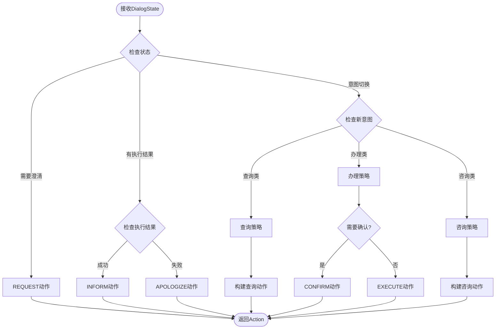

# 电信套餐AI智能客服系统 - 第三阶段Policy+NLG模块设计文档

## 第三阶段概述

### 1.1 阶段目标

**核心目标**：构建智能对话策略引擎和自然语言生成系统，让AI客服能够自主决策并生成人性化的回复。

**关键能力**：

1. ✨ **智能决策**：根据对话状态自动决定下一步动作
2. 🎯 **主动引导**：引导用户完成业务流程
3. 💬 **自然回复**：生成流畅、个性化的对话内容
4. 🔄 **异常处理**：处理各种边界情况和错误场景
5. 📊 **效果评估**：对话质量评估和优化

### 1.2 核心模块

```
┌─────────────────────────────────────┐
│          Policy Engine               │
│  - 动作决策                          │
│  - 策略规则                          │
│  - 流程控制                          │
└─────────────────────────────────────┘
                 ↓
┌─────────────────────────────────────┐
│          NLG Generator               │
│  - 模板生成                          │
│  - LLM生成                           │
│  - 混合策略                          │
└─────────────────────────────────────┘
```


## Policy模块详细设计

### 2.1 Policy模块核心概念

#### 什么是Policy？

Policy（对话策略）是对话系统的"大脑"，负责：

- 📋 根据当前对话状态决定下一步动作
- 🎯 选择最合适的响应策略
- 🔄 控制对话流程
- ⚠️ 处理异常情况

**Policy的输入和输出** 

```
输入:
- DialogState (对话状态)
- NLUResult (意图识别结果)
- ExecutionResult (业务执行结果)

处理:
- 策略匹配
- 决策逻辑
- 优先级判断

输出:
- Action (系统动作)
- ActionParameters (动作参数)
```

### 2.2 动作类型定义

**系统动作分类** 

| 动作类型      | 说明             | 示例                         |
| ------------- | ---------------- | ---------------------------- |
| **REQUEST**   | 请求用户提供信息 | "请问您的手机号是多少？"     |
| **INFORM**    | 告知用户信息     | "为您找到3个套餐..."         |
| **CONFIRM**   | 确认用户意图     | "您是要办理经济套餐吗？"     |
| **RECOMMEND** | 主动推荐         | "根据您的需求，推荐畅游套餐" |
| **EXECUTE**   | 执行业务操作     | 调用数据库/API               |
| **CLARIFY**   | 澄清歧义         | "您是想查询还是办理？"       |
| **APOLOGIZE** | 致歉             | "抱歉，暂时无法处理..."      |
| **CLOSE**     | 结束对话         | "还有什么可以帮您的吗？"     |

**Action数据结构** 

```python
@dataclass
class Action:
    """系统动作"""
    action_type: str  # 动作类型
    intent: str  # 对应的意图
    parameters: Dict[str, Any]  # 动作参数
    priority: int = 0  # 优先级
    requires_confirmation: bool = False  # 是否需要确认
    
    # NLG相关
    template_key: Optional[str] = None  # 模板键
    use_llm: bool = False  # 是否使用LLM生成
```

 ### 2.3 策略决策流程

**完整决策流程图** 



**决策伪代码**

```python
def decide_action(dialog_state: DialogState, 
                  exec_result: Optional[Dict]) -> Action:
    """
    策略决策主函数
    
    决策优先级:
    1. 异常处理
    2. 槽位填充
    3. 确认流程
    4. 业务执行
    5. 主动推荐
    """
    
    # 1. 异常处理
    if exec_result and not exec_result.get("success"):
        return Action(
            action_type="APOLOGIZE",
            intent=dialog_state.current_intent,
            parameters={"error": exec_result.get("error")}
        )
    
    # 2. 槽位填充
    if dialog_state.needs_clarification:
        missing_slot = dialog_state.missing_slots[0]
        return Action(
            action_type="REQUEST",
            intent=dialog_state.current_intent,
            parameters={"slot": missing_slot}
        )
    
    # 3. 确认流程
    if needs_confirmation(dialog_state):
        return Action(
            action_type="CONFIRM",
            intent=dialog_state.current_intent,
            parameters=dialog_state.slots,
            requires_confirmation=True
        )
    
    # 4. 业务执行成功
    if exec_result and exec_result.get("success"):
        action = Action(
            action_type="INFORM",
            intent=dialog_state.current_intent,
            parameters=exec_result
        )
        
        # 5. 主动推荐
        if should_recommend(dialog_state, exec_result):
            action.parameters["recommendation"] = generate_recommendation(
                dialog_state, exec_result
            )
        
        return action
    
    # 默认执行
    return Action(
        action_type="EXECUTE",
        intent=dialog_state.current_intent,
        parameters=dialog_state.slots
    )
```

### 2.4 策略规则库

**规则优先级** 

```
优先级从高到低:
1️⃣ 安全规则 (Safety Rules)
2️⃣ 业务规则 (Business Rules)
3️⃣ 引导规则 (Guidance Rules)
4️⃣ 优化规则 (Optimization Rules)
```

**关键策略规则**

* 规则1: 高风险操作确认

```python
@policy_rule(priority=1)
def confirm_risky_action(state: DialogState) -> bool:
    """高风险操作需要确认"""
    risky_intents = ["change_package", "cancel_service"]
    
    if state.current_intent in risky_intents:
        if not state.user_profile.get("confirmed"):
            return True  # 需要确认
    
    return False
```

* 规则2: 多结果时主动推荐

```python
@policy_rule(priority=3)
def recommend_on_multiple_results(exec_result: Dict) -> bool:
    """当查询结果过多时,主动推荐"""
    if exec_result.get("count", 0) > 3:
        return True  # 需要推荐
    return False
```

* 规则3: 价格敏感引导

```python
@policy_rule(priority=3)
def guide_price_sensitive_user(state: DialogState) -> Optional[str]:
    """识别价格敏感用户,引导至经济套餐"""
    if state.slots.get("price_max") and state.slots["price_max"] < 100:
        return "我们的经济套餐性价比很高,您可以了解一下"
    return None
```

### 2.5 确认策略

#### 何时需要确认？

1. 显式确认

   （用户主动要求）

   - "帮我办理经济套餐" → 确认套餐和手机号

2. 隐式确认

   （系统判断需要）

   - 重要操作（套餐变更）
   - 费用变化
   - 不可逆操作

#### 确认流程

```
用户: "我要办理畅游套餐"
   ↓
Policy: 需要确认 (change_package)
   ↓
NLG: "确认为手机号13800138000办理【畅游套餐】(180元/月,100GB流量)吗?"
   ↓
用户: "确认" / "是的"
   ↓
Policy: 执行办理
   ↓
NLG: "已成功为您办理【畅游套餐】,次月生效"
```


## NLG模块详细设计

### 3.1 NLG核心概念

#### 什么是NLG？

NLG（Natural Language Generation）负责将结构化数据转换为自然语言：

```
输入: Action + Data
  ↓
[NLG处理]
  ↓
输出: 自然语言文本
```

#### NLG的三种策略

| 策略     | 优点               | 缺点           | 适用场景     |
| -------- | ------------------ | -------------- | ------------ |
| 模板化   | 快速、可控、稳定   | 灵活性差       | 固定格式回复 |
| LLM生成  | 灵活、自然、个性化 | 成本高、不可控 | 复杂场景     |
| 混合策略 | 平衡效果和成本     | 实现复杂       | 推荐使用 ⭐   |

### 3.2 模板化NLG

#### 模板设计原则

1. **变量化**：使用占位符
2. **多样化**：同一场景多个模板
3. **个性化**：根据用户特征选择
4. **层次化**：模板分级管理

```python
RESPONSE_TEMPLATES = {
    # REQUEST类模板
    "REQUEST": {
        "phone": [
            "请问您的手机号是多少呢？",
            "为了查询您的信息，需要您提供手机号",
            "可以告诉我您的手机号码吗？"
        ],
        "package_name": [
            "请问您想了解哪个套餐？我们有{package_list}",
            "您想办理哪个套餐呢？",
        ]
    },
    
    # INFORM类模板
    "INFORM": {
        "query_packages": {
            "single": "为您找到【{name}】套餐:\n💰 月费: {price}元\n📊 流量: {data_gb}GB",
            "multiple": "为您找到 {count} 个套餐:\n{package_list}",
            "empty": "抱歉，没有找到符合条件的套餐。要不要看看其他套餐？"
        }
    },
    
    # CONFIRM类模板
    "CONFIRM": {
        "change_package": [
            "确认为手机号{phone}办理【{package_name}】({price}元/月)吗？",
            "您要将{phone}的套餐更换为【{package_name}】，确认吗？"
        ]
    },
    
    # APOLOGIZE类模板
    "APOLOGIZE": {
        "system_error": "抱歉，系统遇到了一些问题，请稍后再试",
        "not_found": "抱歉，{error_detail}",
        "invalid_input": "您提供的{field}格式不正确，请重新输入"
    }
}
```

模板选择逻辑

```python
def select_template(action: Action, state: DialogState) -> str:
    """智能选择模板"""
    
    # 1. 获取基础模板列表
    templates = RESPONSE_TEMPLATES[action.action_type].get(
        action.intent, 
        RESPONSE_TEMPLATES[action.action_type].get("default")
    )
    
    # 2. 根据上下文选择
    if isinstance(templates, dict):
        # 根据数据特征选择
        if action.parameters.get("count") == 0:
            template = templates["empty"]
        elif action.parameters.get("count") == 1:
            template = templates["single"]
        else:
            template = templates["multiple"]
    elif isinstance(templates, list):
        # 随机选择（增加多样性）
        template = random.choice(templates)
    else:
        template = templates
    
    # 3. 个性化调整
    if state.turn_count > 10:
        # 老客户，使用更亲切的表达
        template = make_more_friendly(template)
    
    return template
```

### 3.3 LLM生成NLG

#### 使用场景

- ❌ 不适合：简单查询、固定格式
- ✅ 适合：
  - 复杂推荐解释
  - 个性化建议
  - 情感化回复
  - 多维度对比

#### LLM Prompt设计

```python
NLG_SYSTEM_PROMPT = """你是一个专业的电信客服,负责生成自然、友好的回复。

【生成原则】
1. 语气亲切专业,不过分热情
2. 信息准确完整,突出关键点
3. 简洁明了,避免冗余
4. 根据用户特征调整风格

【输出要求】
- 直接输出回复文本,无需任何标记
- 长度控制在150字以内
- 使用emoji增强可读性(适度)
"""

def generate_with_llm(action: Action, state: DialogState) -> str:
    """使用LLM生成回复"""
    
    # 构建上下文
    context = {
        "action": action.action_type,
        "intent": action.intent,
        "data": action.parameters,
        "user_info": {
            "turn_count": state.turn_count,
            "history_intents": get_recent_intents(state)
        }
    }
    
    # 构建提示
    user_prompt = f"""
根据以下信息生成客服回复:

【动作类型】{action.action_type}
【业务意图】{action.intent}
【数据内容】{json.dumps(context['data'], ensure_ascii=False)}
【用户特征】对话轮次:{state.turn_count}

请生成自然的客服回复:
"""
    
    response = llm_client.chat.completions.create(
        model="deepseek-chat",
        messages=[
            {"role": "system", "content": NLG_SYSTEM_PROMPT},
            {"role": "user", "content": user_prompt}
        ],
        temperature=0.7,
        max_tokens=200
    )
    
    return response.choices[0].message.content
```

### 3.4 混合策略NLG（推荐⭐）

#### 策略选择规则

```python
def choose_nlg_strategy(action: Action, state: DialogState) -> str:
    """
    选择NLG策略
    
    决策树:
    1. 简单动作 → 模板
    2. 复杂推荐 → LLM
    3. 确认类 → 模板
    4. 异常处理 → 模板
    """
    
    # 规则1: REQUEST和CONFIRM总是用模板
    if action.action_type in ["REQUEST", "CONFIRM"]:
        return "template"
    
    # 规则2: 推荐场景用LLM
    if action.parameters.get("recommendation"):
        return "llm"
    
    # 规则3: 多套餐对比用LLM
    if action.parameters.get("count", 0) > 3:
        return "llm"
    
    # 规则4: 其他用模板
    return "template"
```

#### 混合生成流程

```python
def generate_response(action: Action, state: DialogState) -> str:
    """混合策略生成回复"""
    
    strategy = choose_nlg_strategy(action, state)
    
    if strategy == "template":
        # 模板生成
        template = select_template(action, state)
        response = template.format(**action.parameters)
        
    elif strategy == "llm":
        # LLM生成
        response = generate_with_llm(action, state)
        
    else:
        # 模板基础 + LLM增强
        base_response = select_template(action, state)
        enhancement = generate_enhancement_with_llm(action, state)
        response = f"{base_response}\n\n{enhancement}"
    
    # 后处理
    response = post_process(response, state)
    
    return response
```

### 3.5 回复后处理

#### 后处理功能

```python
def post_process(response: str, state: DialogState) -> str:
    """回复后处理"""
    
    # 1. 长度控制
    if len(response) > 500:
        response = truncate_response(response, max_length=500)
    
    # 2. 格式优化
    response = format_response(response)
    
    # 3. 添加引导语
    if should_add_guidance(state):
        response += "\n\n还有什么可以帮您的吗？"
    
    # 4. 敏感词过滤
    response = filter_sensitive_words(response)
    
    return response

def format_response(text: str) -> str:
    """格式化回复"""
    # 统一换行符
    text = text.replace('\r\n', '\n')
    
    # 去除多余空行
    text = re.sub(r'\n{3,}', '\n\n', text)
    
    # emoji前后加空格
    text = re.sub(r'([^\s])([\U0001F300-\U0001F9FF])', r'\1 \2', text)
    
    return text.strip()
```

## 技术实现

### 4.1 核心类设计

#### PolicyEngine类

```python
class PolicyEngine:
    """对话策略引擎"""
    
    def __init__(self):
        self.rules = self._load_rules()
        self.logger = logger
    
    def decide(self, 
               state: DialogState, 
               exec_result: Optional[Dict] = None) -> Action:
        """
        决策主函数
        
        Args:
            state: 对话状态
            exec_result: 执行结果
            
        Returns:
            Action: 决策的动作
        """
        # 1. 异常处理
        if exec_result and not exec_result.get("success"):
            return self._handle_error(state, exec_result)
        
        # 2. 槽位填充
        if state.needs_clarification:
            return self._request_slot(state)
        
        # 3. 应用策略规则
        for rule in self.rules:
            if rule.match(state):
                action = rule.apply(state, exec_result)
                if action:
                    return action
        
        # 4. 默认策略
        return self._default_action(state, exec_result)
    
    def _handle_error(self, state: DialogState, exec_result: Dict) -> Action:
        """错误处理"""
        return Action(
            action_type="APOLOGIZE",
            intent=state.current_intent,
            parameters={
                "error": exec_result.get("error"),
                "error_type": self._classify_error(exec_result)
            }
        )
    
    def _request_slot(self, state: DialogState) -> Action:
        """请求槽位"""
        missing_slot = state.missing_slots[0]
        return Action(
            action_type="REQUEST",
            intent=state.current_intent,
            parameters={
                "slot": missing_slot,
                "context": state.slots
            },
            template_key=f"request_{missing_slot}"
        )
```

#### NLGGenerator类

```python
class NLGGenerator:
    """自然语言生成器"""
    
    def __init__(self):
        self.templates = RESPONSE_TEMPLATES
        self.llm_client = get_llm_client()
    
    def generate(self, action: Action, state: DialogState) -> str:
        """
        生成回复
        
        Args:
            action: 系统动作
            state: 对话状态
            
        Returns:
            str: 生成的回复文本
        """
        # 选择策略
        strategy = self._choose_strategy(action, state)
        
        # 生成回复
        if strategy == "template":
            response = self._generate_from_template(action, state)
        elif strategy == "llm":
            response = self._generate_from_llm(action, state)
        else:
            response = self._generate_hybrid(action, state)
        
        # 后处理
        response = self._post_process(response, state)
        
        return response
    
    def _generate_from_template(self, action: Action, state: DialogState) -> str:
        """模板生成"""
        template = self._select_template(action, state)
        
        try:
            return template.format(**action.parameters)
        except KeyError as e:
            self.logger.error(f"模板参数缺失: {e}")
            return self._fallback_response(action)
    
    def _generate_from_llm(self, action: Action, state: DialogState) -> str:
        """LLM生成"""
        prompt = self._build_prompt(action, state)
        
        response = self.llm_client.chat.completions.create(
            model="deepseek-chat",
            messages=[
                {"role": "system", "content": NLG_SYSTEM_PROMPT},
                {"role": "user", "content": prompt}
            ],
            temperature=0.7,
            max_tokens=200
        )
        
        return response.choices[0].message.content
```

### 4.2 完整对话流程

#### TelecomChatbotPhase3类

```python
class TelecomChatbotPhase3:
    """第三阶段完整对话系统"""
    
    def __init__(self):
        self.nlu = NLUEngine()          # 第一阶段
        self.dst = DialogStateTracker()  # 第二阶段
        self.policy = PolicyEngine()     # ⭐ 第三阶段
        self.nlg = NLGGenerator()        # ⭐ 第三阶段
        self.db_executor = DatabaseExecutor()
    
    def chat(self, user_input: str, session_id: str = None) -> Dict:
        """完整对话处理"""
        
        if not session_id:
            session_id = str(uuid.uuid4())
        
        # 1. NLU理解
        nlu_result = self.nlu.understand(user_input, session_id)
        nlu_result.raw_input = user_input
        
        # 2. DST状态跟踪
        dialog_state = self.dst.track(session_id, nlu_result)
        
        # 3. Policy决策 ⭐
        exec_result = None
        if not dialog_state.needs_clarification:
            exec_result = self.db_executor.execute_function(
                dialog_state.current_intent,
                dialog_state.slots
            )
        
        action = self.policy.decide(dialog_state, exec_result)
        
        # 4. NLG生成 ⭐
        response_text = self.nlg.generate(action, dialog_state)
        
        # 5. 更新状态
        dialog_state.add_turn('assistant', response_text)
        self.dst.state_store.save(session_id, dialog_state)
        
        return {
            "session_id": session_id,
            "response": response_text,
            "action": action.action_type,
            "intent": dialog_state.current_intent,
            "state": dialog_state.to_dict()
        }
```

## 高级特性

### 5.1 主动推荐

#### 推荐策略

```python
class RecommendationEngine:
    """推荐引擎"""
    
    def recommend(self, 
                  state: DialogState, 
                  query_result: Dict) -> Optional[Dict]:
        """
        生成推荐
        
        推荐逻辑:
        1. 基于用户画像
        2. 基于历史行为
        3. 基于当前查询
        """
        # 无需推荐的场景
        if query_result.get("count", 0) <= 1:
            return None
        
        # 提取用户特征
        user_features = self._extract_features(state)
        
        # 计算推荐分数
        candidates = query_result.get("data", [])
        scored = []
        
        for package in candidates:
            score = self._calculate_score(package, user_features)
            scored.append((package, score))
        
        # 选择最佳推荐
        scored.sort(key=lambda x: x[1], reverse=True)
        best_package = scored[0][0]
        
        return {
            "package": best_package,
            "reason": self._explain_recommendation(best_package, user_features),
            "confidence": scored[0][1]
        }
    
    def _calculate_score(self, package: Dict, features: Dict) -> float:
        """计算推荐分数"""
        score = 0.0
        
        # 价格匹配度
        if features.get("price_preference"):
            price_diff = abs(package["price"] - features["price_preference"])
            score += max(0, 100 - price_diff) * 0.4
        
        # 流量匹配度
        if features.get("data_usage"):
            if package["data_gb"] >= features["data_usage"]:
                score += 50 * 0.3
        
        # 性价比
        cpp = package["price"] / package["data_gb"]  # cost per GB
        score += (1 / cpp) * 0.3
        
        return score
```

### 5.2 多轮确认

#### 确认状态机

```python
[初始] → [待确认] → [已确认] → [执行]
           ↓
        [取消]
```

```python
class ConfirmationManager:
    """确认管理器"""
    
    def __init__(self):
        self.pending_confirmations = {}
    
    def need_confirmation(self, action: Action) -> bool:
        """判断是否需要确认"""
        # 重要操作需要确认
        risky_intents = ["change_package", "cancel_service"]
        
        if action.intent in risky_intents:
            return True
        
        # 大额费用需要确认
        if action.parameters.get("price", 0) > 200:
            return True
        
        return False
    
    def create_confirmation(self, 
                           session_id: str, 
                           action: Action) -> str:
        """创建确认请求"""
        confirmation_id = f"confirm_{session_id}_{int(time.time())}"
        
        self.pending_confirmations[confirmation_id] = {
            "action": action,
            "created_at": datetime.now(),
            "status": "pending"
        }
        
        return confirmation_id
    
    def handle_confirmation_response(self, 
                                     confirmation_id: str,
                                     user_response: str) -> Dict:
        """处理确认响应"""
        if confirmation_id not in self.pending_confirmations:
            return {"error": "确认已过期"}
        
        confirmation = self.pending_confirmations[confirmation_id]
        
        # 判断用户意图
        if self._is_positive(user_response):
            confirmation["status"] = "confirmed"
            return {
                "confirmed": True,
                "action": confirmation["action"]
            }
        else:
            confirmation["status"] = "cancelled"
            return {
                "confirmed": False,
                "message": "已取消操作"
            }
    
    def _is_positive(self, text: str) -> bool:
        """判断是否为肯定回复"""
        positive_words = ["确认", "是的", "对", "好的", "可以", "确定", "yes", "ok"]
        text_lower = text.lower()
        return any(word in text_lower for word in positive_words)
```

### 5.3 对话质量评估

#### 评估指标

```python
class DialogQualityEvaluator:
    """对话质量评估器"""
    
    def evaluate(self, session_id: str) -> Dict:
        """评估对话质量"""
        state = self.dst.get_state(session_id)
        
        metrics = {
            "task_success": self._eval_task_success(state),
            "efficiency": self._eval_efficiency(state),
            "user_satisfaction": self._eval_satisfaction(state),
            "response_quality": self._eval_response_quality(state)
        }
        
        metrics["overall_score"] = self._calculate_overall(metrics)
        
        return metrics
    
    def _eval_task_success(self, state: DialogState) -> float:
        """任务成功率"""
        if state.is_completed:
            return 1.0
        elif state.current_intent:
            return 0.5
        return 0.0
    
    def _eval_efficiency(self, state: DialogState) -> float:
        """对话效率(轮次)"""
        optimal_turns = self._get_optimal_turns(state.current_intent)
        actual_turns = state.turn_count
        
        if actual_turns <= optimal_turns:
            return 1.0
        else:
            return optimal_turns / actual_turns
    
    def _eval_satisfaction(self, state: DialogState) -> float:
        """用户满意度(基于行为)"""
        score = 1.0
        
        # 是否有重复询问
        if self._has_repetition(state):
            score -= 0.2
        
        # 是否有错误
        if self._has_errors(state):
            score -= 0.3
        
        return max(0, score)
```

## 测试方案

### 6.1 Policy测试

```python
class TestPolicyEngine:
    """Policy引擎测试"""
    
    def test_error_handling(self):
        """测试错误处理"""
        policy = PolicyEngine()
        state = DialogState(session_id="test_001")
        exec_result = {"success": False, "error": "数据库连接失败"}
        
        action = policy.decide(state, exec_result)
        
        assert action.action_type == "APOLOGIZE"
        assert "error" in action.parameters
    
    def test_confirmation_required(self):
        """测试确认流程"""
        policy = PolicyEngine()
        state = DialogState(
            session_id="test_002",
            current_intent="change_package",
            slots={"phone": "13800138000", "new_package_name": "畅游套餐"}
        )
        
        action = policy.decide(state)
        
        assert action.action_type == "CONFIRM"
        assert action.requires_confirmation == True
    
    def test_recommendation_trigger(self):
        """测试推荐触发"""
        policy = PolicyEngine()
        state = DialogState(session_id="test_003")
        exec_result = {
            "success": True,
            "count": 5,
            "data": [...]  # 5个套餐
        }
        
        action = policy.decide(state, exec_result)
        
        assert "recommendation" in action.parameters
```

### 6.2 NLG测试

```python
class TestNLGGenerator:
    """NLG生成器测试"""
    
    def test_template_generation(self):
        """测试模板生成"""
        nlg = NLGGenerator()
        action = Action(
            action_type="REQUEST",
            intent="query_packages",
            parameters={"slot": "phone"}
        )
        state = DialogState(session_id="test_001")
        
        response = nlg.generate(action, state)
        
        assert "手机号" in response
        assert len(response) < 100
    
    def test_llm_generation(self):
        """测试LLM生成"""
        nlg = NLGGenerator()
        action = Action(
            action_type="INFORM",
            intent="query_packages",
            parameters={
                "count": 5,
                "data": [...],
                "recommendation": {...}
            },
            use_llm=True
        )
        state = DialogState(session_id="test_002")
        
        response = nlg.generate(action, state)
        
        assert len(response) > 50
        assert "推荐" in response or "建议" in response
```

### 6.3 集成测试

```python
class TestPhase3Integration:
    """第三阶段集成测试"""
    
    def test_complete_flow(self):
        """测试完整流程"""
        chatbot = TelecomChatbotPhase3()
        
        # 第1轮：查询
        response1 = chatbot.chat("有便宜的套餐吗", "test_session")
        assert "套餐" in response1["response"]
        
        # 第2轮：办理
        response2 = chatbot.chat("办理经济套餐", "test_session")
        assert response2["action"] in ["REQUEST", "CONFIRM"]
        
        # 第3轮：确认
        response3 = chatbot.chat("13800138000", "test_session")
        if response3["action"] == "CONFIRM":
            response4 = chatbot.chat("确认", "test_session")
            assert "成功" in response4["response"]
```

## 性能优化

### 7.1 缓存策略

```python
class ResponseCache:
    """回复缓存"""
    
    def __init__(self):
        self.cache = {}
        self.ttl = 300  # 5分钟
    
    def get(self, cache_key: str) -> Optional[str]:
        """获取缓存"""
        if cache_key in self.cache:
            cached = self.cache[cache_key]
            if time.time() - cached["time"] < self.ttl:
                return cached["response"]
        return None
    
    def set(self, cache_key: str, response: str):
        """设置缓存"""
        self.cache[cache_key] = {
            "response": response,
            "time": time.time()
        }
    
    @staticmethod
    def generate_key(action: Action, state: DialogState) -> str:
        """生成缓存键"""
        # 对于确定性回复(如模板),使用缓存
        if action.action_type in ["REQUEST", "CONFIRM"]:
            return f"{action.action_type}_{action.intent}_{hash(str(action.parameters))}"
        return None  # 不缓存
```

### 7.2 异步处理

```python
import asyncio

class AsyncNLGGenerator(NLGGenerator):
    """异步NLG生成器"""
    
    async def generate_async(self, action: Action, state: DialogState) -> str:
        """异步生成"""
        strategy = self._choose_strategy(action, state)
        
        if strategy == "llm":
            response = await self._generate_from_llm_async(action, state)
        else:
            response = self._generate_from_template(action, state)
        
        return self._post_process(response, state)
    
    async def _generate_from_llm_async(self, action: Action, state: DialogState) -> str:
        """异步LLM生成"""
        # 使用异步HTTP客户端
        response = await self.async_llm_client.chat.completions.create(...)
        return response.choices[0].message.content
```


### 第三阶段成果

✅ **核心功能**

- Policy策略引擎：智能决策系统动作
- NLG生成器：三种生成策略（模板/LLM/混合）
- 高级特性：推荐、确认、质量评估

✅ **技术亮点**

- 规则驱动 + 数据驱动结合
- 模板效率 + LLM灵活性平衡
- 完整的异常处理机制

✅ **业务价值**

- 对话更自然流畅
- 主动引导用户
- 提升用户体验

### 下一步：第四阶段

**目标**：构建完整的Web应用和AI Agent

**规划**：

1. **Web后端**：FastAPI + WebSocket
2. **前端界面**：Vue.js聊天界面
3. **AI Agent**：工具调用、任务编排
4. **系统集成**：监控、日志、部署


## 附录

### A. 完整对话流程图

```
用户输入
   ↓
[NLU] 意图识别 + 实体抽取
   ↓
[DST] 状态跟踪 + 上下文管理
   ↓
[Policy] 策略决策
   ├─ 需要澄清？ → REQUEST
   ├─ 需要确认？ → CONFIRM
   ├─ 执行业务？ → EXECUTE
   └─ 告知结果？ → INFORM
   ↓
[NLG] 回复生成
   ├─ 模板生成（快速）
   ├─ LLM生成（灵活）
   └─ 混合策略（平衡）
   ↓
系统响应
```

