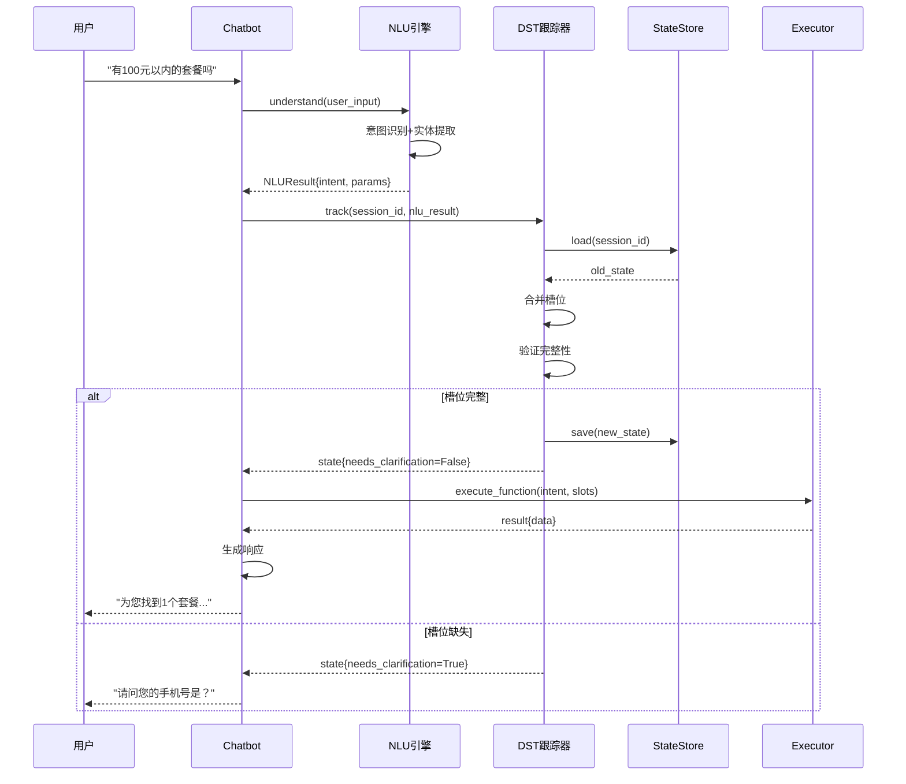
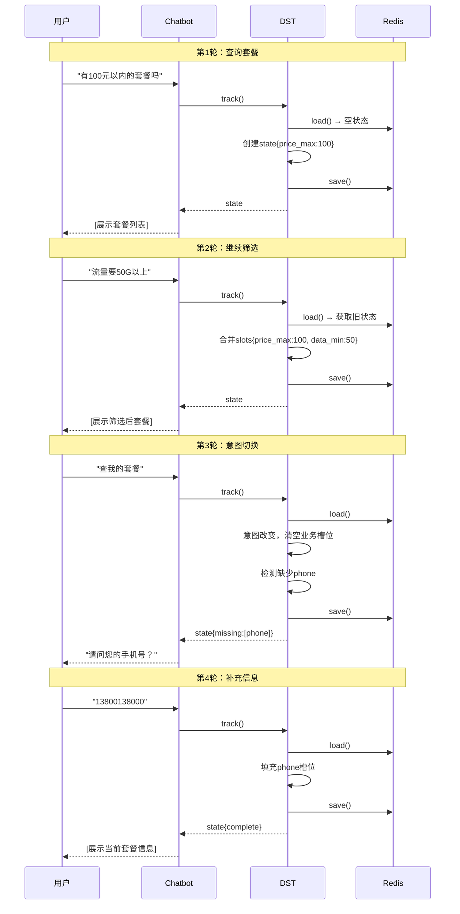
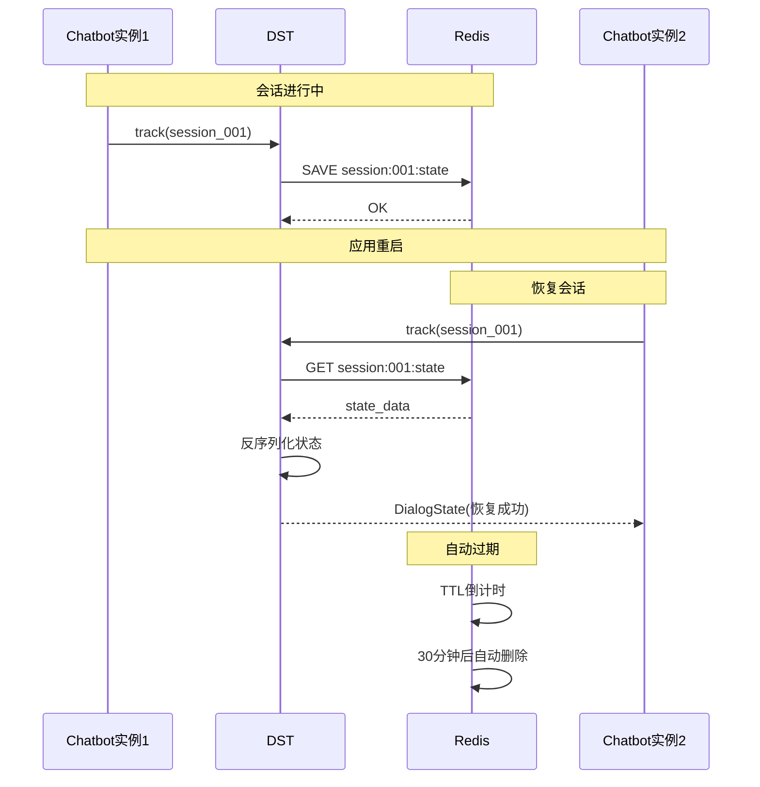
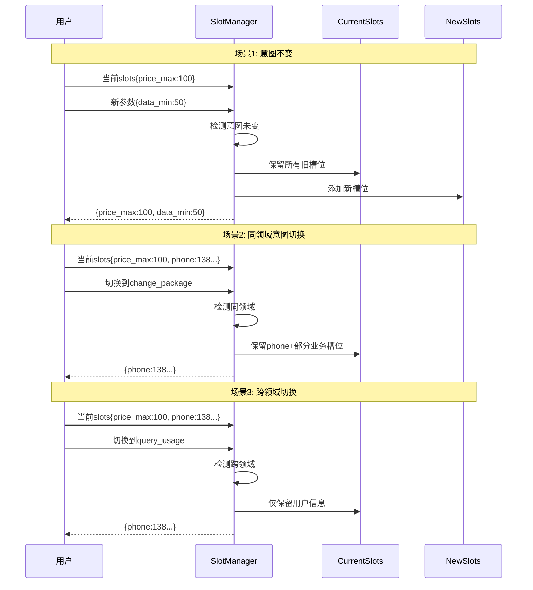

# 电信套餐AI智能客服系统 - 第二阶段DST模块设计文档


## 模块概述

### 1.1 什么是DST？

**DST (Dialog State Tracking)** - 对话状态跟踪，是对话系统的记忆中枢，负责：

```
┌─────────────────────────────────────┐
│           DST的核心职责              │
├─────────────────────────────────────┤
│ 1. 跟踪对话历史                      │
│ 2. 维护槽位状态                      │
│ 3. 管理用户信息                      │
│ 4. 处理上下文继承                    │
│ 5. 支持状态回滚                      │
│ 6. 会话持久化                        │
└─────────────────────────────────────┘
```

### 1.2 第二阶段目标

| 目标             | 说明                   |
| ---------------- | ---------------------- |
| **完善多轮对话** | 支持复杂的多轮对话场景 |
| **状态持久化**   | 使用Redis存储会话状态  |
| **上下文管理**   | 智能的上下文继承和重置 |
| **会话恢复**     | 支持断线重连后恢复对话 |
| **状态可视化**   | 提供状态查询和调试接口 |

### 1.3 与第一阶段的关系

```
第一阶段 (NLU)              第二阶段 (DST)
     ↓                           ↓
理解用户意图        →      跟踪对话状态
提取参数信息        →      维护槽位值
简单会话管理        →      复杂状态管理
内存存储           →      Redis持久化
```


## DST核心概念

### 六大核心概念详解

1. **DialogState (对话状态)** - 对话的完整快照
2. **Slot (槽位)** - 信息收集的基本单元
3. **Context (上下文)** - 对话的历史和环境
4. **StateStore (状态存储)** - Redis持久化层
5. **SlotManager (槽位管理器)** - 槽位智能管理
6. **ContextManager (上下文管理器)** - 上下文生命周期

### 2.1 对话状态 (Dialog State)

对话状态是对话系统在某个时刻的完整"快照"，包含：

```json
DialogState = {
    "session_id": "uuid",
    "user_info": {
        "phone": "13800138000",
        "name": "张三",
        "current_package": "经济套餐"
    },
    "current_intent": "query_packages",
    "slot_values": {
        "price_max": 100,
        "data_min": 50
    },
    "dialog_history": [
        {"role": "user", "content": "..."},
        {"role": "assistant", "content": "..."}
    ],
    "context_stack": [...],
    "timestamp": "2025-01-01 10:00:00",
    "turn_count": 5
}
```

### 2.2 槽位 (Slot)

槽位是需要从用户那里收集的信息：

| 槽位类型     | 示例                  | 特点           |
| ------------ | --------------------- | -------------- |
| **必填槽位** | phone, package_name   | 缺失时必须追问 |
| **可选槽位** | price_max, data_min   | 可以为空       |
| **系统槽位** | session_id, timestamp | 系统自动填充   |
| **临时槽位** | confirmation          | 仅在当前轮有效 |

**槽位生命周期**:

```
创建 → 填充 → 验证 → 使用 → 清理/继承
  ↓      ↓      ↓      ↓        ↓
EMPTY REQUESTED FILLED USED CLEARED/INHERITED
```

示例：

```
# 轮次1
用户: "有便宜的套餐吗"
槽位: {"sort_by": "price_asc"}  # 自动提取

# 轮次2  
用户: "100元以内"
槽位: {
    "sort_by": "price_asc",     # 继承
    "price_max": 100            # 新增
}

# 轮次3（意图切换）
用户: "查我的套餐"
槽位: {"phone": "13800138000"} # 仅保留用户信息
```

### 2.3 上下文管理 (Context)

**定义**: 对话的历史信息和环境信息

**作用**:

-  提供历史对话参考
-  支持上下文理解和推理
-  连接多轮对话的逻辑

**上下文类型**:

1. **短期上下文** - 当前对话轮次
2. **中期上下文** - 当前会话
3. **长期上下文** - 用户历史记录

```
┌─────────────────────────────────────┐
│          上下文层次结构              │
├─────────────────────────────────────┤
│ 1. 短期上下文 (当前轮次)             │
│    - 当前用户输入                    │
│    - 当前NLU结果                     │
│                                      │
│ 2. 中期上下文 (当前会话)             │
│    - 最近N轮对话历史                 │
│    - 当前意图和槽位                  │
│                                      │
│ 3. 长期上下文 (用户画像)             │
│    - 用户基本信息                    │
│    - 历史偏好                        │
│    - 使用习惯                        │
└─────────────────────────────────────┘
```

**上下文继承规则**:

```
# 规则1: 槽位继承
用户: "查下我的套餐"
系统: "请问手机号？"
用户: "13800138000"  # phone槽位填充
# 后续对话中phone槽位自动继承

# 规则2: 意图切换
用户: "有100元以内的套餐吗"  # intent: query_packages
系统: [展示套餐列表]
用户: "我现在用的是什么套餐"  # intent切换: query_current_package
# phone槽位继承，但其他槽位清空
```

**上下文栈结构**:

```
context_stack = [
    {
        "type": "intent_context",
        "intent": "query_packages",
        "slots": {"price_max": 100},
        "timestamp": "2025-01-01 10:00:00",
        "turn_id": 3
    },
    {
        "type": "user_context", 
        "phone": "13800138000",
        "preferences": {
            "favorite_package": "经济套餐"
        }
    }
]
```

**上下文管理规则**:

- ⏰ **时间衰减**: 超过5分钟的上下文自动清理
- 📏 **大小限制**: 最多保留10个上下文项
- 🎯 **优先级**: 用户信息 > 当前意图 > 历史意图


### 2.4 StateStore (状态存储)

**定义**: 状态的持久化存储层

**作用**:

- 💾 持久化保存对话状态
- 🚀 快速读写状态数据
- 🔄 支持应用重启后恢复

**存储策略**:

```
┌─────────────┐
│   第一阶段   │  内存存储 (dict)
│   NLU模块    │  - 快速但易丢失
└─────────────┘  - 不支持分布式
        ↓
┌─────────────┐
│   第二阶段   │  Redis存储 ⭐
│   DST模块    │  - 持久化
└─────────────┘  - 高性能
                 - 支持过期
                 - 支持分布式
```

**Redis数据结构设计**:

```
# 1. 会话状态 (Hash)
Key: session:{session_id}:state
Fields:
  - current_intent: "query_packages"
  - turn_count: "5"
  - user_phone: "13800138000"
  - slots: "{\"price_max\": 100}"
  - history: "[...]"
  - context_stack: "[...]"
TTL: 1800秒 (30分钟)

# 2. 用户会话列表 (Set)
Key: user:{phone}:sessions
Members: [session_id_1, session_id_2, ...]
TTL: 604800秒 (7天)

# 3. 会话元数据 (String)
Key: session:{session_id}:meta
Value: "{\"created_at\": \"...\", \"last_active\": \"...\"}"
TTL: 1800秒
```


### 2.5 SlotManager (槽位管理器)

**定义**: 管理槽位的填充、验证和继承

**作用**:

- 🔄 智能槽位继承
- ✅ 槽位完整性验证
- 🧹 槽位清理策略

**核心功能**:

#### 2.5.1 槽位填充

```python
def fill_slots(current_slots, new_slots, intent_changed):
    if not intent_changed:
        # 意图不变：完全合并
        return {**current_slots, **new_slots}
    elif 同领域:
        # 相同领域：保留用户信息 + 部分业务槽位
        return {**user_info_slots, **new_slots}
    else:
        # 不同领域：仅保留用户信息
        return {**user_info_only, **new_slots}
```

#### 2.5.2 槽位继承规则

| 场景     | 策略                  | 示例                            |
| -------- | --------------------- | ------------------------------- |
| 意图不变 | 全部继承              | query_packages → query_packages |
| 相同领域 | 保留用户信息+部分业务 | query_packages → change_package |
| 不同领域 | 仅保留用户信息        | query_packages → query_usage    |
| 明确重置 | 清空所有              | 用户说"重新开始"                |

#### 2.5.3 槽位验证

```python
def validate_slots(slots, required_slots):
    missing = []
    for slot in required_slots:
        if slot not in slots or slots[slot] is None:
            missing.append(slot)
    return missing
```

### 2.6 ContextManager (上下文管理器)

**定义**: 管理对话上下文的生命周期

**作用**:

- 📝 维护上下文栈
- 🧹 清理过期上下文
- 🔍 提取上下文信息

**核心算法**:

#### 2.6.1 上下文更新

```python
def update_context(context_stack, nlu_result):
    # 1. 清理过期上下文
    context_stack = clean_expired(context_stack)
    
    # 2. 添加新上下文
    new_context = {
        "intent": nlu_result.intent,
        "parameters": nlu_result.parameters,
        "timestamp": now()
    }
    context_stack.append(new_context)
    
    # 3. 限制栈大小
    if len(context_stack) > 10:
        context_stack = context_stack[-10:]
    
    return context_stack
```

#### 2.6.2 上下文清理

```python
def clean_expired_context(context_stack, ttl=300):
    now = datetime.now()
    threshold = now - timedelta(seconds=ttl)
    
    return [
        ctx for ctx in context_stack
        if ctx['timestamp'] > threshold
    ]
```


## 系统架构设计

###  整体架构图

```
┌─────────────────────────────────────────────────────┐
│                   用户交互层                          │
└─────────────────────────────────────────────────────┘
                         ↓
┌─────────────────────────────────────────────────────┐
│                  对话管理器                           │
│  ┌──────────┐  ┌──────────┐  ┌──────────┐         │
│  │SessionMgr│→│   NLU    │→│   DST    │ ⭐新增   │
│  └──────────┘  └──────────┘  └──────────┘         │
└─────────────────────────────────────────────────────┘
                         ↓
┌─────────────────────────────────────────────────────┐
│              DST核心模块 (第二阶段)                   │
│  ┌────────────────────────────────────────────┐    │
│  │         DialogStateTracker                  │    │
│  │  - 状态维护                                 │    │
│  │  - 槽位管理                                 │    │
│  │  - 上下文处理                               │    │
│  └────────────────────────────────────────────┘    │
│                         ↓                           │
│  ┌────────────────────────────────────────────┐    │
│  │         StateStore (Redis)                  │    │
│  │  - 会话持久化                               │    │
│  │  - 快速读写                                 │    │
│  │  - 过期管理                                 │    │
│  └────────────────────────────────────────────┘    │
└─────────────────────────────────────────────────────┘
                         ↓
┌─────────────────────────────────────────────────────┐
│                  执行层 + Policy                      │
└─────────────────────────────────────────────────────┘
```

### 3.2 DST模块分层

```
┌─────────────────────────────────────┐
│      DialogStateTracker (主类)       │
│  - track()      跟踪状态             │
│  - update()     更新状态             │
│  - get_state()  获取状态             │
│  - reset()      重置状态             │
└─────────────────────────────────────┘
              ↓
┌─────────────────────────────────────┐
│         StateManager                 │
│  - 状态初始化                         │
│  - 状态验证                           │
│  - 状态转移                           │
└─────────────────────────────────────┘
              ↓
┌─────────────────────────────────────┐
│         SlotManager                  │
│  - 槽位填充                           │
│  - 槽位验证                           │
│  - 槽位继承                           │
└─────────────────────────────────────┘
              ↓
┌─────────────────────────────────────┐
│         ContextManager               │
│  - 上下文提取                         │
│  - 上下文合并                         │
│  - 上下文清理                         │
└─────────────────────────────────────┘
              ↓
┌─────────────────────────────────────┐
│         StateStore (Redis)           │
│  - save()    保存状态                │
│  - load()    加载状态                │
│  - delete()  删除状态                │
└─────────────────────────────────────┘
```


### 3.3 数据流转

#### 3.3.1 完整数据流程

```
用户输入
   ↓
┌─────────────────┐
│ 1. NLU理解       │  输入: 用户文本
│                 │  输出: NLUResult
│ - 意图识别      │        {intent, params, ...}
│ - 实体提取      │
└─────────────────┘
   ↓
┌─────────────────┐
│ 2. DST跟踪      │  输入: NLUResult + session_id
│                 │  
│ 2.1 加载旧状态  │  ← Redis/内存
│ 2.2 合并信息    │
│ 2.3 验证槽位    │
│ 2.4 更新上下文  │
│ 2.5 保存状态    │  → Redis/内存
└─────────────────┘
   ↓
┌─────────────────┐
│ 3. 决策判断     │  输入: DialogState
│                 │  
│ if 需要澄清:    │  输出: 追问话术
│    return 追问   │
│ else:           │  输出: 执行指令
│    执行业务     │
└─────────────────┘
   ↓
┌─────────────────┐
│ 4. 业务执行     │  输入: Function + 参数
│                 │  
│ - 查询数据库    │  输出: 业务结果
│ - 调用API       │
└─────────────────┘
   ↓
┌─────────────────┐
│ 5. 生成响应     │  输入: 业务结果
│                 │  
│ - NLG生成       │  输出: 自然语言响应
│ - 格式化        │
└─────────────────┘
   ↓
系统响应
```

#### 3.3.2 DST内部流程

```
NLUResult输入
   ↓
┌──────────────────────────────────┐
│ Step 1: 加载旧状态                │
│                                   │
│ old_state = StateStore.load()    │
│                                   │
│ if Redis可用:                     │
│   从Redis加载                     │
│ else:                             │
│   从内存加载                      │
└──────────────────────────────────┘
   ↓
┌──────────────────────────────────┐
│ Step 2: 判断意图变化              │
│                                   │
│ intent_changed = (old_intent !=   │
│                   new_intent)     │
└──────────────────────────────────┘
   ↓
┌──────────────────────────────────┐
│ Step 3: 槽位管理                  │
│                                   │
│ new_slots = SlotManager.fill(    │
│   old_slots,                      │
│   nlu_params,                     │
│   intent_changed                  │
│ )                                 │
└──────────────────────────────────┘
   ↓
┌──────────────────────────────────┐
│ Step 4: 上下文补全                │
│                                   │
│ 从context_stack提取用户信息       │
│ 补全缺失的槽位                    │
└──────────────────────────────────┘
   ↓
┌──────────────────────────────────┐
│ Step 5: 更新上下文栈              │
│                                   │
│ context_stack =                   │
│   ContextManager.update()         │
└──────────────────────────────────┘
   ↓
┌──────────────────────────────────┐
│ Step 6: 构建新状态                │
│                                   │
│ new_state = DialogState(...)      │
└──────────────────────────────────┘
   ↓
┌──────────────────────────────────┐
│ Step 7: 验证完整性                │
│                                   │
│ missing = validate_slots()        │
│                                   │
│ if missing:                       │
│   state.needs_clarification=True  │
└──────────────────────────────────┘
   ↓
┌──────────────────────────────────┐
│ Step 8: 保存状态                  │
│                                   │
│ StateStore.save(new_state)        │
│                                   │
│ → Redis (持久化)                  │
└──────────────────────────────────┘
   ↓
返回DialogState
```

### 3.4 时序图

#### 3.4.1 单轮对话时序图



#### 3.4.2 多轮对话时序图



#### 3.4.3 状态持久化时序图



#### 3.4.4 槽位继承时序图




## 详细设计方案

### 4.1 核心功能需求

#### 4.1.1 状态跟踪

**功能描述**: 跟踪和记录对话的完整状态

**场景示例**:

```
轮次1:
用户: "有便宜的套餐吗"
DST状态: {
  "intent": "query_packages",
  "slots": {"sort_by": "price_asc"},
  "turn": 1
}

轮次2:
用户: "100元以内的"
DST状态: {
  "intent": "query_packages",  # 继承
  "slots": {
    "sort_by": "price_asc",    # 继承
    "price_max": 100            # 新增
  },
  "turn": 2
}
```

####  4.1.2 槽位管理

**槽位生命周期**:

```
槽位状态机:
EMPTY → REQUESTED → FILLED → CONFIRMED
  ↑                              ↓
  └──────────── CLEARED ─────────┘
```

**槽位继承策略**:

| 场景               | 策略               |
| ------------------ | ------------------ |
| 意图不变           | 所有槽位继承       |
| 意图切换，相同领域 | 用户信息槽位继承   |
| 意图切换，不同领域 | 仅保留用户基本信息 |
| 明确取消           | 清空所有槽位       |

#### 4.1.3 上下文管理

**上下文栈设计**:

```
context_stack = [
    {
        "type": "intent_context",
        "intent": "query_packages",
        "slots": {...},
        "created_at": "..."
    },
    {
        "type": "user_context",
        "phone": "13800138000",
        "preferences": {...}
    }
]
```

**上下文清理规则**:

* 超过5轮未使用 → 清理

* 意图完全切换 → 清理旧意图上下文

* 用户明确重置 → 全部清理


#### 4.1.4 会话持久化

**Redis存储方案**:

```
Key设计:
- session:{session_id}:state          # 对话状态
- session:{session_id}:history        # 对话历史
- session:{session_id}:slots          # 槽位值
- user:{phone}:sessions               # 用户会话列表
- user:{phone}:profile                # 用户画像

过期策略:
- 活跃会话: 30分钟无操作后过期
- 历史记录: 7天后过期
- 用户画像: 永久保存
```

### 4.2 状态转移逻辑

状态转移图

```
[开始会话]
     ↓
[初始化状态]
     ↓
[接收用户输入] ←─────┐
     ↓               │
[NLU理解]           │
     ↓               │
[加载旧状态]         │
     ↓               │
[合并新信息]         │
     ↓               │
[验证完整性]         │
     ↓               │
  完整？             │
     ├─ 否 → [追问] ─┘
     └─ 是
        ↓
   [执行动作]
        ↓
   [更新状态]
        ↓
   [保存状态]
        ↓
     继续？
     ├─ 是 → [接收用户输入]
     └─ 否 → [结束会话]
```


### 4.3 错误处理和恢复

异常场景处理

| 异常场景      | 处理策略                |
| ------------- | ----------------------- |
| Redis连接失败 | 降级到内存存储          |
| 状态数据损坏  | 重新初始化状态          |
| 槽位冲突      | 以最新值为准            |
| 会话超时      | 提示用户并重新开始      |
| 并发更新      | 使用Redis事务保证一致性 |

状态回滚

```
# 支持状态回滚到上一轮
def rollback(session_id, steps=1):
    """回滚状态"""
    history = load_state_history(session_id)
    target_state = history[-steps]
    save_state(session_id, target_state)
```


## 技术实现

### 5.1 技术选型

| 组件         | 技术选型       | 理由                       |
| ------------ | -------------- | -------------------------- |
| **状态存储** | Redis          | 高性能、支持过期、原子操作 |
| **序列化**   | JSON           | 可读性好、兼容性强         |
| **并发控制** | Redis事务      | 保证状态一致性             |
| **连接池**   | redis-py连接池 | 提高性能                   |

### 5.2 Redis数据结构

#### 5.2.1 对话状态

```
# Hash结构存储对话状态
HSET session:{session_id}:state
  current_intent "query_packages"
  turn_count "3"
  created_at "2025-01-01 10:00:00"
  updated_at "2025-01-01 10:05:00"

EXPIRE session:{session_id}:state 1800  # 30分钟过期
```

#### 5.2.2 槽位值

```
# Hash结构存储槽位
HSET session:{session_id}:slots
  phone "13800138000"
  price_max "100"
  data_min "50"

EXPIRE session:{session_id}:slots 1800
```

#### 5.2.3 对话历史

```
# List结构存储历史
LPUSH session:{session_id}:history
  '{"role":"user","content":"...","timestamp":"..."}'

# 限制历史长度
LTRIM session:{session_id}:history 0 19  # 保留最近20条

EXPIRE session:{session_id}:history 1800
```

#### 5.2.4 用户会话列表

```
# Set结构存储用户的所有会话
SADD user:{phone}:sessions
  "session_id_1"
  "session_id_2"

EXPIRE user:{phone}:sessions 604800  # 7天过期
```

### 5.3 核心算法

#### 5.3.1 槽位填充算法

```
def fill_slots(current_slots, new_slots, intent_changed):
    """
    槽位填充算法
    
    策略:
    1. 新槽位直接覆盖
    2. 意图未变，保留旧槽位
    3. 意图改变，仅保留用户信息槽位
    """
    if intent_changed:
        # 仅保留用户信息槽位
        user_slots = {
            k: v for k, v in current_slots.items()
            if k in ['phone', 'name']
        }
        result = {**user_slots, **new_slots}
    else:
        # 合并槽位，新值覆盖旧值
        result = {**current_slots, **new_slots}
    
    return result
```

#### 5.3.2 上下文继承算法

```
def inherit_context(old_context, new_intent):
    """
    上下文继承算法
    
    规则:
    - 相同意图: 完全继承
    - 不同意图: 继承用户信息
    - 新会话: 不继承
    """
    if not old_context:
        return {}
    
    old_intent = old_context.get('intent')
    
    if old_intent == new_intent:
        # 完全继承
        return old_context
    elif is_same_domain(old_intent, new_intent):
        # 继承用户信息
        return {
            'phone': old_context.get('phone'),
            'user_profile': old_context.get('user_profile')
        }
    else:
        # 不继承
        return {}
```

## 数据结构设计

### 6.1 DialogState 类

```
@dataclass
class DialogState:
    """对话状态"""
    session_id: str
    user_phone: Optional[str] = None
    current_intent: Optional[str] = None
    previous_intent: Optional[str] = None
    
    # 槽位值
    slots: Dict[str, Any] = field(default_factory=dict)
    
    # 对话历史
    history: List[DialogTurn] = field(default_factory=list)
    
    # 上下文栈
    context_stack: List[Dict] = field(default_factory=list)
    
    # 元数据
    turn_count: int = 0
    created_at: datetime = field(default_factory=datetime.now)
    updated_at: datetime = field(default_factory=datetime.now)
    
    # 状态标志
    is_completed: bool = False
    needs_clarification: bool = False
    missing_slots: List[str] = field(default_factory=list)
```

### 6.2 DialogTurn 类

```
@dataclass
class DialogTurn:
    """对话轮次"""
    turn_id: int
    role: str  # 'user' or 'assistant'
    content: str
    intent: Optional[str] = None
    entities: Dict[str, Any] = field(default_factory=dict)
    timestamp: datetime = field(default_factory=datetime.now)
```

### 6.3 SlotValue 类

```
@dataclass
class SlotValue:
    """槽位值"""
    name: str
    value: Any
    confidence: float = 1.0
    source: str = "user"  # user/system/inherited
    filled_at: datetime = field(default_factory=datetime.now)
    is_confirmed: bool = False
```

## 核心代码实现

### 7.1 目录结构

```
core/dst/
├── __init__.py
├── dialog_state.py          # 对话状态数据类
├── dialog_state_tracker.py  # 状态跟踪器
├── state_manager.py         # 状态管理器
├── slot_manager.py          # 槽位管理器
├── context_manager.py       # 上下文管理器
└── state_store.py           # Redis存储

database/
└── redis_manager.py         # Redis连接管理
```

### 7.2 DialogStateTracker 主类

```
class DialogStateTracker:
    """对话状态跟踪器"""
    
    def __init__(self):
        self.state_store = StateStore()
        self.state_manager = StateManager()
        self.slot_manager = SlotManager()
        self.context_manager = ContextManager()
    
    def track(self, session_id: str, nlu_result: NLUResult) -> DialogState:
        """
        跟踪对话状态
        
        Args:
            session_id: 会话ID
            nlu_result: NLU解析结果
        
        Returns:
            更新后的对话状态
        """
        # 1. 加载旧状态
        old_state = self.state_store.load(session_id)
        
        # 2. 创建新轮次
        turn = self._create_turn(nlu_result)
        
        # 3. 更新意图
        new_intent = nlu_result.intent
        intent_changed = (old_state.current_intent != new_intent)
        
        # 4. 更新槽位
        new_slots = self.slot_manager.fill_slots(
            old_state.slots,
            nlu_result.parameters,
            intent_changed
        )
        
        # 5. 更新上下文
        new_context = self.context_manager.update_context(
            old_state.context_stack,
            nlu_result
        )
        
        # 6. 构建新状态
        new_state = DialogState(
            session_id=session_id,
            user_phone=old_state.user_phone or nlu_result.parameters.get('phone'),
            current_intent=new_intent,
            previous_intent=old_state.current_intent,
            slots=new_slots,
            history=old_state.history + [turn],
            context_stack=new_context,
            turn_count=old_state.turn_count + 1,
            updated_at=datetime.now()
        )
        
        # 7. 验证完整性
        self._validate_state(new_state)
        
        # 8. 保存状态
        self.state_store.save(session_id, new_state)
        
        return new_state
    
    def get_state(self, session_id: str) -> DialogState:
        """获取对话状态"""
        return self.state_store.load(session_id)
    
    def reset_state(self, session_id: str):
        """重置对话状态"""
        self.state_store.delete(session_id)
```

### 7.3 StateStore (Redis存储)

```
class StateStore:
    """状态存储 - Redis实现"""
    
    def __init__(self):
        self.redis = redis_manager.get_client()
        self.ttl = settings.SESSION_TIMEOUT  # 30分钟
    
    def save(self, session_id: str, state: DialogState):
        """保存状态"""
        key = f"session:{session_id}:state"
        
        # 序列化状态
        state_data = {
            "session_id": state.session_id,
            "user_phone": state.user_phone,
            "current_intent": state.current_intent,
            "previous_intent": state.previous_intent,
            "slots": json.dumps(state.slots),
            "history": json.dumps([asdict(t) for t in state.history], default=str),
            "context_stack": json.dumps(state.context_stack),
            "turn_count": state.turn_count,
            "created_at": state.created_at.isoformat(),
            "updated_at": state.updated_at.isoformat()
        }
        
        # 保存到Redis
        pipe = self.redis.pipeline()
        pipe.delete(key)
        pipe.hmset(key, state_data)
        pipe.expire(key, self.ttl)
        pipe.execute()
    
    def load(self, session_id: str) -> DialogState:
        """加载状态"""
        key = f"session:{session_id}:state"
        data = self.redis.hgetall(key)
        
        if not data:
            # 返回新状态
            return DialogState(session_id=session_id)
        
        # 反序列化
        return DialogState(
            session_id=session_id,
            user_phone=data.get('user_phone'),
            current_intent=data.get('current_intent'),
            previous_intent=data.get('previous_intent'),
            slots=json.loads(data.get('slots', '{}')),
            history=[DialogTurn(**t) for t in json.loads(data.get('history', '[]'))],
            context_stack=json.loads(data.get('context_stack', '[]')),
            turn_count=int(data.get('turn_count', 0)),
            created_at=datetime.fromisoformat(data.get('created_at')),
            updated_at=datetime.fromisoformat(data.get('updated_at'))
        )
    
    def delete(self, session_id: str):
        """删除状态"""
        key = f"session:{session_id}:state"
        self.redis.delete(key)
```

## 与第一阶段集成

### 8.1 集成架构

```
┌─────────────────────────────────────┐
│      TelecomChatbotPhase2            │
├─────────────────────────────────────┤
│  def chat(user_input, session_id):  │
│    1. nlu_result = NLU.understand() │ ← 第一阶段
│    2. state = DST.track()           │ ← 第二阶段 ⭐
│    3. action = Policy.decide()      │ ← 第三阶段
│    4. result = Executor.execute()   │ ← 第一阶段
│    5. response = NLG.generate()     │ ← 第三阶段
│    return response                  │
└─────────────────────────────────────┘
```

### 8.2 修改点

#### 1. 修改 `core/chatbot_phase1.py` → `core/chatbot_phase2.py`

```
class TelecomChatbotPhase2:
    """第二阶段对话系统 - 增加DST"""
    
    def __init__(self):
        self.nlu = NLUEngine()
        self.dst = DialogStateTracker()  # ⭐ 新增
        self.db_executor = DatabaseExecutor()
    
    def chat(self, user_input, session_id=None, user_phone=None):
        # 1. NLU理解
        nlu_result = self.nlu.understand(user_input, session_id, user_phone)
        
        # 2. DST状态跟踪 ⭐ 新增
        dialog_state = self.dst.track(session_id, nlu_result)
        
        # 3. 检查完整性
        if dialog_state.needs_clarification:
            return {
                "response": self._get_clarification_message(dialog_state),
                "state": dialog_state,
                "requires_input": True
            }
        
        # 4. 执行查询（使用DST中的槽位）
        exec_result = self.db_executor.execute_function(
            dialog_state.current_intent,
            dialog_state.slots  # ⭐ 使用DST维护的槽位
        )
        
        # 5. 生成响应
        response_text = self._generate_response(exec_result)
        
        return {
            "response": response_text,
            "state": dialog_state,
            "data": exec_result,
            "requires_input": False
        }
```

## 测试方案

### 9.1 单元测试

```
# tests/test_dst.py

def test_slot_filling():
    """测试槽位填充"""
    dst = DialogStateTracker()
    
    # 第一轮
    nlu_result1 = NLUResult(
        intent="query_packages",
        parameters={"sort_by": "price_asc"}
    )
    state1 = dst.track("test_session", nlu_result1)
    assert state1.slots["sort_by"] == "price_asc"
    
    # 第二轮 - 添加新槽位
    nlu_result2 = NLUResult(
        intent="query_packages",
        parameters={"price_max": 100}
    )
    state2 = dst.track("test_session", nlu_result2)
    assert state2.slots["sort_by"] == "price_asc"  # 继承
    assert state2.slots["price_max"] == 100  # 新增


def test_intent_switch():
    """测试意图切换"""
    dst = DialogStateTracker()
    
    # 设置初始状态
    nlu_result1 = NLUResult(
        intent="query_packages",
        parameters={"price_max": 100, "phone": "13800138000"}
    )
    state1 = dst.track("test_session", nlu_result1)
    
    # 意图切换
    nlu_result2 = NLUResult(
        intent="query_current_package",
        parameters={}
    )
    state2 = dst.track("test_session", nlu_result2)
    
    # phone应该继承，但price_max应该清除
    assert state2.slots.get("phone") == "13800138000"
    assert "price_max" not in state2.slots


def test_state_persistence():
    """测试状态持久化"""
    dst = DialogStateTracker()
    session_id = "test_persist"
    
    # 保存状态
    nlu_result = NLUResult(
        intent="query_packages",
        parameters={"price_max": 100}
    )
    state1 = dst.track(session_id, nlu_result)
    
    # 重新加载
    state2 = dst.get_state(session_id)
    assert state2.slots["price_max"] == 100
    assert state2.turn_count == 1
```

### 9.2 集成测试

```
# tests/test_dst_integration.py

def test_multi_turn_conversation():
    """测试多轮对话"""
    chatbot = TelecomChatbotPhase2()
    session_id = "integration_test"
    
    # 第一轮
    response1 = chatbot.chat(
        "有100元以内的套餐吗",
        session_id=session_id
    )
    assert "100元" in response1["response"]
    
    # 第二轮 - 继续筛选
    response2 = chatbot.chat(
        "流量要50G以上",
        session_id=session_id
    )
    # price_max应该保持，data_min应该新增
    state = response2["state"]
    assert state.slots["price_max"] == 100
    assert state.slots["data_min"] == 50


def test_context_inheritance():
    """测试上下文继承"""
    chatbot = TelecomChatbotPhase2()
    session_id = "context_test"
    
    # 查询套餐时填充手机号
    response1 = chatbot.chat(
        "查下我的套餐",
        session_id=session_id
    )
    assert response1["requires_input"]
    
    response2 = chatbot.chat(
        "13800138000",
        session_id=session_id
    )
    
    # 切换到查询使用情况，手机号应该继承
    response3 = chatbot.chat(
        "我用了多少流量",
        session_id=session_id
    )
    assert not response3["requires_input"]  # 不需要再问手机号
```


## 总结

第二阶段DST模块为对话系统提供了：

✅ **完整的状态跟踪** - 记录对话的完整历史
 ✅ **智能的槽位管理** - 自动继承和清理
 ✅ **强大的上下文处理** - 支持复杂多轮对话
 ✅ **可靠的持久化** - Redis存储，支持恢复
 ✅ **良好的可扩展性** - 为第三阶段打下基础

**下一步**: 第三阶段将实现Policy（对话策略）和NLG（自然语言生成），让对话更加智能和流畅。

