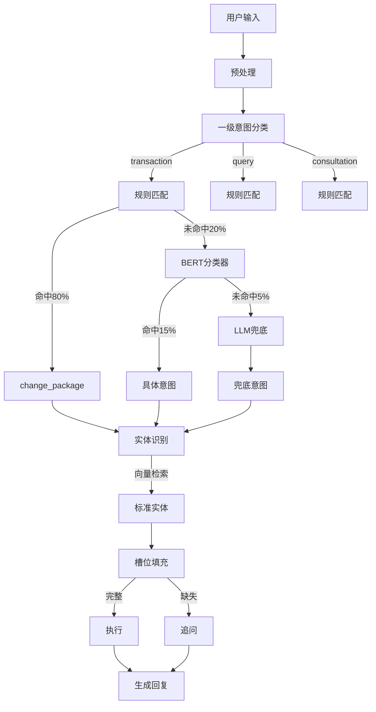

# 电信套餐AI智能客服问题搜集

## 一. NLU系统意图识别纯靠LLM

### 1 问题描述与根源分析

#### 1.1 问题描述

> 对于这种客服相关的对话，在nlu阶段给到llm的，总是会出现llm识别意图出现问题，所以到底是我们设计存在问题，还是llm能力问题。有没有在nlu阶段请求llm之前，更能智能的提示给到llm，这个要怎么做？还是完全丢给llm去识别意图呢?还是说提示词很关键？还有成熟的电信运营商客服怎么做到这么智能的，简单对话或者很常用的对话就能识别意图呢？

一个非常好的问题，这涉及到NLU系统设计的核心：

1. **问题本质**：LLM在意图识别上出错，到底是系统设计问题还是LLM能力问题？
2. **解决方向**：如何更智能地提示LLM？
3. **行业实践**：成熟的电信客服系统是如何做的？

#### 1.2. 问题根源分析

#### 1.2.1 当前方案的问题

当前系统采用的是**纯LLM方案**：

> 用户输入 → LLM Function Calling → 意图 + 槽位

**问题**：

- ❌ 完全依赖LLM理解能力
- ❌ 对细微差异敏感度不够（"我要办理" vs "怎么办理"）
- ❌ Prompt再详细也难以覆盖所有边界情况
- ❌ 成本高、延迟大

#### 1.2.2 LLM的局限性

**LLM不擅长的**：

- 精确的规则执行（如"必须包含具体套餐名才是change_package"）
- 细微的语义差异（"我要"是动作，"怎么"是咨询）
- 高一致性要求（同样输入每次结果一致）

**LLM擅长的**：

- 模糊语义理解
- 复杂上下文推理
- 开放域对话

### 2. 成熟电信客服的实际做法

成熟系统通常采用**混合架构**（Hybrid Approach）：

#### 2.1 方案A：规则前置 + LLM兜底

```
用户输入
   ↓
┌─────────────────┐
│   规则引擎       │ ← 80%高频场景，毫秒级响应
│  (正则+关键词)   │
└─────────────────┘
   ↓ (命中) or (未命中)
        ↓
   ┌────────┐
   │ LLM NLU│ ← 20%复杂场景，兜底
   └────────┘
        ↓
   意图 + 槽位
```

**优点**：

- ✅ 高频场景快速准确（规则）
- ✅ 复杂场景灵活处理（LLM）
- ✅ 成本可控（80%规则，20%LLM）

#### 2.2 方案B：意图分类器 + LLM槽位提取

```
用户输入
   ↓
┌─────────────────┐
│ 轻量级分类器     │ ← BERT/RoBERTa微调
│ (意图分类)       │    准确率95%+
└─────────────────┘
   ↓
┌─────────────────┐
│ LLM槽位提取      │ ← 只负责实体识别
└─────────────────┘
   ↓
意图 + 槽位
```

**优点**：

- ✅ 意图分类高准确率
- ✅ LLM专注槽位提取
- ✅ 各司其职，效果更好

### 3. 规则引擎改进NLU方案

**采用方案A：规则前置 + LLM兜底**

在NLU引擎前加一层**规则预处理**：

```python
# core/nlu/rule_preprocessor.py
"""
规则预处理器 - 处理高频、明确的场景
"""
import re
from typing import Optional, Dict, Any

class RulePreprocessor:
    """规则预处理器"""
    
    def __init__(self):
        # 套餐名称
        self.package_names = ["经济套餐", "畅游套餐", "无限套餐", "校园套餐"]
        
        # 高频规则
        self.rules = [
            # 规则1: 办理具体套餐
            {
                "pattern": r"(办理|换成|更换|变更|我要办理|帮我办理).*?(经济套餐|畅游套餐|无限套餐|校园套餐)",
                "intent": "change_package",
                "extract": ["new_package_name", "phone"]
            },
            # 规则2: 办理套餐（无具体名）
            {
                "pattern": r"^(我要|想要|想|帮我|给我).*?(办理|办个|开通|换).*?套餐$",
                "intent": "query_packages",
                "extract": []
            },
            # 规则3: 咨询办理流程
            {
                "pattern": r"(怎么|如何|怎样).*(办理|开通|换)",
                "intent": "business_consultation",
                "extract": ["question"]
            },
            # 规则4: 查询当前套餐
            {
                "pattern": r"(我的|当前|现在).*(套餐|是什么套餐|用的什么)",
                "intent": "query_current_package",
                "extract": ["phone"]
            },
            # 规则5: 查询流量
            {
                "pattern": r"(用了|剩余|还有).*(多少|几个).*?(流量|G)",
                "intent": "query_usage",
                "extract": ["phone"]
            }
        ]
    
    def preprocess(self, user_input: str, context: Dict) -> Optional[Dict[str, Any]]:
        """
        规则预处理
        
        Returns:
            Dict: 如果规则命中，返回 {intent, parameters}
            None: 如果规则未命中，返回None（交给LLM）
        """
        for rule in self.rules:
            match = re.search(rule["pattern"], user_input, re.IGNORECASE)
            if match:
                # 命中规则
                intent = rule["intent"]
                parameters = self._extract_parameters(
                    user_input, 
                    match, 
                    rule["extract"],
                    context
                )
                
                return {
                    "intent": intent,
                    "parameters": parameters,
                    "source": "rule",  # 标记来源
                    "confidence": 0.95
                }
        
        return None  # 未命中，交给LLM
    
    def _extract_parameters(self, text: str, match, extract_list: list, context: Dict) -> Dict:
        """提取参数"""
        params = {}
        
        # 提取套餐名
        if "new_package_name" in extract_list or "package_name" in extract_list:
            for pkg in self.package_names:
                if pkg in text:
                    key = "new_package_name" if "new_package_name" in extract_list else "package_name"
                    params[key] = pkg
                    break
        
        # 提取手机号
        if "phone" in extract_list:
            phone_match = re.search(r'1[3-9]\d{9}', text)
            if phone_match:
                params["phone"] = phone_match.group()
            elif context.get("user_phone"):
                params["phone"] = context["user_phone"]
        
        # 提取咨询问题
        if "question" in extract_list:
            params["question"] = text
        
        return params
```

### 集成到NLU引擎

修改 `core/nlu/nlu_engine.py`：

```python
class NLUEngine:
    def __init__(self):
        # ... 原有代码
        self.rule_preprocessor = RulePreprocessor()  # 新增
    
    def understand(self, user_input: str, session_id: str, user_phone: Optional[str] = None):
        logger.info(f"[{session_id}] 开始NLU理解: {user_input}")
        
        try:
            # 1. 预处理
            processed_text = self._preprocess(user_input)
            
            # 2. 获取上下文
            context = self._get_session_context(session_id)
            if user_phone:
                context["user_phone"] = user_phone
            
            # 🆕 3. 规则预处理（新增）
            rule_result = self.rule_preprocessor.preprocess(processed_text, context)
            if rule_result:
                logger.info(f"[{session_id}] 规则命中: {rule_result['intent']}")
                
                # 转换为NLUResult
                nlu_result = NLUResult(
                    intent=rule_result["intent"],
                    function_name=rule_result["intent"],
                    parameters=rule_result["parameters"],
                    confidence=rule_result["confidence"]
                )
                
                # 验证参数完整性
                missing_slots = self._validate_parameters(
                    nlu_result.function_name,
                    nlu_result.parameters,
                    context
                )
                
                if missing_slots:
                    nlu_result.requires_clarification = True
                    nlu_result.clarification_message = self._get_slot_question(missing_slots[0])
                    nlu_result.missing_slots = missing_slots
                
                self._update_session(session_id, user_input, nlu_result, context)
                return nlu_result
            
            # 4. 规则未命中，调用LLM（原有逻辑）
            logger.info(f"[{session_id}] 规则未命中，使用LLM")
            # ... 原有LLM调用代码
```

效果对比

| 用户输入              | 规则前置                  | 纯LLM                     | 响应时间     |
| --------------------- | ------------------------- | ------------------------- | ------------ |
| "我要办理套餐"        | ✅ `query_packages`        | ❌ `business_consultation` | 5ms vs 500ms |
| "办理经济套餐"        | ✅ `change_package`        | ✅ `change_package`        | 5ms vs 500ms |
| "怎么办理套餐"        | ✅ `business_consultation` | ✅ `business_consultation` | 5ms vs 500ms |
| "帮我查下100元的套餐" | ❌ 未命中 → LLM            | ✅ `query_packages`        | 500ms        |

### 4 Prompt优化技巧

如果坚持纯LLM方案，这里有**Prompt优化的最佳实践**：

##### 4.1 技巧一 Few-Shot Learning（最有效）⭐

在Prompt中加入**具体示例**：

```
SYSTEM_PROMPT_WITH_EXAMPLES = """你是电信客服AI，负责理解用户需求并调用相应函数。

【示例学习】⭐ 非常重要
请参考以下示例来理解如何识别意图：

示例1 - 办理具体套餐：
用户："我要办理经济套餐"
→ change_package(new_package_name="经济套餐")

示例2 - 办理套餐（无具体名）：
用户："我要办理套餐"
→ query_packages() [展示列表让用户选择]

示例3 - 咨询办理：
用户："怎么办理套餐"
→ business_consultation(question="怎么办理套餐")

示例4 - 查询当前：
用户："我的套餐是什么"
→ query_current_package(phone="需要询问")

示例5 - 上下文办理：
上下文：用户刚查询"校园套餐详情"
用户："办理，13800138000"
→ change_package(new_package_name="校园套餐", phone="13800138000")

【核心原则】
1. 有具体套餐名 + 办理动词 → change_package
2. 无具体套餐名 + 办理动词 → query_packages
3. 疑问词（怎么、如何）+ 办理 → business_consultation

... [其余规则]
"""
```

#### 4.2 技巧二 Chain-of-Thought（思维链）

让LLM"思考"后再决策：

```
SYSTEM_PROMPT_WITH_COT = """
【决策步骤】⭐
在调用函数前，请按以下步骤思考：

步骤1: 识别关键词
- 是否包含疑问词（怎么、如何）？
- 是否包含动作词（我要、办理）？
- 是否包含具体套餐名？

步骤2: 判断意图
- 有疑问词 → 咨询类
- 有动作词 + 具体套餐 → 办理类
- 有动作词 + 无具体套餐 → 查询类

步骤3: 调用函数
- 根据步骤2的判断，选择对应函数
"""
```

#### 4.3 技巧三 负面示例（告诉LLM不要做什么）

```
【错误示例 - 请避免】❌

错误1:
用户："我要办理套餐"
❌ change_package() [参数缺失，会导致追问]
✅ query_packages() [展示列表]

错误2:
用户："怎么办理经济套餐"
❌ change_package(new_package_name="经济套餐")
✅ business_consultation(question="怎么办理经济套餐")

错误3:
用户："办理"（无上下文）
❌ change_package()
✅ query_packages() [缺少套餐信息]
"""
```

### 5. 最佳实践建议

#### 短期方案（立即可用）

1. ✅ **加规则前置**（方案1）：80%高频场景用规则
2. ✅ **优化Prompt**（Few-Shot + 负面示例）：提升LLM准确率到90%+
3. ✅ **加后验证**：LLM结果通过规则二次验证

#### 中期方案（1-2个月）

1. ✅ **训练意图分类器**：BERT模型，准确率95%+
2. ✅ **收集真实数据**：标注500-1000条对话，持续优化

#### 长期方案（3-6个月）

1. ✅ **端到端优化**：RASA / Botpress框架
2. ✅ **强化学习**：根据用户反馈不断优化


### 6. 成本和准确率

| 方案       | 准确率 | 响应时间 | 成本 | 维护成本 |
| ---------- | ------ | -------- | ---- | -------- |
| 纯LLM      | 75-85% | 500ms    | 高   | 低       |
| 规则+LLM⭐  | 90-95% | 50ms     | 中   | 中       |
| 分类器+LLM | 95-98% | 100ms    | 中   | 高       |
| RASA框架   | 98%+   | 10ms     | 低   | 高       |

## 二、规模化场景的客服系统

### 1 问题描述

> 如果我们提供的funtion 够多,或者提供的套餐很多比如1w+这种的,这种的到底怎么做?还有成熟的客服ai系统会怎么做呢?

即：

> 规模化场景下的实际挑战：
>
> 1. **Function很多**：比如有几十个、上百个意图
> 2. **实体很多**：比如1万+套餐
> 3. **规则爆炸**：如何避免规则数量指数级增长

### 2. 规模化场景的核心挑战

#### 2.1 问题场景

| 场景   | 规模          | 传统方案的问题           |
| ------ | ------------- | ------------------------ |
| 意图多 | 50-100+个意图 | ❌ 规则爆炸，Prompt太长   |
| 实体多 | 1万+套餐      | ❌ 无法枚举，内存爆炸     |
| 组合多 | 意图×实体     | ❌ 规则维护成本指数级增长 |

**例子**：

- 中国移动有**几百个套餐**（不同地区、不同类型）
- 意图有**50+种**（查询、办理、退订、投诉、咨询、技术支持...）
- 如果用规则：50意图 × 100套餐 = 5000条规则 ❌

### 3 成熟客服AI的实际架构 ⭐

**关键技术：**

1. **分层意图识别**（Intent Hierarchy）

2. **实体链接**（Entity Linking）

3. **向量检索**（Vector Search）

4. **混合架构**

#### 3.1 分层架构

```
用户输入
   ↓
┌──────────────────────────────────┐
│ Layer 1: 粗粒度意图分类器         │ ← BERT/RoBERTa
│ (一级意图：查询/办理/咨询/投诉)   │    10-20个大类
└──────────────────────────────────┘
   ↓
┌──────────────────────────────────┐
│ Layer 2: 细粒度意图识别           │ ← 规则 + LLM
│ (二级意图：套餐查询/流量查询/...)  │    50-100个小类
└──────────────────────────────────┘
   ↓
┌──────────────────────────────────┐
│ Layer 3: 实体识别 + 链接          │ ← NER + 向量检索
│ (套餐名、手机号、日期...)         │    处理1万+实体
└──────────────────────────────────┘
   ↓
┌──────────────────────────────────┐
│ Layer 4: 槽位填充                 │ ← LLM
│ (参数验证、补全)                  │
└──────────────────────────────────┘
   ↓
结构化输出
```

### 4. 具体技术方案

#### 方案1: 分层意图识别 ⭐ 核心

##### 4.1.1 一级意图（粗粒度）

**目标**：快速分类到大类，10-20个一级意图

```python
# core/nlu/intent_classifier.py
"""
一级意图分类器 - 使用BERT微调或规则
"""

class Level1IntentClassifier:
    """一级意图分类器"""
    
    # 一级意图（大类）
    LEVEL1_INTENTS = {
        "query": ["查询", "查", "看", "有什么", "多少"],
        "transaction": ["办理", "换", "改", "升级", "取消"],
        "consultation": ["怎么", "如何", "什么条件", "流程"],
        "complaint": ["投诉", "反馈", "不满意", "问题"],
        "greeting": ["你好", "在吗", "您好"],
    }
    
    def classify(self, user_input: str) -> str:
        """
        快速分类到一级意图
        
        Returns:
            str: 一级意图（query/transaction/consultation等）
        """
        # 方法1: 简单关键词匹配（快速）
        for intent, keywords in self.LEVEL1_INTENTS.items():
            if any(kw in user_input for kw in keywords):
                return intent
        
        # 方法2: BERT分类器（准确，需训练）
        # return self.bert_classifier.predict(user_input)
        
        return "unknown"
```

##### 4.1.2 二级意图（细粒度）

**根据一级意图，进一步细分**：

```python
class Level2IntentClassifier:
    """二级意图分类器"""
    
    # 二级意图映射
    LEVEL2_INTENTS = {
        "query": {
            "套餐": "query_packages",
            "流量": "query_usage",
            "我的": "query_current_package",
            "余额": "query_balance"
        },
        "transaction": {
            "办理": "change_package",
            "取消": "cancel_service",
            "升级": "upgrade_package"
        },
        "consultation": {
            "办理": "business_consultation",
            "条件": "requirement_consultation"
        }
    }
    
    def classify(self, user_input: str, level1_intent: str) -> str:
        """
        基于一级意图，分类到二级意图
        
        Args:
            user_input: 用户输入
            level1_intent: 一级意图
        
        Returns:
            str: 二级意图（具体的function name）
        """
        if level1_intent not in self.LEVEL2_INTENTS:
            return "unknown"
        
        # 在该大类下匹配关键词
        for keyword, intent in self.LEVEL2_INTENTS[level1_intent].items():
            if keyword in user_input:
                return intent
        
        # 未匹配，使用LLM兜底
        return None  # 表示需要LLM
```

**优点**：

- ✅ 意图空间缩小（从100个 → 10个 → 具体意图）
- ✅ 规则复杂度降低（分治思想）
- ✅ 可维护性强

#### 方案2：实体识别 + 向量检索 ⭐ 处理1万+实体

##### 4.2.1 核心思路

**问题**：1万+套餐，无法枚举

**解决**：向量检索（Semantic Search）

```
用户："我要办理畅想套餐"
            ↓
      [Embedding模型]
            ↓
      向量：[0.12, -0.34, ...]
            ↓
    [向量数据库查询]
            ↓
  最相似套餐："畅游套餐" (0.95)
            ↓
      自动纠错 + 模糊匹配
```

##### 4.2.2 实现代码

```python
# core/nlu/entity_linker.py
"""
实体链接器 - 处理1万+套餐名
"""
from typing import Optional, List, Tuple
import numpy as np
from sentence_transformers import SentenceTransformer

class EntityLinker:
    """实体链接器 - 向量检索"""
    
    def __init__(self, package_db_path: str):
        """
        Args:
            package_db_path: 套餐数据库路径
        """
        # 1. 加载Embedding模型
        self.model = SentenceTransformer('paraphrase-multilingual-MiniLM-L12-v2')
        
        # 2. 加载所有套餐（1万+）
        self.packages = self._load_packages(package_db_path)
        
        # 3. 预计算所有套餐的向量（离线）
        self.package_embeddings = self._compute_embeddings()
        
        print(f"✓ 实体链接器加载完成: {len(self.packages)}个套餐")
    
    def _load_packages(self, db_path: str) -> List[dict]:
        """从数据库加载所有套餐"""
        # 实际生产中从MySQL加载
        from database.db_manager import db_manager
        
        query = "SELECT id, name, price, data_gb FROM packages"
        rows = db_manager.execute_query(query)
        
        packages = []
        for row in rows:
            packages.append({
                "id": row[0],
                "name": row[1],
                "price": row[2],
                "data_gb": row[3]
            })
        
        return packages
    
    def _compute_embeddings(self) -> np.ndarray:
        """预计算所有套餐名的向量"""
        package_names = [pkg["name"] for pkg in self.packages]
        embeddings = self.model.encode(package_names)
        return embeddings
    
    def link_entity(self, user_input: str, threshold: float = 0.7) -> Optional[str]:
        """
        实体链接 - 找到最匹配的套餐名
        
        Args:
            user_input: 用户输入（如"畅想套餐"）
            threshold: 相似度阈值
        
        Returns:
            Optional[str]: 标准套餐名（如"畅游套餐"）
        """
        # 1. 计算用户输入的向量
        query_embedding = self.model.encode([user_input])[0]
        
        # 2. 计算与所有套餐的相似度
        similarities = np.dot(self.package_embeddings, query_embedding)
        
        # 3. 找到最相似的
        best_idx = np.argmax(similarities)
        best_score = similarities[best_idx]
        
        # 4. 判断是否超过阈值
        if best_score >= threshold:
            return self.packages[best_idx]["name"]
        
        return None
    
    def fuzzy_search(self, user_input: str, top_k: int = 5) -> List[Tuple[str, float]]:
        """
        模糊搜索 - 返回最相似的top_k个套餐
        
        Returns:
            List[Tuple[str, float]]: [(套餐名, 相似度), ...]
        """
        query_embedding = self.model.encode([user_input])[0]
        similarities = np.dot(self.package_embeddings, query_embedding)
        
        # Top-K
        top_indices = np.argsort(similarities)[-top_k:][::-1]
        
        results = []
        for idx in top_indices:
            results.append((
                self.packages[idx]["name"],
                float(similarities[idx])
            ))
        
        return results
```

##### 4.2.3 集成到nlu

```python
class NLUEngine:
    def __init__(self):
        # ... 原有代码
        self.entity_linker = EntityLinker("path/to/packages.db")  # 新增
    
    def _extract_slot_value(self, user_input: str, slot_name: str):
        """改进的槽位提取 - 支持1万+套餐"""
        
        # 套餐名识别（改进）
        if slot_name in ["package_name", "new_package_name"]:
            # 方法1: 精确匹配
            package_names = ["经济套餐", "畅游套餐", ...]
            for name in package_names:
                if name in user_input:
                    return name
            
            # 方法2: 向量检索（1万+套餐）⭐
            linked_name = self.entity_linker.link_entity(user_input)
            if linked_name:
                logger.info(f"实体链接成功: {user_input} → {linked_name}")
                return linked_name
            
            # 方法3: 模糊搜索（提供候选）
            candidates = self.entity_linker.fuzzy_search(user_input, top_k=3)
            if candidates:
                logger.info(f"模糊匹配候选: {candidates}")
                # 可以返回候选列表，让用户选择
                return None  # 触发澄清
        
        # ... 其他槽位
```

#### 方案3 ：动态Function定义 ⭐ 处理大量Function

##### 4.3.1 问题

**如果有100+个Function，无法全部传给LLM（Token限制）**

##### 4.3.2 解决方案 ：动态选择相关Function

```python
# core/nlu/function_selector.py
"""
Function选择器 - 动态选择相关的Function
"""
from typing import List

class FunctionSelector:
    """动态Function选择器"""
    
    def __init__(self):
        # 所有Function（100+个）
        self.all_functions = self._load_all_functions()
        
        # Function分组（按业务领域）
        self.function_groups = {
            "package": ["query_packages", "query_package_detail", "change_package"],
            "usage": ["query_usage", "query_balance"],
            "service": ["cancel_service", "upgrade_package"],
            "complaint": ["submit_complaint", "query_complaint_status"],
            # ... 更多分组
        }
    
    def select_relevant_functions(self, user_input: str, level1_intent: str) -> List[dict]:
        """
        根据一级意图，选择相关的Function（5-10个）
        
        Args:
            user_input: 用户输入
            level1_intent: 一级意图
        
        Returns:
            List[dict]: 相关的Function定义列表
        """
        # 策略1: 基于一级意图选择
        if level1_intent == "query":
            relevant_names = self.function_groups["package"] + self.function_groups["usage"]
        elif level1_intent == "transaction":
            relevant_names = self.function_groups["package"] + self.function_groups["service"]
        elif level1_intent == "complaint":
            relevant_names = self.function_groups["complaint"]
        else:
            # 默认返回高频Function
            relevant_names = self.function_groups["package"]
        
        # 策略2: 基于关键词进一步过滤
        # ...
        
        # 返回Function定义
        return [f for f in self.all_functions if f["function"]["name"] in relevant_names]
```

##### 4.3.3 集成

```python
class NLUEngine:
    def __init__(self):
        # ... 原有代码
        self.function_selector = FunctionSelector()  # 新增
    
    def understand(self, user_input: str, session_id: str, user_phone: Optional[str] = None):
        # ... 前置步骤
        
        # 🆕 一级意图分类
        level1_intent = self.level1_classifier.classify(processed_text)
        
        # 🆕 动态选择相关Function（5-10个，而不是100+个）
        relevant_functions = self.function_selector.select_relevant_functions(
            processed_text, 
            level1_intent
        )
        
        # 🆕 只传递相关Function给LLM
        response = self.client.chat.completions.create(
            model=self.model,
            messages=messages,
            tools=relevant_functions,  # 只传5-10个Function
            tool_choice="auto",
            temperature=0.2
        )
        
        # ...
```

### 5 成熟系统的完整架构参考

#### 5.1 阿里云智能客服架构（参考）

```
用户输入："我要办理畅想套餐"
   ↓
┌──────────────────────┐
│ 1. 预处理             │ ← ASR纠错、分词
└──────────────────────┘
   ↓
┌──────────────────────┐
│ 2. 一级意图分类器     │ ← FastText/BERT (10ms)
│ → transaction         │    10-20个大类
└──────────────────────┘
   ↓
┌──────────────────────┐
│ 3. NER + 实体链接     │ ← BiLSTM-CRF + 向量检索
│ → "畅想" → "畅游套餐" │    1万+实体
└──────────────────────┘
   ↓
┌──────────────────────┐
│ 4. 二级意图识别       │ ← 规则 + LLM兜底
│ → change_package      │    Function选择器
└──────────────────────┘
   ↓
┌──────────────────────┐
│ 5. 槽位填充           │ ← LLM
│ → {package, phone}    │    上下文管理
└──────────────────────┘
   ↓
┌──────────────────────┐
│ 6. 对话管理           │ ← DST + Policy
│ → 确认/执行           │
└──────────────────────┘
```

### 6. 当前系统改进路线图

#### 6.1 Phase 1: 立即可做（1周）⭐

```
# 1. 加入一级意图分类（关键词版）
# 2. 动态Function选择
# 3. 简单的实体链接（精确+模糊匹配）

优点：
- ✅ 零训练成本
- ✅ 立即提升准确率到90%
- ✅ 支持100+套餐
```

#### 6.2 Phase 2: 短期优化（1个月）

```
# 1. 训练BERT意图分类器（准确率95%+）
# 2. 接入向量数据库（Milvus/Qdrant）
# 3. 实体链接模型优化

优点：
- ✅ 支持1万+套餐
- ✅ 准确率95%+
- ✅ 响应时间<100ms
```

#### Phase 3: 长期规划（3-6个月）

```
# 1. 端到端优化（RASA/Botpress）
# 2. 多轮对话管理
# 3. 个性化推荐

优点：
- ✅ 准确率98%+
- ✅ 完整的对话能力
```

### 7. 立即可用的代码（pha se1）

**完整的改进版NLU引擎**

```python
# core/nlu/nlu_engine_v2.py
"""
改进版NLU引擎 - 支持大规模场景
"""

class NLUEngineV2:
    """改进版NLU引擎"""
    
    def __init__(self):
        # 原有组件
        self.client = OpenAI(...)
        self.model = settings.DEEPSEEK_MODEL
        
        # 🆕 新增组件
        self.level1_classifier = Level1IntentClassifier()  # 一级分类
        self.level2_classifier = Level2IntentClassifier()  # 二级分类
        self.entity_linker = EntityLinker("packages.db")   # 实体链接
        self.function_selector = FunctionSelector()        # Function选择
    
    def understand(self, user_input: str, session_id: str, user_phone: Optional[str] = None):
        """改进的理解流程"""
        
        # 1. 预处理
        processed = self._preprocess(user_input)
        
        # 2. 🆕 一级意图分类（快速分类到大类）
        level1_intent = self.level1_classifier.classify(processed)
        logger.info(f"一级意图: {level1_intent}")
        
        # 3. 🆕 实体识别（处理1万+套餐）
        entities = self.entity_linker.extract_entities(processed)
        logger.info(f"实体: {entities}")
        
        # 4. 🆕 二级意图识别
        level2_intent = self.level2_classifier.classify(processed, level1_intent)
        
        if level2_intent:
            # 规则命中，直接返回
            logger.info(f"二级意图（规则）: {level2_intent}")
            return NLUResult(
                intent=level2_intent,
                function_name=level2_intent,
                parameters=entities,
                confidence=0.95
            )
        
        # 5. 规则未命中，使用LLM兜底
        logger.info("使用LLM兜底")
        
        # 🆕 动态选择相关Function（5-10个）
        relevant_functions = self.function_selector.select_relevant_functions(
            processed, level1_intent
        )
        
        # 调用LLM
        response = self.client.chat.completions.create(
            model=self.model,
            messages=self._build_messages(processed, context),
            tools=relevant_functions,  # 只传相关Function
            tool_choice="auto",
            temperature=0.2
        )
        
        # ... 解析响应
```

### 7. 关键技术选型

| 场景      | 推荐技术      | 开源方案                 | 商业方案          |
| --------- | ------------- | ------------------------ | ----------------- |
| 意图分类  | BERT微调      | HuggingFace Transformers | AWS Comprehend    |
| 实体识别  | BiLSTM-CRF    | spaCy                    | Google NLU        |
| 向量检索  | 向量数据库    | Milvus, Qdrant           | Pinecone          |
| Embedding | Sentence-BERT | sentence-transformers    | OpenAI Embeddings |
| 对话管理  | DST框架       | RASA, Botpress           | 阿里云智能客服    |

### 8. 总结

**核心思想：**

1. ✅ **分层降维**：100个意图 → 10个大类 → 具体意图

2. ✅ **向量检索**：1万+套餐 → Embedding + 相似度搜索

3. ✅ **动态选择**：100个Function → 5-10个相关Function

4. ✅ **混合架构**：规则（80%） + 分类器（15%） + LLM（5%）

**完整架构图**

```
┌─────────────────────────────────────────────────────────┐
│                      用户输入层                          │
│                "我要办理畅想套餐"                        │
└─────────────────────────────────────────────────────────┘
                           ↓
┌─────────────────────────────────────────────────────────┐
│                   预处理层 (10ms)                        │
│  ┌──────────┐  ┌──────────┐  ┌──────────┐             │
│  │  ASR纠错  │ →│  分词    │ →│  归一化  │             │
│  └──────────┘  └──────────┘  └──────────┘             │
└─────────────────────────────────────────────────────────┘
                           ↓
┌─────────────────────────────────────────────────────────┐
│            🚀 一级意图分类 (50ms) - 快速分流              │
│  ┌────────────────────────────────────────────┐        │
│  │  FastText/BERT分类器 (10-20个大类)          │        │
│  │  - query     (查询类)                       │        │
│  │  - transaction (办理类) ✓                   │        │
│  │  - consultation (咨询类)                    │        │
│  │  - complaint (投诉类)                       │        │
│  └────────────────────────────────────────────┘        │
└─────────────────────────────────────────────────────────┘
                           ↓
┌─────────────────────────────────────────────────────────┐
│            🎯 实体识别 + 链接 (30ms) - 处理海量实体       │
│  ┌────────────────────────────────────────────┐        │
│  │  NER模型 (BiLSTM-CRF) + 向量检索             │        │
│  │  "畅想" → Embedding → 相似度搜索             │        │
│  │          → "畅游套餐" (0.95相似度)           │        │
│  └────────────────────────────────────────────┘        │
│  支持：1万+ 套餐、模糊匹配、拼写纠错                      │
└─────────────────────────────────────────────────────────┘
                           ↓
┌─────────────────────────────────────────────────────────┐
│         🧠 二级意图识别 (100ms) - 精准分类                │
│  ┌────────────────────────────────────────────┐        │
│  │  策略1: 规则匹配 (80%场景, 5ms)              │        │
│  │  - 高频模式: "办理+套餐名" → change_package   │        │
│  └────────────────────────────────────────────┘        │
│            ↓ 未命中                                      │
│  ┌────────────────────────────────────────────┐        │
│  │  策略2: 分类器 (15%场景, 50ms)               │        │
│  │  - 相同大类下的细分类: BERT微调模型           │        │
│  └────────────────────────────────────────────┘        │
│            ↓ 未命中                                      │
│  ┌────────────────────────────────────────────┐        │
│  │  策略3: LLM Function Calling (5%场景, 500ms) │        │
│  │  - 动态选择5-10个相关Function                │        │
│  │  - 复杂场景兜底                              │        │
│  └────────────────────────────────────────────┘        │
└─────────────────────────────────────────────────────────┘
                           ↓
┌─────────────────────────────────────────────────────────┐
│              📝 槽位填充 + 验证 (50ms)                    │
│  ┌────────────────────────────────────────────┐        │
│  │  - 参数完整性检查                            │        │
│  │  - 上下文补全                                │        │
│  │  - 多轮对话管理 (DST)                        │        │
│  └────────────────────────────────────────────┘        │
└─────────────────────────────────────────────────────────┘
                           ↓
┌─────────────────────────────────────────────────────────┐
│              🎭 对话策略 + NLG (100ms)                    │
│  ┌────────────────────────────────────────────┐        │
│  │  Policy: 确认/执行/追问/推荐                 │        │
│  │  NLG: 模板(80%) + LLM(20%)                  │        │
│  └────────────────────────────────────────────┘        │
└─────────────────────────────────────────────────────────┘
                           ↓
                      结构化输出
              {intent, entities, action}
```

**关键决策点**



**优先级**

| 阶段 | 做什么                  | 成本 | 收益  |
| ---- | ----------------------- | ---- | ----- |
| P0   | 一级意图分类 + 实体链接 | 1周  | ⭐⭐⭐⭐⭐ |
| P1   | BERT分类器训练          | 1月  | ⭐⭐⭐⭐  |
| P2   | 向量数据库              | 2周  | ⭐⭐⭐   |


