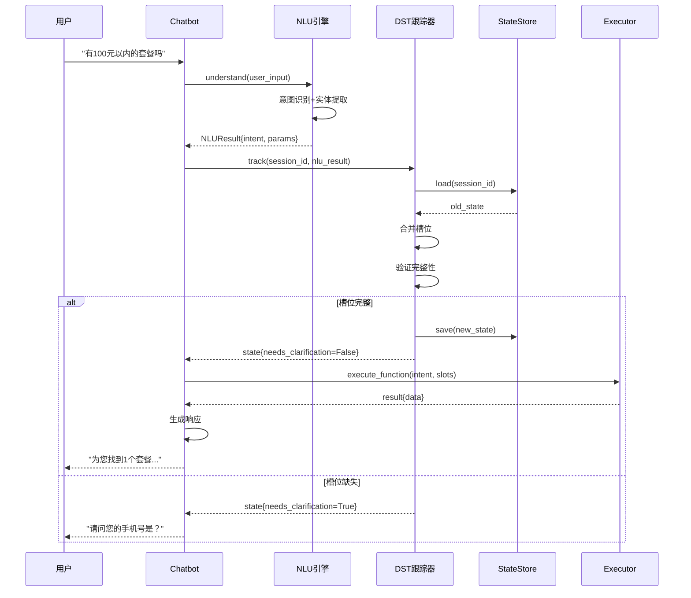
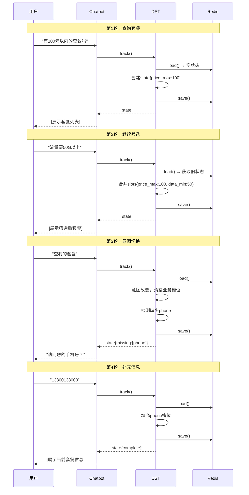
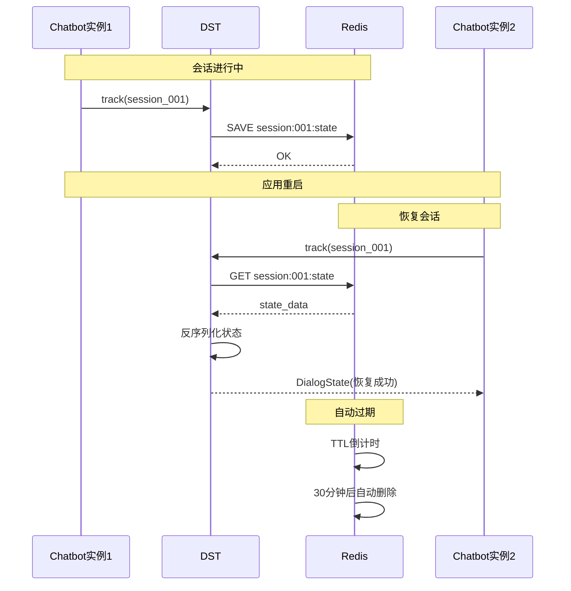
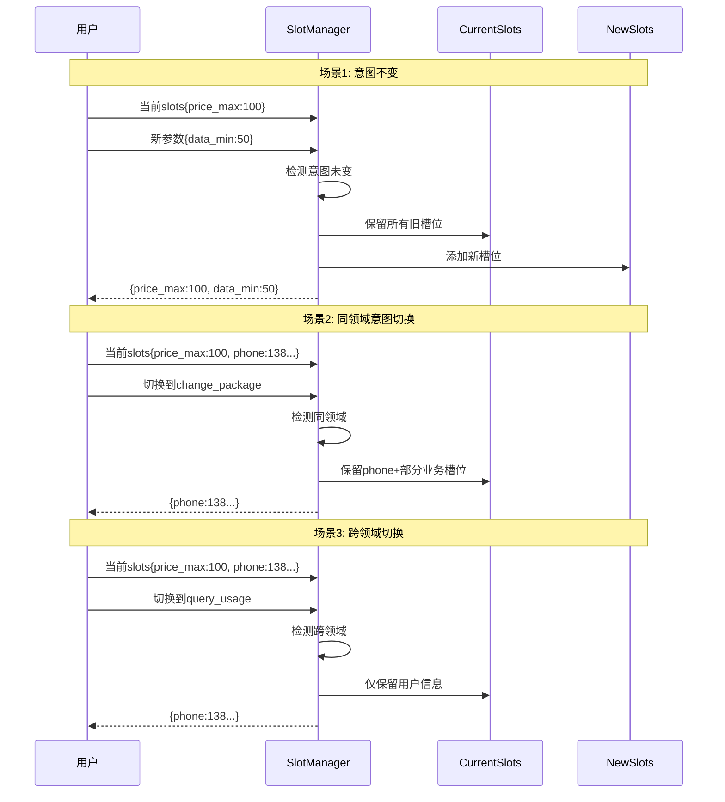
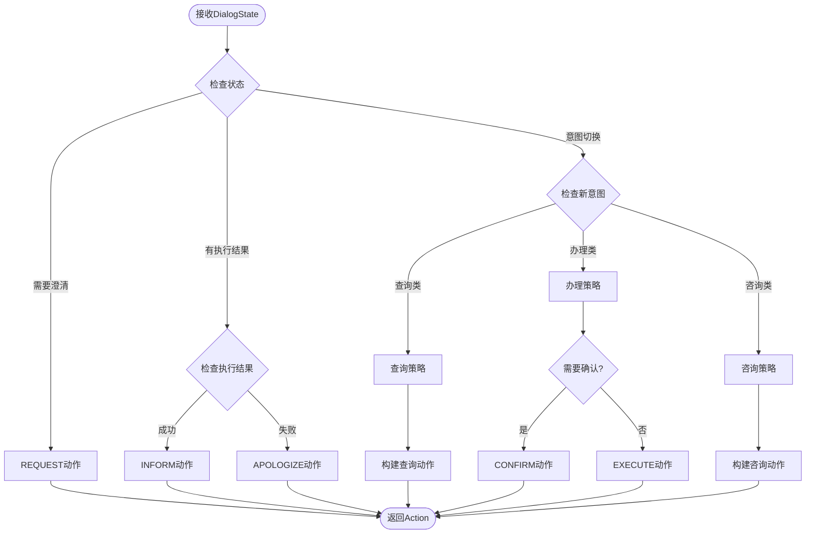

# 电信套餐AI智能客服系统 - NLU模块完整设计文档


## 项目概述

### 1.1 业务场景

**业务场景**：办理流量包的智能客服

**核心业务**: 

- 查询套餐信息
- 推荐合适套餐
- 办理套餐变更
- 查询使用情况


**可用套餐**：

| 名称     | 流量(G/月) | 价格(元/月) | 适用人群 |
| -------- | ---------- | ----------- | -------- |
| 经济套餐 | 10         | 50          | 无限制   |
| 畅游套餐 | 100        | 180         | 无限制   |
| 无限套餐 | 1000       | 300         | 无限制   |
| 校园套餐 | 200        | 150         | 在校生   |


### 1.2 项目目标

1. 理解用户自然语言查询套餐需求
2. 支持多轮对话，智能追问缺失信息
3. 精准推荐符合用户需求的套餐
4. 支持套餐办理、查询使用情况等业务
5. 预留RAG接口，未来可接入业务知识库


### 1.3 整体模块图


### 1.4 分阶段实施计划

| 阶段         | 时间      | 目标                  | 状态       |
| ------------ | --------- | --------------------- | ---------- |
| **第一阶段** | Week 1-2  | NLU模块实现           | ✅ 当前阶段 |
| 第二阶段     | Week 3-4  | DST模块(对话状态跟踪) | 📋 规划中   |
| 第三阶段     | Week 5-6  | Policy + NLG模块      | 📋 规划中   |
| 第四阶段     | Week 7-10 | Web系统 + AI Agent    | 📋 规划中   |


\---

## 整体架构

### 2.1 系统分层架构

```
┌─────────────────────────────────────────────────────┐
│                   用户交互层                          │
│            (Web/App/微信/语音接口)                    │
└─────────────────────────────────────────────────────┘
                         ↓
┌─────────────────────────────────────────────────────┐
│                  对话管理层                           │
│  ┌──────────┐  ┌──────────┐  ┌──────────┐         │
│  │ 会话管理  │  │ 上下文   │  │ 多轮对话 │         │
│  │ Session  │  │ Context  │  │ 状态机   │         │
│  └──────────┘  └──────────┘  └──────────┘         │
└─────────────────────────────────────────────────────┘
                         ↓
┌─────────────────────────────────────────────────────┐
│              🎯 NLU理解层 (第一阶段核心)              │
│  ┌────────────────────────────────────────────┐    │
│  │         大模型 Function Calling             │    │
│  │  - 意图识别 (Intent Classification)         │    │
│  │  - 实体抽取 (Entity Extraction)             │    │
│  │  - 参数填充 (Slot Filling)                  │    │
│  └────────────────────────────────────────────┘    │
│                         ↓                           │
│  ┌────────────────────────────────────────────┐    │
│  │         Function Router (预留RAG接口)       │    │
│  │  - 套餐查询 → DB Query                      │    │
│  │  - 业务咨询 → RAG (预留)                    │    │
│  │  - 其他服务 → API                           │    │
│  └────────────────────────────────────────────┘    │
└─────────────────────────────────────────────────────┘
                         ↓
┌─────────────────────────────────────────────────────┐
│                  执行层                               │
│  ┌──────────┐  ┌──────────┐  ┌──────────┐         │
│  │ 数据库   │  │ RAG引擎  │  │ 外部API  │         │
│  │ MySQL    │  │ (预留)   │  │          │         │
│  └──────────┘  └──────────┘  └──────────┘         │
└─────────────────────────────────────────────────────┘
                         ↓
┌─────────────────────────────────────────────────────┐
│                  响应生成层                           │
│       NLG (自然语言生成) + TTS (可选)                 │
└─────────────────────────────────────────────────────┘
```


### 2.2 对话系统基本模块

我们的系统包含如下模块：

```
   ↓
[ASR] 语音识别 (可选，第四阶段)
   ↓
[NLU] 语义理解 ⭐ 第一阶段核心
   ↓
[DST] 状态跟踪 (第二阶段)
   ↓
[Policy] 对话策略 (第三阶段)
   ↓
[NLG] 语言生成 (第三阶段)
   ↓
[TTS] 语音合成 (可选，第四阶段)
   ↓
系统输出
```

**各模块职责**：

- **NLU (Natural Language Understanding)**: 理解用户意图和提取关键信息
- **DST (Dialog State Tracking)**: 跟踪对话状态，管理多轮对话
- **Policy**: 决定系统下一步动作(查询、推荐、确认等)
- **NLG (Natural Language Generation)**: 生成自然流畅的回复
- **DB/API**: 查询数据库或调用外部API


### 2.3 数据流转示意

```
用户: "有100块以内的套餐吗"
   ↓
[NLU] 解析
   - Intent: query_packages
   - Parameters: {price_max: 100, sort_by: "price_asc"}
   ↓
[DST] 状态更新 (第二阶段)
   - 保存意图和参数
   ↓
[Policy] 决策 (第三阶段)
   - 决定: 执行查询
   ↓
[DB] 执行查询
   - SELECT * FROM packages WHERE price <= 100
   ↓
[NLG] 生成回复 (第三阶段)
   - "为您找到1个套餐: 经济套餐..."
   ↓
返回用户
```


---

## NLU模块详细设计

### 3.1 模块概述

***\*模块名称\****: Natural Language Understanding (NLU)  

***\*开发周期\****: 2周  

***\*核心目标\****: 将用户自然语言输入转换为结构化参数，用于数据库查询


### 3.2 功能需求

#### 3.2.1 意图识别**(Intent Classification)**

| 意图名称                | 描述         | 示例                       |
| ----------------------- | ------------ | -------------------------- |
| `query_packages`        | 查询套餐列表 | "有便宜的套餐吗"           |
| `query_current_package` | 查询当前套餐 | "我现在用的什么套餐"       |
| `query_package_detail`  | 查询套餐详情 | "畅游套餐有什么内容"       |
| `change_package`        | 办理套餐变更 | "我要办理经济套餐"         |
| `query_usage`           | 查询使用情况 | "我用了多少流量"           |
| `business_consultation` | 业务咨询     | "有什么优惠活动" (预留RAG) |


#### 3.2.2 实体抽取（Entity Extraction）

从用户输入中提取关键信息：

| 实体类型 | 示例输入      | 提取结果                |
| -------- | ------------- | ----------------------- |
| 价格范围 | "100块以内"   | `price_max: 100`        |
| 流量需求 | "至少50G"     | `data_min: 50`          |
| 排序偏好 | "便宜点的"    | `sort_by: "price_asc"`  |
| 人群限制 | "学生套餐"    | `target_user: "在校生"` |
| 手机号   | "13800138000" | `phone: "13800138000"`  |


#### 3.2.3 槽位填充 (Slot Filling)

当必填参数缺失时，智能追问：

***\*示例场景\****:

```
用户: "帮我查下我的套餐"
↓ [NLU检测到缺少phone槽位]
系统: "请问您的手机号是多少呢？"
↓
用户: "13800138000"
↓ [NLU填充phone槽位，执行查询]
系统: "您当前使用的是【经济套餐】..."
```


### 3.3 NLU处理流程

```mermaid
graph TB
    Start([用户输入文本]) --> Preprocess[文本预处理模块]
    
    Preprocess --> P1[去除多余空格和特殊符号]
    P1 --> P2[数字归一化]
    P2 --> P3[价格关键词识别]
    P3 --> CleanText[清洗后的文本]
    
    CleanText --> CheckSession{检查会话状态}
    CheckSession -->|新会话| BuildMsg1[构建消息]
    CheckSession -->|有历史| GetContext[获取上下文]
    
    GetContext --> MergeContext[合并上下文信息]
    MergeContext --> BuildMsg2[构建消息含历史]
    
    BuildMsg1 --> LLMCall[调用大模型API]
    BuildMsg2 --> LLMCall
    
    LLMCall --> SystemPrompt[System Prompt]
    SystemPrompt --> UserMessage[User Message]
    UserMessage --> FunctionDefs[Function Definitions]
    FunctionDefs --> ModelProcess[模型处理]
    
    ModelProcess --> ResponseType{响应类型判断}
    
    ResponseType -->|Function Call| ExtractFunc[提取Function信息]
    ResponseType -->|纯文本| TextResponse[直接文本回复]
    ResponseType -->|Error| ErrorHandle[错误处理]
    
    ExtractFunc --> ParseJSON[解析JSON参数]
    ParseJSON --> ValidateParams{参数验证}
    
    ValidateParams --> CheckRequired{所有必填参数齐全?}
    
    CheckRequired -->|是| ParamsComplete[参数完整]
    CheckRequired -->|否| FindMissing[找出缺失槽位]
    
    FindMissing --> CheckContext{上下文中有该参数?}
    CheckContext -->|有| FillFromContext[从上下文补全]
    CheckContext -->|无| GenQuestion[生成追问话术]
    
    FillFromContext --> ParamsComplete
    GenQuestion --> NLUResult1[NLU结果需要澄清]
    
    ParamsComplete --> FunctionRouter[Function路由器]
    
    FunctionRouter --> RouteDecision{Function类型判断}
    
    RouteDecision -->|套餐查询类| DBRoute[数据库查询路由]
    RouteDecision -->|业务咨询类| RAGRoute[RAG路由预留]
    
    DBRoute --> BuildSQL[构建SQL查询]
    BuildSQL --> ExecSQL[执行SQL]
    ExecSQL --> FormatResult[格式化结果]
    
    RAGRoute --> RAGCheck{RAG是否启用?}
    RAGCheck -->|是| RAGProcess[向量检索]
    RAGCheck -->|否| DefaultReply[返回默认提示]
    
    FormatResult --> MergeData[合并查询结果]
    RAGProcess --> MergeData
    DefaultReply --> MergeData
    
    MergeData --> NLUResult2[NLU结果包含数据]
    
    TextResponse --> NLUResult3[NLU结果直接回复]
    ErrorHandle --> NLUResult4[NLU结果错误信息]
    
    NLUResult1 --> UpdateSession1[更新会话状态]
    NLUResult2 --> UpdateSession2[更新会话状态]
    NLUResult3 --> UpdateSession3[更新会话状态]
    NLUResult4 --> UpdateSession3
    
    UpdateSession1 --> Return1([返回需要用户补充信息])
    UpdateSession2 --> Return2([返回完整的查询结果])
    UpdateSession3 --> Return3([返回文本回复])
    
    style LLMCall fill:#4A90E2,color:#fff
    style FunctionRouter fill:#F5A623,color:#fff
    style DBRoute fill:#7ED321,color:#fff
    style RAGRoute fill:#D0D0D0,color:#333
    style ParamsComplete fill:#50E3C2,color:#000
    style GenQuestion fill:#FF6B6B,color:#fff
```




#### 完整流程图

```
用户输入文本
   ↓
┌─────────────────────────────────┐
│  1. 文本预处理模块               │
│  - 去除多余空格和特殊符号        │
│  - 数字归一化(一百→100)          │
│  - 价格关键词识别(块→元)         │
└─────────────────────────────────┘
   ↓
┌─────────────────────────────────┐
│  2. 上下文检查                   │
│  检查会话状态                    │
└─────────────────────────────────┘
   ↓
   是否有历史会话？
   ├─ 是 → 获取上下文 → 合并上下文信息
   └─ 否 → 构建新消息
   ↓
┌─────────────────────────────────┐
│  3. 大模型理解 ⭐ 核心            │
│  调用Function Calling API        │
│  - System Prompt                 │
│  - User Message                  │
│  - Function Definitions          │
│  - 模型处理                      │
└─────────────────────────────────┘
   ↓
┌─────────────────────────────────┐
│  4. 响应类型判断                 │
└─────────────────────────────────┘
   ↓
   ├─ Function Call → 提取Function信息 → 解析JSON参数
   ├─ 纯文本 → 直接文本回复(闲聊/澄清)
   └─ Error → 错误处理
   ↓
┌─────────────────────────────────┐
│  5. 参数验证                     │
│  检查必填参数是否完整            │
└─────────────────────────────────┘
   ↓
   所有必填参数齐全？
   ├─ 是 → 参数完整
   └─ 否 → 找出缺失槽位
            ↓
            上下文中有该参数？
            ├─ 有 → 从上下文补全 → 参数完整
            └─ 无 → 生成追问话术 → 返回(需要用户补充信息)
   ↓
┌─────────────────────────────────┐
│  6. Function路由器               │
│  判断Function类型                │
└─────────────────────────────────┘
   ↓
   ├─ 套餐查询类(query_packages等)
   │    ↓
   │  ┌────────────────────────┐
   │  │ 数据库查询路由          │
   │  │ - 构建SQL查询           │
   │  │ - 执行SQL              │
   │  │ - 格式化结果           │
   │  └────────────────────────┘
   │
   └─ 业务咨询类(business_consultation)
        ↓
      ┌────────────────────────┐
      │ RAG路由(预留)          │
      │ RAG是否启用？          │
      │ ├─ 是 → 向量检索       │
      │ └─ 否 → 返回默认提示   │
      └────────────────────────┘
   ↓
┌─────────────────────────────────┐
│  7. 合并查询结果                 │
└─────────────────────────────────┘
   ↓
┌─────────────────────────────────┐
│  8. 更新会话状态                 │
│  保存当前意图和已知槽位          │
└─────────────────────────────────┘
   ↓
返回NLU结果
├─ 需要澄清 → 返回追问话术
├─ 包含数据 → 返回完整查询结果
└─ 直接回复 → 返回文本回复
```


#### 详细步骤说明

**步骤1: 文本预处理**

```python
def _preprocess(text: str) -> str:
    # 去除多余空格
    text = re.sub(r'\s+', ' ', text).strip()
    
    # 数字归一化
    text = text.replace('一百', '100').replace('两百', '200')
    
    # 价格单位统一
    text = text.replace('块', '元')
    
    return text
```

***\*步骤2: 上下文检查\****

- 检查session_id是否存在

- 如果存在，加载历史对话

- 如果有user_phone，加入上下文


***\*步骤3: 大模型理解\****

```python
response = client.chat.completions.create(

​    model="gpt-4",

​    messages=[

​        {"role": "system", "content": SYSTEM_PROMPT},

​        {"role": "user", "content": user_input}

​    ],

​    tools=FUNCTION_DEFINITIONS,

​    tool_choice="auto"

)
```

**步骤4:解析响应**

- 如果返回tool_calls → 提取function和参数

- 如果返回纯文本 → 闲聊或澄清

- 如果返回错误 → 异常处理

***\*步骤5: 参数验证\****

```python
def _validate_parameters(function_name, parameters, context):
    missing = []
    required = get_required_params(function_name)
    
    for param in required:
        if param not in parameters:
            # 尝试从上下文补全
            if param == "phone" and context.get("user_phone"):
                parameters[param] = context["user_phone"]
            else:
                missing.append(param)
    
    return missing
```

***\*步骤6: Function路由\****

```python
def route_function(function_name, parameters):
    if function_name == "business_consultation":
        return execute_rag(parameters)  # RAG预留
    else:
        return execute_db_query(function_name, parameters)
```

### 3.4 核心组件设计

#### 3.4.1 NLUEngine 类

```python
class NLUEngine:
    """NLU引擎主控制器"""
    
    def __init__(self):
        self.client = OpenAI(api_key=settings.OPENAI_API_KEY)
        self.model = settings.OPENAI_MODEL
        self.sessions = {}
    
    def understand(self, user_input, session_id, user_phone=None) -> NLUResult:
        """理解用户输入，返回结构化结果"""
        # 1. 预处理
        # 2. 获取上下文
        # 3. 调用大模型
        # 4. 解析响应
        # 5. 验证参数
        # 6. 返回结果
    
    def _preprocess(self, text) -> str:
        """文本预处理"""
    
    def _call_llm(self, messages) -> Response:
        """调用大模型"""
    
    def _parse_response(self, response) -> NLUResult:
        """解析响应"""
    
    def _validate_parameters(self, function_name, params) -> List[str]:
        """验证参数，返回缺失的槽位"""
```

**NLUResult 数据结构**:

```python
@dataclass
class NLUResult:
    intent: str                          # 意图
    function_name: Optional[str]         # 调用的函数名
    parameters: Dict[str, Any]           # 提取的参数
    confidence: float                    # 置信度
    requires_clarification: bool         # 是否需要澄清
    clarification_message: Optional[str] # 澄清提示
    missing_slots: List[str]             # 缺失的槽位
```

#### 3.4.2 FunctionRouter 类

```python
class FunctionRouter:
    """Function调用路由"""
    
    def route(self, function_name, parameters) -> Dict:
        """路由到对应的执行器"""
        if function_name == "business_consultation":
            return self._execute_rag_query(parameters)
        else:
            return self._execute_db_query(function_name, parameters)
    
    def _execute_db_query(self, function_name, params) -> Dict:
        """执行数据库查询"""
        executor = DatabaseExecutor()
        return executor.execute_function(function_name, params)
    
    def _execute_rag_query(self, params) -> Dict:
        """执行RAG查询(预留)"""
        if not settings.RAG_ENABLED:
            return {"success": True, "response": "RAG功能开发中..."}
        # TODO: 接入RAG
```

#### 3.4.3 DatabaseExecutor 类

```python
class DatabaseExecutor:
    """数据库查询执行器"""
    
    def execute_function(self, function_name, parameters) -> Dict:
        """执行Function调用"""
        executor_map = {
            "query_packages": self.query_packages,
            "query_current_package": self.query_current_package,
            # ...
        }
        return executor_map[function_name](**parameters)
    
    def query_packages(self, price_min=None, price_max=None, ...):
        """查询套餐列表"""
        # 构建SQL并执行
    
    def query_current_package(self, phone):
        """查询用户当前套餐"""
        # 查询用户信息
```

---

## 技术实现方案

### 4.1 技术选型

#### 4.1.1 核心技术

| 技术     | 选型                   | 理由                 |
| -------- | ---------------------- | -------------------- |
| 编程语言 | Python 3.10+           | 生态丰富，AI库支持好 |
| NLU方案  | 大模型Function Calling | 无需训练，理解能力强 |
| 大模型   | OpenAI GPT-4 / Claude  | 成熟稳定，API完善    |
| 数据库   | MySQL 8.0              | 关系型数据，事务支持 |
| ORM      | SQLAlchemy             | Python生态标准       |
| 日志     | Loguru                 | 简单易用，功能强大   |

#### 4.1.2 为什么使用Function Calling？

**对比传统NLU方案**:

| 方案                    | 优点                     | 缺点                               |
| ----------------------- | ------------------------ | ---------------------------------- |
| **传统NLU** (BERT/LSTM) | 响应快，成本低           | 需要标注数据，需要训练，泛化能力弱 |
| **大模型Fine-tuning**   | 效果好，可定制           | 成本高，需要GPU，维护复杂          |
| **Function Calling** ⭐  | 无需训练，泛化强，易维护 | API调用成本，有延迟                |

**我们选择Function Calling的原因**:

1. ✅ **快速迭代**: 无需标注数据和训练模型
2. ✅ **理解能力强**: GPT-4对自然语言理解能力出色
3. ✅ **易于扩展**: 新增意图只需添加Function定义
4. ✅ **维护成本低**: 不需要管理模型训练流程
5. ✅ **适合中小规模**: 对于客服场景，调用频率可控

### 4.2 Function Calling定义

#### 4.2.1 Function定义规范

每个Function包含以下字段：

- `name`: 函数名称
- `description`: 功能描述(帮助模型理解何时调用)
- `parameters`: 参数定义
  - `type`: 参数类型
  - `properties`: 参数属性
  - `required`: 必填参数列表

#### 4.2.2 完整Function定义

**1. query_packages (查询套餐)**

```json
{
  "name": "query_packages",
  "description": "查询符合条件的流量套餐列表。当用户想了解套餐、比较套餐、查找合适的套餐时使用",
  "parameters": {
    "type": "object",
    "properties": {
      "price_min": {
        "type": "number",
        "description": "最低价格(元/月),例如'50元以上'表示price_min=50"
      },
      "price_max": {
        "type": "number",
        "description": "最高价格(元/月),例如'100元以内'表示price_max=100"
      },
      "data_min": {
        "type": "number",
        "description": "最少流量(GB/月),例如'至少50G'表示data_min=50"
      },
      "data_max": {
        "type": "number",
        "description": "最多流量(GB/月)"
      },
      "target_user": {
        "type": "string",
        "enum": ["无限制", "在校生"],
        "description": "适用人群。'学生套餐'、'校园套餐'对应'在校生'"
      },
      "sort_by": {
        "type": "string",
        "enum": ["price_asc", "price_desc", "data_desc"],
        "description": "排序方式。price_asc=价格升序(便宜优先)",
        "default": "price_asc"
      }
    },
    "required": []
  }
}
```

**2. query_current_package (查询当前套餐)**

```json
{
  "name": "query_current_package",
  "description": "查询用户当前使用的套餐信息。当用户询问'我现在是什么套餐'时使用",
  "parameters": {
    "type": "object",
    "properties": {
      "phone": {
        "type": "string",
        "description": "手机号码,11位数字,格式如13800138000"
      }
    },
    "required": ["phone"]
  }
}
```

**3. query_package_detail (查询套餐详情)**

```json
{
  "name": "query_package_detail",
  "description": "查询指定套餐的详细信息",
  "parameters": {
    "type": "object",
    "properties": {
      "package_name": {
        "type": "string",
        "enum": ["经济套餐", "畅游套餐", "无限套餐", "校园套餐"],
        "description": "套餐名称"
      }
    },
    "required": ["package_name"]
  }
}
```

**4. change_package (办理套餐变更)**

```json
{
  "name": "change_package",
  "description": "办理套餐变更。当用户明确要求更换/办理某个套餐时使用",
  "parameters": {
    "type": "object",
    "properties": {
      "phone": {"type": "string", "description": "手机号码"},
      "new_package_name": {
        "type": "string",
        "enum": ["经济套餐", "畅游套餐", "无限套餐", "校园套餐"],
        "description": "要更换的新套餐名称"
      }
    },
    "required": ["phone", "new_package_name"]
  }
}
```

**5. query_usage (查询使用情况)**

```json
{
  "name": "query_usage",
  "description": "查询用户的流量、话费使用情况",
  "parameters": {
    "type": "object",
    "properties": {
      "phone": {"type": "string", "description": "手机号码"},
      "query_type": {
        "type": "string",
        "enum": ["data", "balance", "all"],
        "description": "查询类型: data=流量, balance=余额, all=全部",
        "default": "all"
      }
    },
    "required": ["phone"]
  }
}
```

**6. business_consultation (业务咨询 - RAG预留)**

```json
{
  "name": "business_consultation",
  "description": "业务咨询和政策说明。当用户询问业务规则、办理流程、优惠活动等时使用(预留RAG接口)",
  "parameters": {
    "type": "object",
    "properties": {
      "question": {"type": "string", "description": "用户的咨询问题"},
      "business_type": {
        "type": "string",
        "enum": ["套餐说明", "办理流程", "资费规则", "优惠活动", "其他"],
        "description": "业务类型分类"
      }
    },
    "required": ["question"]
  }
}
```

### 4.3 System Prompt设计

```python
SYSTEM_PROMPT = """你是一个专业的电信客服助手,负责帮助用户查询和办理流量套餐业务。

【你的职责】
1. 理解用户的自然语言需求
2. 识别用户意图并调用相应的函数
3. 当信息不完整时,友好地向用户确认缺失的信息
4. 用专业但亲切的语气与用户交流

【当前可用套餐】
- 经济套餐: 10G/月, 50元/月, 无限制人群
- 畅游套餐: 100G/月, 180元/月, 无限制人群
- 无限套餐: 1000G/月, 300元/月, 无限制人群
- 校园套餐: 200G/月, 150元/月, 在校生专享

【理解规则】
- 价格表达要准确理解: "100块以内"→price_max=100, "50元以上"→price_min=50
- "便宜点的"、"经济实惠"等模糊表达→sort_by="price_asc"
- "学生套餐"、"校园"→target_user="在校生"
- 如果用户没有提供手机号,需要礼貌询问

【重要】
- 始终保持友好和专业
- 不要假设用户信息,缺失时一定要询问
- 回答要简洁明了
"""
```

### 4.4 槽位填充策略

#### 追问话术模板

```python
SLOT_QUESTIONS = {
    "phone": "请问您的手机号码是多少呢？",
    "package_name": "请问您想了解哪个套餐呢？我们有经济套餐、畅游套餐、无限套餐和校园套餐。",
    "new_package_name": "请问您想更换为哪个套餐？",
    "query_type": "您想查询流量使用情况还是话费余额？",
}
```

#### 槽位补全优先级

1. **从当前参数中获取** (优先级最高)
2. **从上下文中补全** (如user_phone)
3. **从历史槽位值中补全**
4. **追问用户** (最后的手段)

---

## 数据库设计

### 5.1 ER图

```
┌─────────────┐         ┌─────────────┐
│  packages   │         │    users    │
├─────────────┤         ├─────────────┤
│ id (PK)     │         │ phone (PK)  │
│ name        │◄────────│ current_    │
│ data_gb     │  FK     │  package_id │
│ price       │         │ usage_gb    │
│ target_user │         │ balance     │
│ description │         └─────────────┘
└─────────────┘
```

### 5.2 表结构设计

#### 5.2.1 套餐表 (packages)

```sql
CREATE TABLE packages (
    id INT PRIMARY KEY AUTO_INCREMENT COMMENT '套餐ID',
    name VARCHAR(50) NOT NULL UNIQUE COMMENT '套餐名称',
    data_gb INT NOT NULL COMMENT '每月流量(GB)',
    voice_minutes INT DEFAULT 0 COMMENT '每月通话时长(分钟)',
    price DECIMAL(10,2) NOT NULL COMMENT '月费(元)',
    target_user VARCHAR(20) DEFAULT '无限制' COMMENT '适用人群',
    description TEXT COMMENT '套餐说明',
    status TINYINT DEFAULT 1 COMMENT '状态: 1=在售, 0=下架',
    created_at TIMESTAMP DEFAULT CURRENT_TIMESTAMP,
    updated_at TIMESTAMP DEFAULT CURRENT_TIMESTAMP ON UPDATE CURRENT_TIMESTAMP,
    INDEX idx_price (price),
    INDEX idx_data (data_gb),
    INDEX idx_status (status)
) ENGINE=InnoDB DEFAULT CHARSET=utf8mb4 COMMENT='套餐信息表';
```

#### 5.2.2 用户表 (users)

```sql
CREATE TABLE users (
    phone VARCHAR(11) PRIMARY KEY COMMENT '手机号',
    name VARCHAR(50) COMMENT '姓名',
    current_package_id INT COMMENT '当前套餐ID',
    package_start_date DATE COMMENT '套餐生效日期',
    monthly_usage_gb DECIMAL(10,2) DEFAULT 0 COMMENT '本月已用流量(GB)',
    monthly_usage_minutes INT DEFAULT 0 COMMENT '本月已用通话(分钟)',
    balance DECIMAL(10,2) DEFAULT 0 COMMENT '账户余额(元)',
    status TINYINT DEFAULT 1 COMMENT '状态: 1=正常, 0=停机',
    created_at TIMESTAMP DEFAULT CURRENT_TIMESTAMP,
    updated_at TIMESTAMP DEFAULT CURRENT_TIMESTAMP ON UPDATE CURRENT_TIMESTAMP,
    FOREIGN KEY (current_package_id) REFERENCES packages(id),
    INDEX idx_package (current_package_id),
    INDEX idx_status (status)
) ENGINE=InnoDB DEFAULT CHARSET=utf8mb4 COMMENT='用户信息表';
```

#### 5.2.3 对话记录表 (conversations)

```sql
CREATE TABLE conversations (
    id BIGINT PRIMARY KEY AUTO_INCREMENT,
    session_id VARCHAR(64) NOT NULL COMMENT '会话ID',
    phone VARCHAR(11) COMMENT '用户手机号',
    user_input TEXT NOT NULL COMMENT '用户输入',
    intent VARCHAR(50) COMMENT '识别的意图',
    function_name VARCHAR(50) COMMENT '调用的函数',
    parameters JSON COMMENT '函数参数',
    bot_response TEXT COMMENT '机器人回复',
    execution_time_ms INT COMMENT '执行耗时(毫秒)',
    created_at TIMESTAMP DEFAULT CURRENT_TIMESTAMP,
    INDEX idx_session (session_id),
    INDEX idx_phone (phone),
    INDEX idx_created (created_at)
) ENGINE=InnoDB DEFAULT CHARSET=utf8mb4 COMMENT='对话记录表';
```

### 5.3 初始化数据

```sql
-- 插入套餐数据
INSERT INTO packages (name, data_gb, voice_minutes, price, target_user, description) VALUES
('经济套餐', 10, 100, 50.00, '无限制', '适合轻度上网用户,性价比高'),
('畅游套餐', 100, 300, 180.00, '无限制', '适合经常上网的用户,流量充足'),
('无限套餐', 1000, 1000, 300.00, '无限制', '流量无忧,畅享网络,商务首选'),
('校园套餐', 200, 200, 150.00, '在校生', '学生专享优惠套餐,需提供学生证');

-- 插入测试用户数据
INSERT INTO users (phone, name, current_package_id, monthly_usage_gb, balance) VALUES
('13800138000', '张三', 1, 5.2, 45.50),
('13900139000', '李四', 2, 67.8, 120.00),
('13700137000', '王五', 4, 125.5, 50.00);
```

---


## 代码实现

### 6.1 项目目录结构

```
telecom-ai-customer-service/
│
├── config/                    # 配置模块
│   ├── __init__.py
│   ├── settings.py           # 系统配置
│   └── prompts.py            # Prompt模板
│
├── core/                      # 核心业务逻辑
│   ├── __init__.py
│   │
│   └── nlu/                  # 【第一阶段】NLU模块
│       ├── __init__.py
│       ├── nlu_engine.py     # NLU引擎主类
│       ├── function_definitions.py  # Function定义
│       └── slot_filler.py    # 槽位填充(扩展)
│
├── executor/                  # 执行层
│   ├── __init__.py
│   ├── db_executor.py        # 数据库执行器
│   ├── rag_executor.py       # RAG执行器(预留)
│   └── api_executor.py       # API执行器
│
├── database/                  # 数据库
│   ├── __init__.py
│   ├── db_manager.py         # 数据库管理器
│   ├── schema.sql            # 表结构SQL
│   └── init_data.sql         # 初始化数据SQL
│
├── models/                    # 数据模型
│   ├── __init__.py
│   ├── package.py            # 套餐模型
│   ├── user.py               # 用户模型
│   └── conversation.py       # 对话模型
│
├── utils/                     # 工具函数
│   ├── __init__.py
│   ├── logger.py             # 日志工具
│   └── validators.py         # 数据验证
│
├── examples/                  # 示例代码
│   └── phase1_demo.py        # 第一阶段演示
│
├── tests/                     # 测试代码
│   ├── __init__.py
│   ├── test_nlu.py           # NLU测试
│   ├── test_db_executor.py   # 执行器测试
│   └── test_integration.py   # 集成测试
│
├── .env.example              # 环境变量模板
├── requirements.txt          # Python依赖
├── docker-compose.yml        # Docker配置
├── Makefile                  # 项目管理命令
└── README.md                 # 项目说明
```

### 6.2 核心代码实现

#### 6.2.1 配置文件 (config/settings.py)

```python
from pydantic_settings import BaseSettings

class Settings(BaseSettings):
    # 应用配置
    APP_NAME: str = "电信套餐AI客服系统"
    VERSION: str = "0.1.0"
    DEBUG: bool = True
    
    # 大模型配置
    LLM_PROVIDER: str = "openai"
    OPENAI_API_KEY: str = ""
    OPENAI_MODEL: str = "gpt-4"
    ANTHROPIC_API_KEY: str = ""
    ANTHROPIC_MODEL: str = "claude-sonnet-4-20250514"
    
    # 数据库配置
    DB_HOST: str = "localhost"
    DB_PORT: int = 3306
    DB_USER: str = "root"
    DB_PASSWORD: str = "password"
    DB_NAME: str = "telecom_chatbot"
    
    # RAG配置 (预留)
    RAG_ENABLED: bool = False
    
    @property
    def database_url(self) -> str:
        return f"mysql+pymysql://{self.DB_USER}:{self.DB_PASSWORD}@{self.DB_HOST}:{self.DB_PORT}/{self.DB_NAME}"
    
    class Config:
        env_file = ".env"

settings = Settings()
```

#### 6.2.2 NLU引擎 (core/nlu/nlu_engine.py)

```python
from typing import Dict, Any, Optional, List
from dataclasses import dataclass, field
from openai import OpenAI

@dataclass
class NLUResult:
    """NLU解析结果"""
    intent: str
    function_name: Optional[str] = None
    parameters: Dict[str, Any] = field(default_factory=dict)
    confidence: float = 0.0
    requires_clarification: bool = False
    clarification_message: Optional[str] = None
    missing_slots: List[str] = field(default_factory=list)

class NLUEngine:
    """NLU引擎 - 基于大模型Function Calling"""
    
    def __init__(self):
        self.client = OpenAI(api_key=settings.OPENAI_API_KEY)
        self.model = settings.OPENAI_MODEL
        self.sessions = {}
    
    def understand(self,
                   user_input: str,
                   session_id: str,
                   user_phone: Optional[str] = None) -> NLUResult:
        """理解用户输入"""
        
        # 1. 文本预处理
        processed_text = self._preprocess(user_input)
        
        # 2. 获取上下文
        context = self._get_session_context(session_id)
        if user_phone:
            context["user_phone"] = user_phone
        
        # 3. 构建消息
        messages = self._build_messages(processed_text, context)
        
        # 4. 调用大模型
        response = self.client.chat.completions.create(
            model=self.model,
            messages=messages,
            tools=FUNCTION_DEFINITIONS,
            tool_choice="auto",
            temperature=0.3
        )
        
        # 5. 解析响应
        nlu_result = self._parse_response(response, context)
        
        # 6. 更新会话
        self._update_session(session_id, user_input, nlu_result, context)
        
        return nlu_result
    
    def _preprocess(self, text: str) -> str:
        """文本预处理"""
        text = re.sub(r'\s+', ' ', text).strip()
        text = text.replace('一百', '100').replace('两百', '200')
        text = text.replace('块', '元')
        return text
    
    def _parse_response(self, response, context) -> NLUResult:
        """解析大模型响应"""
        message = response.choices[0].message
        
        # 调用了Function
        if message.tool_calls:
            tool_call = message.tool_calls[0]
            function_name = tool_call.function.name
            parameters = json.loads(tool_call.function.arguments)
            
            # 参数验证
            missing_slots = self._validate_parameters(
                function_name, parameters, context
            )
            
            if missing_slots:
                return NLUResult(
                    intent=function_name,
                    function_name=function_name,
                    parameters=parameters,
                    requires_clarification=True,
                    clarification_message=self._get_slot_question(missing_slots[0]),
                    missing_slots=missing_slots
                )
            
            return NLUResult(
                intent=function_name,
                function_name=function_name,
                parameters=parameters,
                confidence=0.9
            )
        
        # 纯文本回复
        return NLUResult(
            intent="chat",
            raw_response=message.content
        )
```

#### 6.2.3 数据库执行器 (executor/db_executor.py)

```python
class DatabaseExecutor:
    """数据库查询执行器"""
    
    def execute_function(self, function_name: str, parameters: Dict) -> Dict:
        """执行Function调用"""
        executor_map = {
            "query_packages": self.query_packages,
            "query_current_package": self.query_current_package,
            "query_package_detail": self.query_package_detail,
            "change_package": self.change_package,
            "query_usage": self.query_usage,
            "business_consultation": self.business_consultation
        }
        
        executor = executor_map.get(function_name)
        if not executor:
            return {"success": False, "error": f"未知函数: {function_name}"}
        
        try:
            return executor(**parameters)
        except Exception as e:
            return {"success": False, "error": str(e)}
    
    def query_packages(self, price_min=None, price_max=None, 
                      data_min=None, sort_by="price_asc") -> Dict:
        """查询套餐列表"""
        sql = "SELECT * FROM packages WHERE status = 1"
        params = {}
        
        if price_min:
            sql += " AND price >= :price_min"
            params['price_min'] = price_min
        
        if price_max:
            sql += " AND price <= :price_max"
            params['price_max'] = price_max
        
        if data_min:
            sql += " AND data_gb >= :data_min"
            params['data_min'] = data_min
        
        # 排序
        sort_map = {
            "price_asc": "price ASC",
            "price_desc": "price DESC",
            "data_desc": "data_gb DESC"
        }
        sql += f" ORDER BY {sort_map.get(sort_by, 'price ASC')}"
        
        rows = self.db.execute_query(sql, params)
        
        packages = [
            {
                "id": row[0],
                "name": row[1],
                "data_gb": row[2],
                "price": float(row[4]),
                "target_user": row[5]
            }
            for row in rows
        ]
        
        return {"success": True, "data": packages, "count": len(packages)}
```

#### 6.2.4 完整对话系统 (core/chatbot_phase1.py)

```python
class TelecomChatbotPhase1:
    """电信客服对话系统 - 第一阶段"""
    
    def __init__(self):
        self.nlu = NLUEngine()
        self.db_executor = DatabaseExecutor()
    
    def chat(self, user_input: str, session_id: str = None,
             user_phone: str = None) -> Dict:
        """处理用户输入"""
        
        if not session_id:
            session_id = str(uuid.uuid4())
        
        # 1. NLU理解
        nlu_result = self.nlu.understand(user_input, session_id, user_phone)
        
        # 2. 如果需要澄清
        if nlu_result.requires_clarification:
            return {
                "session_id": session_id,
                "response": nlu_result.clarification_message,
                "requires_input": True,
                "missing_slots": nlu_result.missing_slots
            }
        
        # 3. 执行Function
        if nlu_result.function_name:
            exec_result = self.db_executor.execute_function(
                nlu_result.function_name,
                nlu_result.parameters
            )
        
        # 4. 生成响应
        response_text = self._generate_response(
            nlu_result.function_name,
            exec_result
        )
        
        return {
            "session_id": session_id,
            "response": response_text,
            "intent": nlu_result.intent,
            "data": exec_result
        }
    
    def _generate_response(self, function_name, exec_result):
        """生成自然语言响应"""
        if function_name == "query_packages":
            return self._format_packages_response(exec_result)
        elif function_name == "query_current_package":
            return self._format_current_package_response(exec_result)
        # ...更多格式化逻辑
```


---

## 测试方案

### 7.1 测试策略

#### 测试金字塔

```
        /\
       /  \      E2E测试 (集成测试)
      /────\     - 完整对话流程
     /      \    - 多轮对话测试
    /────────\   
   /          \  单元测试
  /____________\ - NLU模块测试
                 - 执行器测试
                 - 工具函数测试
```

### 7.2 测试用例

#### 7.2.1 NLU意图识别测试

```python
class TestNLUEngine:
    
    def test_price_query(self):
        """测试价格查询"""
        nlu = NLUEngine()
        result = nlu.understand("有100块以内的套餐吗", "test_001")
        
        assert result.intent == "query_packages"
        assert result.parameters.get("price_max") == 100
        assert not result.requires_clarification
    
    def test_fuzzy_query(self):
        """测试模糊查询"""
        result = nlu.understand("想要便宜点的套餐", "test_002")
        
        assert result.intent == "query_packages"
        assert result.parameters.get("sort_by") == "price_asc"
    
    def test_missing_param(self):
        """测试缺失参数"""
        result = nlu.understand("查下我的套餐", "test_003")
        
        assert result.intent == "query_current_package"
        assert result.requires_clarification
        assert "phone" in result.missing_slots
```

#### 7.2.2 数据库执行器测试

```python
class TestDatabaseExecutor:
    
    def test_query_packages(self):
        """测试套餐查询"""
        executor = DatabaseExecutor()
        result = executor.query_packages(price_max=100)
        
        assert result["success"]
        assert all(pkg["price"] <= 100 for pkg in result["data"])
    
    def test_invalid_phone(self):
        """测试无效手机号"""
        result = executor.query_current_package(phone="123")
        
        assert not result["success"]
        assert "error" in result
```

#### 7.2.3 集成测试

```python
class TestIntegration:
    
    def test_complete_conversation(self):
        """测试完整对话流程"""
        chatbot = TelecomChatbotPhase1()
        
        response = chatbot.chat("有100元以内的套餐吗")
        
        assert response["intent"] == "query_packages"
        assert not response["requires_input"]
        assert response["data"]["success"]
    
    def test_multi_turn_conversation(self):
        """测试多轮对话"""
        chatbot = TelecomChatbotPhase1()
        session_id = "test_session"
        
        # 第一轮
        response1 = chatbot.chat("查我的套餐", session_id=session_id)
        assert response1["requires_input"]
        
        # 第二轮
        response2 = chatbot.chat("13800138000", session_id=session_id)
        assert not response2["requires_input"]
```

### 7.3 测试覆盖率目标

| 模块         | 目标覆盖率     | 当前状态 |
| ------------ | -------------- | -------- |
| NLU引擎      | > 80%          | ✅        |
| 数据库执行器 | > 85%          | ✅        |
| 工具函数     | > 90%          | ✅        |
| 集成测试     | 核心流程全覆盖 | ✅        |

### 7.4 运行测试

```bash
# 运行所有测试
pytest tests/ -v

# 查看覆盖率
pytest tests/ --cov=core --cov=executor --cov-report=html

# 运行特定测试
pytest tests/test_nlu.py -v

# 运行并显示详细输出
pytest tests/ -v -s
```

---

## 部署指南

### 8.1 环境准备

#### 8.1.1 系统要求

- **操作系统**: Linux / macOS / Windows
- **Python**: 3.10+
- **MySQL**: 8.0+
- **内存**: 至少2GB
- **磁盘**: 至少10GB

#### 8.1.2 安装依赖

```bash
# 克隆项目
git clone <your-repo-url>
cd telecom-ai-customer-service

# 创建虚拟环境
python -m venv venv
source venv/bin/activate  # Linux/Mac
# 或
venv\Scripts\activate  # Windows

# 安装依赖
pip install -r requirements.txt
```

**requirements.txt**:

```
openai>=1.0.0
anthropic>=0.18.0
pydantic>=2.0.0
pydantic-settings>=2.0.0
pymysql>=1.1.0
SQLAlchemy>=2.0.0
loguru>=0.7.0
python-dotenv>=1.0.0
pytest>=7.4.0
pytest-cov>=4.1.0
```

### 8.2 配置环境

#### 8.2.1 创建环境变量文件

```bash
cp .env.example .env
```

#### 8.2.2 编辑 .env 文件

```ini
# 大模型配置 (二选一)
OPENAI_API_KEY=sk-your-openai-key-here
ANTHROPIC_API_KEY=your-anthropic-key-here

# 数据库配置
DB_HOST=localhost
DB_PORT=3306
DB_USER=root
DB_PASSWORD=your_password
DB_NAME=telecom_chatbot

# 应用配置
DEBUG=True
LLM_PROVIDER=openai
```

### 8.3 初始化数据库

#### 方式1: 使用MySQL命令

```bash
# 创建数据库并导入数据
mysql -u root -p < database/schema.sql
mysql -u root -p < database/init_data.sql
```

#### 方式2: 使用Docker Compose

```bash
# 启动MySQL容器
docker-compose up -d mysql

# 数据会自动初始化
```

**docker-compose.yml**:

```yaml
version: '3.8'

services:
  mysql:
    image: mysql:8.0
    container_name: telecom_mysql
    environment:
      MYSQL_ROOT_PASSWORD: password
      MYSQL_DATABASE: telecom_chatbot
    ports:
      - "3306:3306"
    volumes:
      - ./database/schema.sql:/docker-entrypoint-initdb.d/1-schema.sql
      - ./database/init_data.sql:/docker-entrypoint-initdb.d/2-init_data.sql
      - mysql_data:/var/lib/mysql

volumes:
  mysql_data:
```

### 8.4 运行项目

#### 8.4.1 运行演示程序

```bash
# 运行第一阶段演示
python examples/phase1_demo.py
```

**演示效果**:

```
================================================================
           电信套餐AI智能客服系统 - 第一阶段演示
================================================================

======================================================================

【演示1: 查询便宜的套餐】

======================================================================

用户: 我想看看有没有便宜点的套餐

系统回复:
为您找到 4 个合适的套餐:

【经济套餐】
  💰 月费: 50.0元
  📊 流量: 10GB/月
  📞 通话: 100分钟/月
  👥 适用: 无限制

...
```

#### 8.4.2 交互式对话

```bash
# 进入交互模式
python examples/phase1_demo.py

# 选择 'y' 进入交互模式
是否进入交互式对话模式? (y/n): y

用户: 有什么套餐
系统: 为您找到4个套餐...

用户: quit
再见!
```

### 8.5 验证部署

#### 检查清单

- [ ] 数据库连接成功
- [ ] API Key配置正确
- [ ] 测试用例全部通过
- [ ] 演示程序运行正常
- [ ] 日志正常输出

#### 验证脚本

```python
# verify_deployment.py
from config.settings import settings
from database.db_manager import db_manager
from core.nlu.nlu_engine import NLUEngine

def verify_database():
    """验证数据库连接"""
    try:
        result = db_manager.execute_query("SELECT COUNT(*) FROM packages")
        print(f"✅ 数据库连接成功, 套餐数量: {result[0][0]}")
        return True
    except Exception as e:
        print(f"❌ 数据库连接失败: {e}")
        return False

def verify_llm():
    """验证大模型API"""
    try:
        nlu = NLUEngine()
        result = nlu.understand("测试", "verify_test")
        print(f"✅ 大模型API连接成功")
        return True
    except Exception as e:
        print(f"❌ 大模型API失败: {e}")
        return False

if __name__ == "__main__":
    print("开始验证部署...")
    db_ok = verify_database()
    llm_ok = verify_llm()
    
    if db_ok and llm_ok:
        print("\n🎉 部署验证成功!")
    else:
        print("\n⚠️ 部署验证失败,请检查配置")
```

### 8.6 常见问题

#### Q1: 数据库连接失败

```bash
# 检查MySQL是否运行
systemctl status mysql

# 测试连接
mysql -u root -p -e "SHOW DATABASES;"

# 检查配置
cat .env | grep DB_
```

#### Q2: API Key错误

```bash
# 验证OpenAI Key
curl https://api.openai.com/v1/models \
  -H "Authorization: Bearer $OPENAI_API_KEY"

# 或在Python中测试
python -c "from openai import OpenAI; client = OpenAI(); print('Key有效')"
```

#### Q3: 依赖安装失败

```bash
# 升级pip
pip install --upgrade pip

# 使用国内镜像
pip install -r requirements.txt -i https://pypi.tuna.tsinghua.edu.cn/simple
```

---

## 附录

### A. 术语表

| 术语             | 英文                           | 解释         |
| ---------------- | ------------------------------ | ------------ |
| NLU              | Natural Language Understanding | 自然语言理解 |
| DST              | Dialog State Tracking          | 对话状态跟踪 |
| NLG              | Natural Language Generation    | 自然语言生成 |
| Intent           | Intent                         | 意图         |
| Entity           | Entity                         | 实体         |
| Slot             | Slot                           | 槽位         |
| Function Calling | Function Calling               | 函数调用     |
| RAG              | Retrieval Augmented Generation | 检索增强生成 |

### B. 参考文档

- [OpenAI Function Calling文档](https://platform.openai.com/docs/guides/function-calling)
- [Anthropic Claude文档](https://docs.anthropic.com/)
- [SQLAlchemy文档](https://docs.sqlalchemy.org/)
- [FastAPI文档](https://fastapi.tiangolo.com/)

### C. 后续扩展计划

#### 第二阶段: DST模块

**目标**: 实现完整的对话状态跟踪

**核心功能**:

- 对话状态管理
- 会话持久化(Redis)
- 复杂多轮对话支持
- 状态回滚机制

#### 第三阶段: Policy + NLG

**目标**: 实现智能对话策略和自然语言生成

**核心功能**:

- 对话策略引擎
- 主动推荐机制
- 自然语言生成优化
- A/B测试框架

#### 第四阶段: Web系统

**目标**: 完整的Web应用和AI Agent

**核心功能**:

- FastAPI后端服务
- Vue.js前端界面
- WebSocket实时通信
- MCP协议集成

---

## 总结

本文档详细介绍了电信套餐AI智能客服系统第一阶段NLU模块的完整设计方案,包括:

✅ **架构设计**: 清晰的分层架构和模块划分  
✅ **技术方案**: 基于大模型Function Calling的NLU实现  
✅ **数据库设计**: 完整的表结构和关系设计  
✅ **代码实现**: 核心模块的详细代码  
✅ **测试方案**: 完善的测试策略和用例  
✅ **部署指南**: 详细的部署步骤和问题排查  

**下一步行动**:

1. 按照本文档部署第一阶段系统
2. 运行测试确保功能正常
3. 根据实际使用情况优化Prompt和Function定义
4. 准备第二阶段DST模块的开发


# 电信套餐AI智能客服系统 - 第二阶段DST模块设计文档


## 模块概述

### 1.1 什么是DST？

**DST (Dialog State Tracking)** - 对话状态跟踪，是对话系统的记忆中枢，负责：

```
┌─────────────────────────────────────┐
│           DST的核心职责              │
├─────────────────────────────────────┤
│ 1. 跟踪对话历史                      │
│ 2. 维护槽位状态                      │
│ 3. 管理用户信息                      │
│ 4. 处理上下文继承                    │
│ 5. 支持状态回滚                      │
│ 6. 会话持久化                        │
└─────────────────────────────────────┘
```

### 1.2 第二阶段目标

| 目标             | 说明                   |
| ---------------- | ---------------------- |
| **完善多轮对话** | 支持复杂的多轮对话场景 |
| **状态持久化**   | 使用Redis存储会话状态  |
| **上下文管理**   | 智能的上下文继承和重置 |
| **会话恢复**     | 支持断线重连后恢复对话 |
| **状态可视化**   | 提供状态查询和调试接口 |

### 1.3 与第一阶段的关系

```
第一阶段 (NLU)              第二阶段 (DST)
     ↓                           ↓
理解用户意图        →      跟踪对话状态
提取参数信息        →      维护槽位值
简单会话管理        →      复杂状态管理
内存存储           →      Redis持久化
```


## DST核心概念

### 六大核心概念详解

1. **DialogState (对话状态)** - 对话的完整快照
2. **Slot (槽位)** - 信息收集的基本单元
3. **Context (上下文)** - 对话的历史和环境
4. **StateStore (状态存储)** - Redis持久化层
5. **SlotManager (槽位管理器)** - 槽位智能管理
6. **ContextManager (上下文管理器)** - 上下文生命周期

### 2.1 对话状态 (Dialog State)

对话状态是对话系统在某个时刻的完整"快照"，包含：

```json
DialogState = {
    "session_id": "uuid",
    "user_info": {
        "phone": "13800138000",
        "name": "张三",
        "current_package": "经济套餐"
    },
    "current_intent": "query_packages",
    "slot_values": {
        "price_max": 100,
        "data_min": 50
    },
    "dialog_history": [
        {"role": "user", "content": "..."},
        {"role": "assistant", "content": "..."}
    ],
    "context_stack": [...],
    "timestamp": "2025-01-01 10:00:00",
    "turn_count": 5
}
```

### 2.2 槽位 (Slot)

槽位是需要从用户那里收集的信息：

| 槽位类型     | 示例                  | 特点           |
| ------------ | --------------------- | -------------- |
| **必填槽位** | phone, package_name   | 缺失时必须追问 |
| **可选槽位** | price_max, data_min   | 可以为空       |
| **系统槽位** | session_id, timestamp | 系统自动填充   |
| **临时槽位** | confirmation          | 仅在当前轮有效 |

**槽位生命周期**:

```
创建 → 填充 → 验证 → 使用 → 清理/继承
  ↓      ↓      ↓      ↓        ↓
EMPTY REQUESTED FILLED USED CLEARED/INHERITED
```

示例：

```
# 轮次1
用户: "有便宜的套餐吗"
槽位: {"sort_by": "price_asc"}  # 自动提取

# 轮次2  
用户: "100元以内"
槽位: {
    "sort_by": "price_asc",     # 继承
    "price_max": 100            # 新增
}

# 轮次3（意图切换）
用户: "查我的套餐"
槽位: {"phone": "13800138000"} # 仅保留用户信息
```

### 2.3 上下文管理 (Context)

**定义**: 对话的历史信息和环境信息

**作用**:

-  提供历史对话参考
-  支持上下文理解和推理
-  连接多轮对话的逻辑

**上下文类型**:

1. **短期上下文** - 当前对话轮次
2. **中期上下文** - 当前会话
3. **长期上下文** - 用户历史记录

```
┌─────────────────────────────────────┐
│          上下文层次结构              │
├─────────────────────────────────────┤
│ 1. 短期上下文 (当前轮次)             │
│    - 当前用户输入                    │
│    - 当前NLU结果                     │
│                                      │
│ 2. 中期上下文 (当前会话)             │
│    - 最近N轮对话历史                 │
│    - 当前意图和槽位                  │
│                                      │
│ 3. 长期上下文 (用户画像)             │
│    - 用户基本信息                    │
│    - 历史偏好                        │
│    - 使用习惯                        │
└─────────────────────────────────────┘
```

**上下文继承规则**:

```
# 规则1: 槽位继承
用户: "查下我的套餐"
系统: "请问手机号？"
用户: "13800138000"  # phone槽位填充
# 后续对话中phone槽位自动继承

# 规则2: 意图切换
用户: "有100元以内的套餐吗"  # intent: query_packages
系统: [展示套餐列表]
用户: "我现在用的是什么套餐"  # intent切换: query_current_package
# phone槽位继承，但其他槽位清空
```

**上下文栈结构**:

```
context_stack = [
    {
        "type": "intent_context",
        "intent": "query_packages",
        "slots": {"price_max": 100},
        "timestamp": "2025-01-01 10:00:00",
        "turn_id": 3
    },
    {
        "type": "user_context", 
        "phone": "13800138000",
        "preferences": {
            "favorite_package": "经济套餐"
        }
    }
]
```

**上下文管理规则**:

- ⏰ **时间衰减**: 超过5分钟的上下文自动清理
- 📏 **大小限制**: 最多保留10个上下文项
- 🎯 **优先级**: 用户信息 > 当前意图 > 历史意图


### 2.4 StateStore (状态存储)

**定义**: 状态的持久化存储层

**作用**:

- 💾 持久化保存对话状态
- 🚀 快速读写状态数据
- 🔄 支持应用重启后恢复

**存储策略**:

```
┌─────────────┐
│   第一阶段   │  内存存储 (dict)
│   NLU模块    │  - 快速但易丢失
└─────────────┘  - 不支持分布式
        ↓
┌─────────────┐
│   第二阶段   │  Redis存储 ⭐
│   DST模块    │  - 持久化
└─────────────┘  - 高性能
                 - 支持过期
                 - 支持分布式
```

**Redis数据结构设计**:

```
# 1. 会话状态 (Hash)
Key: session:{session_id}:state
Fields:
  - current_intent: "query_packages"
  - turn_count: "5"
  - user_phone: "13800138000"
  - slots: "{\"price_max\": 100}"
  - history: "[...]"
  - context_stack: "[...]"
TTL: 1800秒 (30分钟)

# 2. 用户会话列表 (Set)
Key: user:{phone}:sessions
Members: [session_id_1, session_id_2, ...]
TTL: 604800秒 (7天)

# 3. 会话元数据 (String)
Key: session:{session_id}:meta
Value: "{\"created_at\": \"...\", \"last_active\": \"...\"}"
TTL: 1800秒
```


### 2.5 SlotManager (槽位管理器)

**定义**: 管理槽位的填充、验证和继承

**作用**:

- 🔄 智能槽位继承
- ✅ 槽位完整性验证
- 🧹 槽位清理策略

**核心功能**:

#### 2.5.1 槽位填充

```python
def fill_slots(current_slots, new_slots, intent_changed):
    if not intent_changed:
        # 意图不变：完全合并
        return {**current_slots, **new_slots}
    elif 同领域:
        # 相同领域：保留用户信息 + 部分业务槽位
        return {**user_info_slots, **new_slots}
    else:
        # 不同领域：仅保留用户信息
        return {**user_info_only, **new_slots}
```

#### 2.5.2 槽位继承规则

| 场景     | 策略                  | 示例                            |
| -------- | --------------------- | ------------------------------- |
| 意图不变 | 全部继承              | query_packages → query_packages |
| 相同领域 | 保留用户信息+部分业务 | query_packages → change_package |
| 不同领域 | 仅保留用户信息        | query_packages → query_usage    |
| 明确重置 | 清空所有              | 用户说"重新开始"                |

#### 2.5.3 槽位验证

```python
def validate_slots(slots, required_slots):
    missing = []
    for slot in required_slots:
        if slot not in slots or slots[slot] is None:
            missing.append(slot)
    return missing
```

### 2.6 ContextManager (上下文管理器)

**定义**: 管理对话上下文的生命周期

**作用**:

- 📝 维护上下文栈
- 🧹 清理过期上下文
- 🔍 提取上下文信息

**核心算法**:

#### 2.6.1 上下文更新

```python
def update_context(context_stack, nlu_result):
    # 1. 清理过期上下文
    context_stack = clean_expired(context_stack)
    
    # 2. 添加新上下文
    new_context = {
        "intent": nlu_result.intent,
        "parameters": nlu_result.parameters,
        "timestamp": now()
    }
    context_stack.append(new_context)
    
    # 3. 限制栈大小
    if len(context_stack) > 10:
        context_stack = context_stack[-10:]
    
    return context_stack
```

#### 2.6.2 上下文清理

```python
def clean_expired_context(context_stack, ttl=300):
    now = datetime.now()
    threshold = now - timedelta(seconds=ttl)
    
    return [
        ctx for ctx in context_stack
        if ctx['timestamp'] > threshold
    ]
```


## 系统架构设计

###  整体架构图

```
┌─────────────────────────────────────────────────────┐
│                   用户交互层                          │
└─────────────────────────────────────────────────────┘
                         ↓
┌─────────────────────────────────────────────────────┐
│                  对话管理器                           │
│  ┌──────────┐  ┌──────────┐  ┌──────────┐         │
│  │SessionMgr│→│   NLU    │→│   DST    │ ⭐新增   │
│  └──────────┘  └──────────┘  └──────────┘         │
└─────────────────────────────────────────────────────┘
                         ↓
┌─────────────────────────────────────────────────────┐
│              DST核心模块 (第二阶段)                   │
│  ┌────────────────────────────────────────────┐    │
│  │         DialogStateTracker                  │    │
│  │  - 状态维护                                 │    │
│  │  - 槽位管理                                 │    │
│  │  - 上下文处理                               │    │
│  └────────────────────────────────────────────┘    │
│                         ↓                           │
│  ┌────────────────────────────────────────────┐    │
│  │         StateStore (Redis)                  │    │
│  │  - 会话持久化                               │    │
│  │  - 快速读写                                 │    │
│  │  - 过期管理                                 │    │
│  └────────────────────────────────────────────┘    │
└─────────────────────────────────────────────────────┘
                         ↓
┌─────────────────────────────────────────────────────┐
│                  执行层 + Policy                      │
└─────────────────────────────────────────────────────┘
```

### 3.2 DST模块分层

```
┌─────────────────────────────────────┐
│      DialogStateTracker (主类)       │
│  - track()      跟踪状态             │
│  - update()     更新状态             │
│  - get_state()  获取状态             │
│  - reset()      重置状态             │
└─────────────────────────────────────┘
              ↓
┌─────────────────────────────────────┐
│         StateManager                 │
│  - 状态初始化                         │
│  - 状态验证                           │
│  - 状态转移                           │
└─────────────────────────────────────┘
              ↓
┌─────────────────────────────────────┐
│         SlotManager                  │
│  - 槽位填充                           │
│  - 槽位验证                           │
│  - 槽位继承                           │
└─────────────────────────────────────┘
              ↓
┌─────────────────────────────────────┐
│         ContextManager               │
│  - 上下文提取                         │
│  - 上下文合并                         │
│  - 上下文清理                         │
└─────────────────────────────────────┘
              ↓
┌─────────────────────────────────────┐
│         StateStore (Redis)           │
│  - save()    保存状态                │
│  - load()    加载状态                │
│  - delete()  删除状态                │
└─────────────────────────────────────┘
```


### 3.3 数据流转

#### 3.3.1 完整数据流程

```
用户输入
   ↓
┌─────────────────┐
│ 1. NLU理解       │  输入: 用户文本
│                 │  输出: NLUResult
│ - 意图识别      │        {intent, params, ...}
│ - 实体提取      │
└─────────────────┘
   ↓
┌─────────────────┐
│ 2. DST跟踪      │  输入: NLUResult + session_id
│                 │  
│ 2.1 加载旧状态  │  ← Redis/内存
│ 2.2 合并信息    │
│ 2.3 验证槽位    │
│ 2.4 更新上下文  │
│ 2.5 保存状态    │  → Redis/内存
└─────────────────┘
   ↓
┌─────────────────┐
│ 3. 决策判断     │  输入: DialogState
│                 │  
│ if 需要澄清:    │  输出: 追问话术
│    return 追问   │
│ else:           │  输出: 执行指令
│    执行业务     │
└─────────────────┘
   ↓
┌─────────────────┐
│ 4. 业务执行     │  输入: Function + 参数
│                 │  
│ - 查询数据库    │  输出: 业务结果
│ - 调用API       │
└─────────────────┘
   ↓
┌─────────────────┐
│ 5. 生成响应     │  输入: 业务结果
│                 │  
│ - NLG生成       │  输出: 自然语言响应
│ - 格式化        │
└─────────────────┘
   ↓
系统响应
```

#### 3.3.2 DST内部流程

```
NLUResult输入
   ↓
┌──────────────────────────────────┐
│ Step 1: 加载旧状态                │
│                                   │
│ old_state = StateStore.load()    │
│                                   │
│ if Redis可用:                     │
│   从Redis加载                     │
│ else:                             │
│   从内存加载                      │
└──────────────────────────────────┘
   ↓
┌──────────────────────────────────┐
│ Step 2: 判断意图变化              │
│                                   │
│ intent_changed = (old_intent !=   │
│                   new_intent)     │
└──────────────────────────────────┘
   ↓
┌──────────────────────────────────┐
│ Step 3: 槽位管理                  │
│                                   │
│ new_slots = SlotManager.fill(    │
│   old_slots,                      │
│   nlu_params,                     │
│   intent_changed                  │
│ )                                 │
└──────────────────────────────────┘
   ↓
┌──────────────────────────────────┐
│ Step 4: 上下文补全                │
│                                   │
│ 从context_stack提取用户信息       │
│ 补全缺失的槽位                    │
└──────────────────────────────────┘
   ↓
┌──────────────────────────────────┐
│ Step 5: 更新上下文栈              │
│                                   │
│ context_stack =                   │
│   ContextManager.update()         │
└──────────────────────────────────┘
   ↓
┌──────────────────────────────────┐
│ Step 6: 构建新状态                │
│                                   │
│ new_state = DialogState(...)      │
└──────────────────────────────────┘
   ↓
┌──────────────────────────────────┐
│ Step 7: 验证完整性                │
│                                   │
│ missing = validate_slots()        │
│                                   │
│ if missing:                       │
│   state.needs_clarification=True  │
└──────────────────────────────────┘
   ↓
┌──────────────────────────────────┐
│ Step 8: 保存状态                  │
│                                   │
│ StateStore.save(new_state)        │
│                                   │
│ → Redis (持久化)                  │
└──────────────────────────────────┘
   ↓
返回DialogState
```

### 3.4 时序图

#### 3.4.1 单轮对话时序图



#### 3.4.2 多轮对话时序图



#### 3.4.3 状态持久化时序图



#### 3.4.4 槽位继承时序图




## 详细设计方案

### 4.1 核心功能需求

#### 4.1.1 状态跟踪

**功能描述**: 跟踪和记录对话的完整状态

**场景示例**:

```
轮次1:
用户: "有便宜的套餐吗"
DST状态: {
  "intent": "query_packages",
  "slots": {"sort_by": "price_asc"},
  "turn": 1
}

轮次2:
用户: "100元以内的"
DST状态: {
  "intent": "query_packages",  # 继承
  "slots": {
    "sort_by": "price_asc",    # 继承
    "price_max": 100            # 新增
  },
  "turn": 2
}
```

####  4.1.2 槽位管理

**槽位生命周期**:

```
槽位状态机:
EMPTY → REQUESTED → FILLED → CONFIRMED
  ↑                              ↓
  └──────────── CLEARED ─────────┘
```

**槽位继承策略**:

| 场景               | 策略               |
| ------------------ | ------------------ |
| 意图不变           | 所有槽位继承       |
| 意图切换，相同领域 | 用户信息槽位继承   |
| 意图切换，不同领域 | 仅保留用户基本信息 |
| 明确取消           | 清空所有槽位       |

#### 4.1.3 上下文管理

**上下文栈设计**:

```
context_stack = [
    {
        "type": "intent_context",
        "intent": "query_packages",
        "slots": {...},
        "created_at": "..."
    },
    {
        "type": "user_context",
        "phone": "13800138000",
        "preferences": {...}
    }
]
```

**上下文清理规则**:

* 超过5轮未使用 → 清理

* 意图完全切换 → 清理旧意图上下文

* 用户明确重置 → 全部清理


#### 4.1.4 会话持久化

**Redis存储方案**:

```
Key设计:
- session:{session_id}:state          # 对话状态
- session:{session_id}:history        # 对话历史
- session:{session_id}:slots          # 槽位值
- user:{phone}:sessions               # 用户会话列表
- user:{phone}:profile                # 用户画像

过期策略:
- 活跃会话: 30分钟无操作后过期
- 历史记录: 7天后过期
- 用户画像: 永久保存
```

### 4.2 状态转移逻辑

状态转移图

```
[开始会话]
     ↓
[初始化状态]
     ↓
[接收用户输入] ←─────┐
     ↓               │
[NLU理解]           │
     ↓               │
[加载旧状态]         │
     ↓               │
[合并新信息]         │
     ↓               │
[验证完整性]         │
     ↓               │
  完整？             │
     ├─ 否 → [追问] ─┘
     └─ 是
        ↓
   [执行动作]
        ↓
   [更新状态]
        ↓
   [保存状态]
        ↓
     继续？
     ├─ 是 → [接收用户输入]
     └─ 否 → [结束会话]
```


### 4.3 错误处理和恢复

异常场景处理

| 异常场景      | 处理策略                |
| ------------- | ----------------------- |
| Redis连接失败 | 降级到内存存储          |
| 状态数据损坏  | 重新初始化状态          |
| 槽位冲突      | 以最新值为准            |
| 会话超时      | 提示用户并重新开始      |
| 并发更新      | 使用Redis事务保证一致性 |

状态回滚

```
# 支持状态回滚到上一轮
def rollback(session_id, steps=1):
    """回滚状态"""
    history = load_state_history(session_id)
    target_state = history[-steps]
    save_state(session_id, target_state)
```


## 技术实现

### 5.1 技术选型

| 组件         | 技术选型       | 理由                       |
| ------------ | -------------- | -------------------------- |
| **状态存储** | Redis          | 高性能、支持过期、原子操作 |
| **序列化**   | JSON           | 可读性好、兼容性强         |
| **并发控制** | Redis事务      | 保证状态一致性             |
| **连接池**   | redis-py连接池 | 提高性能                   |

### 5.2 Redis数据结构

#### 5.2.1 对话状态

```
# Hash结构存储对话状态
HSET session:{session_id}:state
  current_intent "query_packages"
  turn_count "3"
  created_at "2025-01-01 10:00:00"
  updated_at "2025-01-01 10:05:00"

EXPIRE session:{session_id}:state 1800  # 30分钟过期
```

#### 5.2.2 槽位值

```
# Hash结构存储槽位
HSET session:{session_id}:slots
  phone "13800138000"
  price_max "100"
  data_min "50"

EXPIRE session:{session_id}:slots 1800
```

#### 5.2.3 对话历史

```
# List结构存储历史
LPUSH session:{session_id}:history
  '{"role":"user","content":"...","timestamp":"..."}'

# 限制历史长度
LTRIM session:{session_id}:history 0 19  # 保留最近20条

EXPIRE session:{session_id}:history 1800
```

#### 5.2.4 用户会话列表

```
# Set结构存储用户的所有会话
SADD user:{phone}:sessions
  "session_id_1"
  "session_id_2"

EXPIRE user:{phone}:sessions 604800  # 7天过期
```

### 5.3 核心算法

#### 5.3.1 槽位填充算法

```
def fill_slots(current_slots, new_slots, intent_changed):
    """
    槽位填充算法
    
    策略:
    1. 新槽位直接覆盖
    2. 意图未变，保留旧槽位
    3. 意图改变，仅保留用户信息槽位
    """
    if intent_changed:
        # 仅保留用户信息槽位
        user_slots = {
            k: v for k, v in current_slots.items()
            if k in ['phone', 'name']
        }
        result = {**user_slots, **new_slots}
    else:
        # 合并槽位，新值覆盖旧值
        result = {**current_slots, **new_slots}
    
    return result
```

#### 5.3.2 上下文继承算法

```
def inherit_context(old_context, new_intent):
    """
    上下文继承算法
    
    规则:
    - 相同意图: 完全继承
    - 不同意图: 继承用户信息
    - 新会话: 不继承
    """
    if not old_context:
        return {}
    
    old_intent = old_context.get('intent')
    
    if old_intent == new_intent:
        # 完全继承
        return old_context
    elif is_same_domain(old_intent, new_intent):
        # 继承用户信息
        return {
            'phone': old_context.get('phone'),
            'user_profile': old_context.get('user_profile')
        }
    else:
        # 不继承
        return {}
```

## 数据结构设计

### 6.1 DialogState 类

```
@dataclass
class DialogState:
    """对话状态"""
    session_id: str
    user_phone: Optional[str] = None
    current_intent: Optional[str] = None
    previous_intent: Optional[str] = None
    
    # 槽位值
    slots: Dict[str, Any] = field(default_factory=dict)
    
    # 对话历史
    history: List[DialogTurn] = field(default_factory=list)
    
    # 上下文栈
    context_stack: List[Dict] = field(default_factory=list)
    
    # 元数据
    turn_count: int = 0
    created_at: datetime = field(default_factory=datetime.now)
    updated_at: datetime = field(default_factory=datetime.now)
    
    # 状态标志
    is_completed: bool = False
    needs_clarification: bool = False
    missing_slots: List[str] = field(default_factory=list)
```

### 6.2 DialogTurn 类

```
@dataclass
class DialogTurn:
    """对话轮次"""
    turn_id: int
    role: str  # 'user' or 'assistant'
    content: str
    intent: Optional[str] = None
    entities: Dict[str, Any] = field(default_factory=dict)
    timestamp: datetime = field(default_factory=datetime.now)
```

### 6.3 SlotValue 类

```
@dataclass
class SlotValue:
    """槽位值"""
    name: str
    value: Any
    confidence: float = 1.0
    source: str = "user"  # user/system/inherited
    filled_at: datetime = field(default_factory=datetime.now)
    is_confirmed: bool = False
```

## 核心代码实现

### 7.1 目录结构

```
core/dst/
├── __init__.py
├── dialog_state.py          # 对话状态数据类
├── dialog_state_tracker.py  # 状态跟踪器
├── state_manager.py         # 状态管理器
├── slot_manager.py          # 槽位管理器
├── context_manager.py       # 上下文管理器
└── state_store.py           # Redis存储

database/
└── redis_manager.py         # Redis连接管理
```

### 7.2 DialogStateTracker 主类

```
class DialogStateTracker:
    """对话状态跟踪器"""
    
    def __init__(self):
        self.state_store = StateStore()
        self.state_manager = StateManager()
        self.slot_manager = SlotManager()
        self.context_manager = ContextManager()
    
    def track(self, session_id: str, nlu_result: NLUResult) -> DialogState:
        """
        跟踪对话状态
        
        Args:
            session_id: 会话ID
            nlu_result: NLU解析结果
        
        Returns:
            更新后的对话状态
        """
        # 1. 加载旧状态
        old_state = self.state_store.load(session_id)
        
        # 2. 创建新轮次
        turn = self._create_turn(nlu_result)
        
        # 3. 更新意图
        new_intent = nlu_result.intent
        intent_changed = (old_state.current_intent != new_intent)
        
        # 4. 更新槽位
        new_slots = self.slot_manager.fill_slots(
            old_state.slots,
            nlu_result.parameters,
            intent_changed
        )
        
        # 5. 更新上下文
        new_context = self.context_manager.update_context(
            old_state.context_stack,
            nlu_result
        )
        
        # 6. 构建新状态
        new_state = DialogState(
            session_id=session_id,
            user_phone=old_state.user_phone or nlu_result.parameters.get('phone'),
            current_intent=new_intent,
            previous_intent=old_state.current_intent,
            slots=new_slots,
            history=old_state.history + [turn],
            context_stack=new_context,
            turn_count=old_state.turn_count + 1,
            updated_at=datetime.now()
        )
        
        # 7. 验证完整性
        self._validate_state(new_state)
        
        # 8. 保存状态
        self.state_store.save(session_id, new_state)
        
        return new_state
    
    def get_state(self, session_id: str) -> DialogState:
        """获取对话状态"""
        return self.state_store.load(session_id)
    
    def reset_state(self, session_id: str):
        """重置对话状态"""
        self.state_store.delete(session_id)
```

### 7.3 StateStore (Redis存储)

```
class StateStore:
    """状态存储 - Redis实现"""
    
    def __init__(self):
        self.redis = redis_manager.get_client()
        self.ttl = settings.SESSION_TIMEOUT  # 30分钟
    
    def save(self, session_id: str, state: DialogState):
        """保存状态"""
        key = f"session:{session_id}:state"
        
        # 序列化状态
        state_data = {
            "session_id": state.session_id,
            "user_phone": state.user_phone,
            "current_intent": state.current_intent,
            "previous_intent": state.previous_intent,
            "slots": json.dumps(state.slots),
            "history": json.dumps([asdict(t) for t in state.history], default=str),
            "context_stack": json.dumps(state.context_stack),
            "turn_count": state.turn_count,
            "created_at": state.created_at.isoformat(),
            "updated_at": state.updated_at.isoformat()
        }
        
        # 保存到Redis
        pipe = self.redis.pipeline()
        pipe.delete(key)
        pipe.hmset(key, state_data)
        pipe.expire(key, self.ttl)
        pipe.execute()
    
    def load(self, session_id: str) -> DialogState:
        """加载状态"""
        key = f"session:{session_id}:state"
        data = self.redis.hgetall(key)
        
        if not data:
            # 返回新状态
            return DialogState(session_id=session_id)
        
        # 反序列化
        return DialogState(
            session_id=session_id,
            user_phone=data.get('user_phone'),
            current_intent=data.get('current_intent'),
            previous_intent=data.get('previous_intent'),
            slots=json.loads(data.get('slots', '{}')),
            history=[DialogTurn(**t) for t in json.loads(data.get('history', '[]'))],
            context_stack=json.loads(data.get('context_stack', '[]')),
            turn_count=int(data.get('turn_count', 0)),
            created_at=datetime.fromisoformat(data.get('created_at')),
            updated_at=datetime.fromisoformat(data.get('updated_at'))
        )
    
    def delete(self, session_id: str):
        """删除状态"""
        key = f"session:{session_id}:state"
        self.redis.delete(key)
```

## 与第一阶段集成

### 8.1 集成架构

```
┌─────────────────────────────────────┐
│      TelecomChatbotPhase2            │
├─────────────────────────────────────┤
│  def chat(user_input, session_id):  │
│    1. nlu_result = NLU.understand() │ ← 第一阶段
│    2. state = DST.track()           │ ← 第二阶段 ⭐
│    3. action = Policy.decide()      │ ← 第三阶段
│    4. result = Executor.execute()   │ ← 第一阶段
│    5. response = NLG.generate()     │ ← 第三阶段
│    return response                  │
└─────────────────────────────────────┘
```

### 8.2 修改点

#### 1. 修改 `core/chatbot_phase1.py` → `core/chatbot_phase2.py`

```
class TelecomChatbotPhase2:
    """第二阶段对话系统 - 增加DST"""
    
    def __init__(self):
        self.nlu = NLUEngine()
        self.dst = DialogStateTracker()  # ⭐ 新增
        self.db_executor = DatabaseExecutor()
    
    def chat(self, user_input, session_id=None, user_phone=None):
        # 1. NLU理解
        nlu_result = self.nlu.understand(user_input, session_id, user_phone)
        
        # 2. DST状态跟踪 ⭐ 新增
        dialog_state = self.dst.track(session_id, nlu_result)
        
        # 3. 检查完整性
        if dialog_state.needs_clarification:
            return {
                "response": self._get_clarification_message(dialog_state),
                "state": dialog_state,
                "requires_input": True
            }
        
        # 4. 执行查询（使用DST中的槽位）
        exec_result = self.db_executor.execute_function(
            dialog_state.current_intent,
            dialog_state.slots  # ⭐ 使用DST维护的槽位
        )
        
        # 5. 生成响应
        response_text = self._generate_response(exec_result)
        
        return {
            "response": response_text,
            "state": dialog_state,
            "data": exec_result,
            "requires_input": False
        }
```

## 测试方案

### 9.1 单元测试

```
# tests/test_dst.py

def test_slot_filling():
    """测试槽位填充"""
    dst = DialogStateTracker()
    
    # 第一轮
    nlu_result1 = NLUResult(
        intent="query_packages",
        parameters={"sort_by": "price_asc"}
    )
    state1 = dst.track("test_session", nlu_result1)
    assert state1.slots["sort_by"] == "price_asc"
    
    # 第二轮 - 添加新槽位
    nlu_result2 = NLUResult(
        intent="query_packages",
        parameters={"price_max": 100}
    )
    state2 = dst.track("test_session", nlu_result2)
    assert state2.slots["sort_by"] == "price_asc"  # 继承
    assert state2.slots["price_max"] == 100  # 新增


def test_intent_switch():
    """测试意图切换"""
    dst = DialogStateTracker()
    
    # 设置初始状态
    nlu_result1 = NLUResult(
        intent="query_packages",
        parameters={"price_max": 100, "phone": "13800138000"}
    )
    state1 = dst.track("test_session", nlu_result1)
    
    # 意图切换
    nlu_result2 = NLUResult(
        intent="query_current_package",
        parameters={}
    )
    state2 = dst.track("test_session", nlu_result2)
    
    # phone应该继承，但price_max应该清除
    assert state2.slots.get("phone") == "13800138000"
    assert "price_max" not in state2.slots


def test_state_persistence():
    """测试状态持久化"""
    dst = DialogStateTracker()
    session_id = "test_persist"
    
    # 保存状态
    nlu_result = NLUResult(
        intent="query_packages",
        parameters={"price_max": 100}
    )
    state1 = dst.track(session_id, nlu_result)
    
    # 重新加载
    state2 = dst.get_state(session_id)
    assert state2.slots["price_max"] == 100
    assert state2.turn_count == 1
```

### 9.2 集成测试

```
# tests/test_dst_integration.py

def test_multi_turn_conversation():
    """测试多轮对话"""
    chatbot = TelecomChatbotPhase2()
    session_id = "integration_test"
    
    # 第一轮
    response1 = chatbot.chat(
        "有100元以内的套餐吗",
        session_id=session_id
    )
    assert "100元" in response1["response"]
    
    # 第二轮 - 继续筛选
    response2 = chatbot.chat(
        "流量要50G以上",
        session_id=session_id
    )
    # price_max应该保持，data_min应该新增
    state = response2["state"]
    assert state.slots["price_max"] == 100
    assert state.slots["data_min"] == 50


def test_context_inheritance():
    """测试上下文继承"""
    chatbot = TelecomChatbotPhase2()
    session_id = "context_test"
    
    # 查询套餐时填充手机号
    response1 = chatbot.chat(
        "查下我的套餐",
        session_id=session_id
    )
    assert response1["requires_input"]
    
    response2 = chatbot.chat(
        "13800138000",
        session_id=session_id
    )
    
    # 切换到查询使用情况，手机号应该继承
    response3 = chatbot.chat(
        "我用了多少流量",
        session_id=session_id
    )
    assert not response3["requires_input"]  # 不需要再问手机号
```


## 总结

第二阶段DST模块为对话系统提供了：

✅ **完整的状态跟踪** - 记录对话的完整历史
 ✅ **智能的槽位管理** - 自动继承和清理
 ✅ **强大的上下文处理** - 支持复杂多轮对话
 ✅ **可靠的持久化** - Redis存储，支持恢复
 ✅ **良好的可扩展性** - 为第三阶段打下基础

**下一步**: 第三阶段将实现Policy（对话策略）和NLG（自然语言生成），让对话更加智能和流畅。


# 电信套餐AI智能客服系统 - 第三阶段Policy+NLG模块设计文档

## 第三阶段概述

### 1.1 阶段目标

**核心目标**：构建智能对话策略引擎和自然语言生成系统，让AI客服能够自主决策并生成人性化的回复。

**关键能力**：

1. ✨ **智能决策**：根据对话状态自动决定下一步动作
2. 🎯 **主动引导**：引导用户完成业务流程
3. 💬 **自然回复**：生成流畅、个性化的对话内容
4. 🔄 **异常处理**：处理各种边界情况和错误场景
5. 📊 **效果评估**：对话质量评估和优化

### 1.2 核心模块

```
┌─────────────────────────────────────┐
│          Policy Engine               │
│  - 动作决策                          │
│  - 策略规则                          │
│  - 流程控制                          │
└─────────────────────────────────────┘
                 ↓
┌─────────────────────────────────────┐
│          NLG Generator               │
│  - 模板生成                          │
│  - LLM生成                           │
│  - 混合策略                          │
└─────────────────────────────────────┘
```


## Policy模块详细设计

### 2.1 Policy模块核心概念

#### 什么是Policy？

Policy（对话策略）是对话系统的"大脑"，负责：

- 📋 根据当前对话状态决定下一步动作
- 🎯 选择最合适的响应策略
- 🔄 控制对话流程
- ⚠️ 处理异常情况

**Policy的输入和输出** 

```
输入:
- DialogState (对话状态)
- NLUResult (意图识别结果)
- ExecutionResult (业务执行结果)

处理:
- 策略匹配
- 决策逻辑
- 优先级判断

输出:
- Action (系统动作)
- ActionParameters (动作参数)
```

### 2.2 动作类型定义

**系统动作分类** 

| 动作类型      | 说明             | 示例                         |
| ------------- | ---------------- | ---------------------------- |
| **REQUEST**   | 请求用户提供信息 | "请问您的手机号是多少？"     |
| **INFORM**    | 告知用户信息     | "为您找到3个套餐..."         |
| **CONFIRM**   | 确认用户意图     | "您是要办理经济套餐吗？"     |
| **RECOMMEND** | 主动推荐         | "根据您的需求，推荐畅游套餐" |
| **EXECUTE**   | 执行业务操作     | 调用数据库/API               |
| **CLARIFY**   | 澄清歧义         | "您是想查询还是办理？"       |
| **APOLOGIZE** | 致歉             | "抱歉，暂时无法处理..."      |
| **CLOSE**     | 结束对话         | "还有什么可以帮您的吗？"     |

**Action数据结构** 

```python
@dataclass
class Action:
    """系统动作"""
    action_type: str  # 动作类型
    intent: str  # 对应的意图
    parameters: Dict[str, Any]  # 动作参数
    priority: int = 0  # 优先级
    requires_confirmation: bool = False  # 是否需要确认
    
    # NLG相关
    template_key: Optional[str] = None  # 模板键
    use_llm: bool = False  # 是否使用LLM生成
```

 ### 2.3 策略决策流程

**完整决策流程图** 



**决策伪代码**

```python
def decide_action(dialog_state: DialogState, 
                  exec_result: Optional[Dict]) -> Action:
    """
    策略决策主函数
    
    决策优先级:
    1. 异常处理
    2. 槽位填充
    3. 确认流程
    4. 业务执行
    5. 主动推荐
    """
    
    # 1. 异常处理
    if exec_result and not exec_result.get("success"):
        return Action(
            action_type="APOLOGIZE",
            intent=dialog_state.current_intent,
            parameters={"error": exec_result.get("error")}
        )
    
    # 2. 槽位填充
    if dialog_state.needs_clarification:
        missing_slot = dialog_state.missing_slots[0]
        return Action(
            action_type="REQUEST",
            intent=dialog_state.current_intent,
            parameters={"slot": missing_slot}
        )
    
    # 3. 确认流程
    if needs_confirmation(dialog_state):
        return Action(
            action_type="CONFIRM",
            intent=dialog_state.current_intent,
            parameters=dialog_state.slots,
            requires_confirmation=True
        )
    
    # 4. 业务执行成功
    if exec_result and exec_result.get("success"):
        action = Action(
            action_type="INFORM",
            intent=dialog_state.current_intent,
            parameters=exec_result
        )
        
        # 5. 主动推荐
        if should_recommend(dialog_state, exec_result):
            action.parameters["recommendation"] = generate_recommendation(
                dialog_state, exec_result
            )
        
        return action
    
    # 默认执行
    return Action(
        action_type="EXECUTE",
        intent=dialog_state.current_intent,
        parameters=dialog_state.slots
    )
```

### 2.4 策略规则库

**规则优先级** 

```
优先级从高到低:
1️⃣ 安全规则 (Safety Rules)
2️⃣ 业务规则 (Business Rules)
3️⃣ 引导规则 (Guidance Rules)
4️⃣ 优化规则 (Optimization Rules)
```

**关键策略规则**

* 规则1: 高风险操作确认

```python
@policy_rule(priority=1)
def confirm_risky_action(state: DialogState) -> bool:
    """高风险操作需要确认"""
    risky_intents = ["change_package", "cancel_service"]
    
    if state.current_intent in risky_intents:
        if not state.user_profile.get("confirmed"):
            return True  # 需要确认
    
    return False
```

* 规则2: 多结果时主动推荐

```python
@policy_rule(priority=3)
def recommend_on_multiple_results(exec_result: Dict) -> bool:
    """当查询结果过多时,主动推荐"""
    if exec_result.get("count", 0) > 3:
        return True  # 需要推荐
    return False
```

* 规则3: 价格敏感引导

```python
@policy_rule(priority=3)
def guide_price_sensitive_user(state: DialogState) -> Optional[str]:
    """识别价格敏感用户,引导至经济套餐"""
    if state.slots.get("price_max") and state.slots["price_max"] < 100:
        return "我们的经济套餐性价比很高,您可以了解一下"
    return None
```

### 2.5 确认策略

#### 何时需要确认？

1. 显式确认

   （用户主动要求）

   - "帮我办理经济套餐" → 确认套餐和手机号

2. 隐式确认

   （系统判断需要）

   - 重要操作（套餐变更）
   - 费用变化
   - 不可逆操作

#### 确认流程

```
用户: "我要办理畅游套餐"
   ↓
Policy: 需要确认 (change_package)
   ↓
NLG: "确认为手机号13800138000办理【畅游套餐】(180元/月,100GB流量)吗?"
   ↓
用户: "确认" / "是的"
   ↓
Policy: 执行办理
   ↓
NLG: "已成功为您办理【畅游套餐】,次月生效"
```


## NLG模块详细设计

### 3.1 NLG核心概念

#### 什么是NLG？

NLG（Natural Language Generation）负责将结构化数据转换为自然语言：

```
输入: Action + Data
  ↓
[NLG处理]
  ↓
输出: 自然语言文本
```

#### NLG的三种策略

| 策略     | 优点               | 缺点           | 适用场景     |
| -------- | ------------------ | -------------- | ------------ |
| 模板化   | 快速、可控、稳定   | 灵活性差       | 固定格式回复 |
| LLM生成  | 灵活、自然、个性化 | 成本高、不可控 | 复杂场景     |
| 混合策略 | 平衡效果和成本     | 实现复杂       | 推荐使用 ⭐   |

### 3.2 模板化NLG

#### 模板设计原则

1. **变量化**：使用占位符
2. **多样化**：同一场景多个模板
3. **个性化**：根据用户特征选择
4. **层次化**：模板分级管理

```python
RESPONSE_TEMPLATES = {
    # REQUEST类模板
    "REQUEST": {
        "phone": [
            "请问您的手机号是多少呢？",
            "为了查询您的信息，需要您提供手机号",
            "可以告诉我您的手机号码吗？"
        ],
        "package_name": [
            "请问您想了解哪个套餐？我们有{package_list}",
            "您想办理哪个套餐呢？",
        ]
    },
    
    # INFORM类模板
    "INFORM": {
        "query_packages": {
            "single": "为您找到【{name}】套餐:\n💰 月费: {price}元\n📊 流量: {data_gb}GB",
            "multiple": "为您找到 {count} 个套餐:\n{package_list}",
            "empty": "抱歉，没有找到符合条件的套餐。要不要看看其他套餐？"
        }
    },
    
    # CONFIRM类模板
    "CONFIRM": {
        "change_package": [
            "确认为手机号{phone}办理【{package_name}】({price}元/月)吗？",
            "您要将{phone}的套餐更换为【{package_name}】，确认吗？"
        ]
    },
    
    # APOLOGIZE类模板
    "APOLOGIZE": {
        "system_error": "抱歉，系统遇到了一些问题，请稍后再试",
        "not_found": "抱歉，{error_detail}",
        "invalid_input": "您提供的{field}格式不正确，请重新输入"
    }
}
```

模板选择逻辑

```python
def select_template(action: Action, state: DialogState) -> str:
    """智能选择模板"""
    
    # 1. 获取基础模板列表
    templates = RESPONSE_TEMPLATES[action.action_type].get(
        action.intent, 
        RESPONSE_TEMPLATES[action.action_type].get("default")
    )
    
    # 2. 根据上下文选择
    if isinstance(templates, dict):
        # 根据数据特征选择
        if action.parameters.get("count") == 0:
            template = templates["empty"]
        elif action.parameters.get("count") == 1:
            template = templates["single"]
        else:
            template = templates["multiple"]
    elif isinstance(templates, list):
        # 随机选择（增加多样性）
        template = random.choice(templates)
    else:
        template = templates
    
    # 3. 个性化调整
    if state.turn_count > 10:
        # 老客户，使用更亲切的表达
        template = make_more_friendly(template)
    
    return template
```

### 3.3 LLM生成NLG

#### 使用场景

- ❌ 不适合：简单查询、固定格式
- ✅ 适合：
  - 复杂推荐解释
  - 个性化建议
  - 情感化回复
  - 多维度对比

#### LLM Prompt设计

```python
NLG_SYSTEM_PROMPT = """你是一个专业的电信客服,负责生成自然、友好的回复。

【生成原则】
1. 语气亲切专业,不过分热情
2. 信息准确完整,突出关键点
3. 简洁明了,避免冗余
4. 根据用户特征调整风格

【输出要求】
- 直接输出回复文本,无需任何标记
- 长度控制在150字以内
- 使用emoji增强可读性(适度)
"""

def generate_with_llm(action: Action, state: DialogState) -> str:
    """使用LLM生成回复"""
    
    # 构建上下文
    context = {
        "action": action.action_type,
        "intent": action.intent,
        "data": action.parameters,
        "user_info": {
            "turn_count": state.turn_count,
            "history_intents": get_recent_intents(state)
        }
    }
    
    # 构建提示
    user_prompt = f"""
根据以下信息生成客服回复:

【动作类型】{action.action_type}
【业务意图】{action.intent}
【数据内容】{json.dumps(context['data'], ensure_ascii=False)}
【用户特征】对话轮次:{state.turn_count}

请生成自然的客服回复:
"""
    
    response = llm_client.chat.completions.create(
        model="deepseek-chat",
        messages=[
            {"role": "system", "content": NLG_SYSTEM_PROMPT},
            {"role": "user", "content": user_prompt}
        ],
        temperature=0.7,
        max_tokens=200
    )
    
    return response.choices[0].message.content
```

### 3.4 混合策略NLG（推荐⭐）

#### 策略选择规则

```python
def choose_nlg_strategy(action: Action, state: DialogState) -> str:
    """
    选择NLG策略
    
    决策树:
    1. 简单动作 → 模板
    2. 复杂推荐 → LLM
    3. 确认类 → 模板
    4. 异常处理 → 模板
    """
    
    # 规则1: REQUEST和CONFIRM总是用模板
    if action.action_type in ["REQUEST", "CONFIRM"]:
        return "template"
    
    # 规则2: 推荐场景用LLM
    if action.parameters.get("recommendation"):
        return "llm"
    
    # 规则3: 多套餐对比用LLM
    if action.parameters.get("count", 0) > 3:
        return "llm"
    
    # 规则4: 其他用模板
    return "template"
```

#### 混合生成流程

```python
def generate_response(action: Action, state: DialogState) -> str:
    """混合策略生成回复"""
    
    strategy = choose_nlg_strategy(action, state)
    
    if strategy == "template":
        # 模板生成
        template = select_template(action, state)
        response = template.format(**action.parameters)
        
    elif strategy == "llm":
        # LLM生成
        response = generate_with_llm(action, state)
        
    else:
        # 模板基础 + LLM增强
        base_response = select_template(action, state)
        enhancement = generate_enhancement_with_llm(action, state)
        response = f"{base_response}\n\n{enhancement}"
    
    # 后处理
    response = post_process(response, state)
    
    return response
```

### 3.5 回复后处理

#### 后处理功能

```python
def post_process(response: str, state: DialogState) -> str:
    """回复后处理"""
    
    # 1. 长度控制
    if len(response) > 500:
        response = truncate_response(response, max_length=500)
    
    # 2. 格式优化
    response = format_response(response)
    
    # 3. 添加引导语
    if should_add_guidance(state):
        response += "\n\n还有什么可以帮您的吗？"
    
    # 4. 敏感词过滤
    response = filter_sensitive_words(response)
    
    return response

def format_response(text: str) -> str:
    """格式化回复"""
    # 统一换行符
    text = text.replace('\r\n', '\n')
    
    # 去除多余空行
    text = re.sub(r'\n{3,}', '\n\n', text)
    
    # emoji前后加空格
    text = re.sub(r'([^\s])([\U0001F300-\U0001F9FF])', r'\1 \2', text)
    
    return text.strip()
```

## 技术实现

### 4.1 核心类设计

#### PolicyEngine类

```python
class PolicyEngine:
    """对话策略引擎"""
    
    def __init__(self):
        self.rules = self._load_rules()
        self.logger = logger
    
    def decide(self, 
               state: DialogState, 
               exec_result: Optional[Dict] = None) -> Action:
        """
        决策主函数
        
        Args:
            state: 对话状态
            exec_result: 执行结果
            
        Returns:
            Action: 决策的动作
        """
        # 1. 异常处理
        if exec_result and not exec_result.get("success"):
            return self._handle_error(state, exec_result)
        
        # 2. 槽位填充
        if state.needs_clarification:
            return self._request_slot(state)
        
        # 3. 应用策略规则
        for rule in self.rules:
            if rule.match(state):
                action = rule.apply(state, exec_result)
                if action:
                    return action
        
        # 4. 默认策略
        return self._default_action(state, exec_result)
    
    def _handle_error(self, state: DialogState, exec_result: Dict) -> Action:
        """错误处理"""
        return Action(
            action_type="APOLOGIZE",
            intent=state.current_intent,
            parameters={
                "error": exec_result.get("error"),
                "error_type": self._classify_error(exec_result)
            }
        )
    
    def _request_slot(self, state: DialogState) -> Action:
        """请求槽位"""
        missing_slot = state.missing_slots[0]
        return Action(
            action_type="REQUEST",
            intent=state.current_intent,
            parameters={
                "slot": missing_slot,
                "context": state.slots
            },
            template_key=f"request_{missing_slot}"
        )
```

#### NLGGenerator类

```python
class NLGGenerator:
    """自然语言生成器"""
    
    def __init__(self):
        self.templates = RESPONSE_TEMPLATES
        self.llm_client = get_llm_client()
    
    def generate(self, action: Action, state: DialogState) -> str:
        """
        生成回复
        
        Args:
            action: 系统动作
            state: 对话状态
            
        Returns:
            str: 生成的回复文本
        """
        # 选择策略
        strategy = self._choose_strategy(action, state)
        
        # 生成回复
        if strategy == "template":
            response = self._generate_from_template(action, state)
        elif strategy == "llm":
            response = self._generate_from_llm(action, state)
        else:
            response = self._generate_hybrid(action, state)
        
        # 后处理
        response = self._post_process(response, state)
        
        return response
    
    def _generate_from_template(self, action: Action, state: DialogState) -> str:
        """模板生成"""
        template = self._select_template(action, state)
        
        try:
            return template.format(**action.parameters)
        except KeyError as e:
            self.logger.error(f"模板参数缺失: {e}")
            return self._fallback_response(action)
    
    def _generate_from_llm(self, action: Action, state: DialogState) -> str:
        """LLM生成"""
        prompt = self._build_prompt(action, state)
        
        response = self.llm_client.chat.completions.create(
            model="deepseek-chat",
            messages=[
                {"role": "system", "content": NLG_SYSTEM_PROMPT},
                {"role": "user", "content": prompt}
            ],
            temperature=0.7,
            max_tokens=200
        )
        
        return response.choices[0].message.content
```

### 4.2 完整对话流程

#### TelecomChatbotPhase3类

```python
class TelecomChatbotPhase3:
    """第三阶段完整对话系统"""
    
    def __init__(self):
        self.nlu = NLUEngine()          # 第一阶段
        self.dst = DialogStateTracker()  # 第二阶段
        self.policy = PolicyEngine()     # ⭐ 第三阶段
        self.nlg = NLGGenerator()        # ⭐ 第三阶段
        self.db_executor = DatabaseExecutor()
    
    def chat(self, user_input: str, session_id: str = None) -> Dict:
        """完整对话处理"""
        
        if not session_id:
            session_id = str(uuid.uuid4())
        
        # 1. NLU理解
        nlu_result = self.nlu.understand(user_input, session_id)
        nlu_result.raw_input = user_input
        
        # 2. DST状态跟踪
        dialog_state = self.dst.track(session_id, nlu_result)
        
        # 3. Policy决策 ⭐
        exec_result = None
        if not dialog_state.needs_clarification:
            exec_result = self.db_executor.execute_function(
                dialog_state.current_intent,
                dialog_state.slots
            )
        
        action = self.policy.decide(dialog_state, exec_result)
        
        # 4. NLG生成 ⭐
        response_text = self.nlg.generate(action, dialog_state)
        
        # 5. 更新状态
        dialog_state.add_turn('assistant', response_text)
        self.dst.state_store.save(session_id, dialog_state)
        
        return {
            "session_id": session_id,
            "response": response_text,
            "action": action.action_type,
            "intent": dialog_state.current_intent,
            "state": dialog_state.to_dict()
        }
```

## 高级特性

### 5.1 主动推荐

#### 推荐策略

```python
class RecommendationEngine:
    """推荐引擎"""
    
    def recommend(self, 
                  state: DialogState, 
                  query_result: Dict) -> Optional[Dict]:
        """
        生成推荐
        
        推荐逻辑:
        1. 基于用户画像
        2. 基于历史行为
        3. 基于当前查询
        """
        # 无需推荐的场景
        if query_result.get("count", 0) <= 1:
            return None
        
        # 提取用户特征
        user_features = self._extract_features(state)
        
        # 计算推荐分数
        candidates = query_result.get("data", [])
        scored = []
        
        for package in candidates:
            score = self._calculate_score(package, user_features)
            scored.append((package, score))
        
        # 选择最佳推荐
        scored.sort(key=lambda x: x[1], reverse=True)
        best_package = scored[0][0]
        
        return {
            "package": best_package,
            "reason": self._explain_recommendation(best_package, user_features),
            "confidence": scored[0][1]
        }
    
    def _calculate_score(self, package: Dict, features: Dict) -> float:
        """计算推荐分数"""
        score = 0.0
        
        # 价格匹配度
        if features.get("price_preference"):
            price_diff = abs(package["price"] - features["price_preference"])
            score += max(0, 100 - price_diff) * 0.4
        
        # 流量匹配度
        if features.get("data_usage"):
            if package["data_gb"] >= features["data_usage"]:
                score += 50 * 0.3
        
        # 性价比
        cpp = package["price"] / package["data_gb"]  # cost per GB
        score += (1 / cpp) * 0.3
        
        return score
```

### 5.2 多轮确认

#### 确认状态机

```python
[初始] → [待确认] → [已确认] → [执行]
           ↓
        [取消]
```

```python
class ConfirmationManager:
    """确认管理器"""
    
    def __init__(self):
        self.pending_confirmations = {}
    
    def need_confirmation(self, action: Action) -> bool:
        """判断是否需要确认"""
        # 重要操作需要确认
        risky_intents = ["change_package", "cancel_service"]
        
        if action.intent in risky_intents:
            return True
        
        # 大额费用需要确认
        if action.parameters.get("price", 0) > 200:
            return True
        
        return False
    
    def create_confirmation(self, 
                           session_id: str, 
                           action: Action) -> str:
        """创建确认请求"""
        confirmation_id = f"confirm_{session_id}_{int(time.time())}"
        
        self.pending_confirmations[confirmation_id] = {
            "action": action,
            "created_at": datetime.now(),
            "status": "pending"
        }
        
        return confirmation_id
    
    def handle_confirmation_response(self, 
                                     confirmation_id: str,
                                     user_response: str) -> Dict:
        """处理确认响应"""
        if confirmation_id not in self.pending_confirmations:
            return {"error": "确认已过期"}
        
        confirmation = self.pending_confirmations[confirmation_id]
        
        # 判断用户意图
        if self._is_positive(user_response):
            confirmation["status"] = "confirmed"
            return {
                "confirmed": True,
                "action": confirmation["action"]
            }
        else:
            confirmation["status"] = "cancelled"
            return {
                "confirmed": False,
                "message": "已取消操作"
            }
    
    def _is_positive(self, text: str) -> bool:
        """判断是否为肯定回复"""
        positive_words = ["确认", "是的", "对", "好的", "可以", "确定", "yes", "ok"]
        text_lower = text.lower()
        return any(word in text_lower for word in positive_words)
```

### 5.3 对话质量评估

#### 评估指标

```python
class DialogQualityEvaluator:
    """对话质量评估器"""
    
    def evaluate(self, session_id: str) -> Dict:
        """评估对话质量"""
        state = self.dst.get_state(session_id)
        
        metrics = {
            "task_success": self._eval_task_success(state),
            "efficiency": self._eval_efficiency(state),
            "user_satisfaction": self._eval_satisfaction(state),
            "response_quality": self._eval_response_quality(state)
        }
        
        metrics["overall_score"] = self._calculate_overall(metrics)
        
        return metrics
    
    def _eval_task_success(self, state: DialogState) -> float:
        """任务成功率"""
        if state.is_completed:
            return 1.0
        elif state.current_intent:
            return 0.5
        return 0.0
    
    def _eval_efficiency(self, state: DialogState) -> float:
        """对话效率(轮次)"""
        optimal_turns = self._get_optimal_turns(state.current_intent)
        actual_turns = state.turn_count
        
        if actual_turns <= optimal_turns:
            return 1.0
        else:
            return optimal_turns / actual_turns
    
    def _eval_satisfaction(self, state: DialogState) -> float:
        """用户满意度(基于行为)"""
        score = 1.0
        
        # 是否有重复询问
        if self._has_repetition(state):
            score -= 0.2
        
        # 是否有错误
        if self._has_errors(state):
            score -= 0.3
        
        return max(0, score)
```

## 测试方案

### 6.1 Policy测试

```python
class TestPolicyEngine:
    """Policy引擎测试"""
    
    def test_error_handling(self):
        """测试错误处理"""
        policy = PolicyEngine()
        state = DialogState(session_id="test_001")
        exec_result = {"success": False, "error": "数据库连接失败"}
        
        action = policy.decide(state, exec_result)
        
        assert action.action_type == "APOLOGIZE"
        assert "error" in action.parameters
    
    def test_confirmation_required(self):
        """测试确认流程"""
        policy = PolicyEngine()
        state = DialogState(
            session_id="test_002",
            current_intent="change_package",
            slots={"phone": "13800138000", "new_package_name": "畅游套餐"}
        )
        
        action = policy.decide(state)
        
        assert action.action_type == "CONFIRM"
        assert action.requires_confirmation == True
    
    def test_recommendation_trigger(self):
        """测试推荐触发"""
        policy = PolicyEngine()
        state = DialogState(session_id="test_003")
        exec_result = {
            "success": True,
            "count": 5,
            "data": [...]  # 5个套餐
        }
        
        action = policy.decide(state, exec_result)
        
        assert "recommendation" in action.parameters
```

### 6.2 NLG测试

```python
class TestNLGGenerator:
    """NLG生成器测试"""
    
    def test_template_generation(self):
        """测试模板生成"""
        nlg = NLGGenerator()
        action = Action(
            action_type="REQUEST",
            intent="query_packages",
            parameters={"slot": "phone"}
        )
        state = DialogState(session_id="test_001")
        
        response = nlg.generate(action, state)
        
        assert "手机号" in response
        assert len(response) < 100
    
    def test_llm_generation(self):
        """测试LLM生成"""
        nlg = NLGGenerator()
        action = Action(
            action_type="INFORM",
            intent="query_packages",
            parameters={
                "count": 5,
                "data": [...],
                "recommendation": {...}
            },
            use_llm=True
        )
        state = DialogState(session_id="test_002")
        
        response = nlg.generate(action, state)
        
        assert len(response) > 50
        assert "推荐" in response or "建议" in response
```

### 6.3 集成测试

```python
class TestPhase3Integration:
    """第三阶段集成测试"""
    
    def test_complete_flow(self):
        """测试完整流程"""
        chatbot = TelecomChatbotPhase3()
        
        # 第1轮：查询
        response1 = chatbot.chat("有便宜的套餐吗", "test_session")
        assert "套餐" in response1["response"]
        
        # 第2轮：办理
        response2 = chatbot.chat("办理经济套餐", "test_session")
        assert response2["action"] in ["REQUEST", "CONFIRM"]
        
        # 第3轮：确认
        response3 = chatbot.chat("13800138000", "test_session")
        if response3["action"] == "CONFIRM":
            response4 = chatbot.chat("确认", "test_session")
            assert "成功" in response4["response"]
```

## 性能优化

### 7.1 缓存策略

```python
class ResponseCache:
    """回复缓存"""
    
    def __init__(self):
        self.cache = {}
        self.ttl = 300  # 5分钟
    
    def get(self, cache_key: str) -> Optional[str]:
        """获取缓存"""
        if cache_key in self.cache:
            cached = self.cache[cache_key]
            if time.time() - cached["time"] < self.ttl:
                return cached["response"]
        return None
    
    def set(self, cache_key: str, response: str):
        """设置缓存"""
        self.cache[cache_key] = {
            "response": response,
            "time": time.time()
        }
    
    @staticmethod
    def generate_key(action: Action, state: DialogState) -> str:
        """生成缓存键"""
        # 对于确定性回复(如模板),使用缓存
        if action.action_type in ["REQUEST", "CONFIRM"]:
            return f"{action.action_type}_{action.intent}_{hash(str(action.parameters))}"
        return None  # 不缓存
```

### 7.2 异步处理

```python
import asyncio

class AsyncNLGGenerator(NLGGenerator):
    """异步NLG生成器"""
    
    async def generate_async(self, action: Action, state: DialogState) -> str:
        """异步生成"""
        strategy = self._choose_strategy(action, state)
        
        if strategy == "llm":
            response = await self._generate_from_llm_async(action, state)
        else:
            response = self._generate_from_template(action, state)
        
        return self._post_process(response, state)
    
    async def _generate_from_llm_async(self, action: Action, state: DialogState) -> str:
        """异步LLM生成"""
        # 使用异步HTTP客户端
        response = await self.async_llm_client.chat.completions.create(...)
        return response.choices[0].message.content
```


### 第三阶段成果

✅ **核心功能**

- Policy策略引擎：智能决策系统动作
- NLG生成器：三种生成策略（模板/LLM/混合）
- 高级特性：推荐、确认、质量评估

✅ **技术亮点**

- 规则驱动 + 数据驱动结合
- 模板效率 + LLM灵活性平衡
- 完整的异常处理机制

✅ **业务价值**

- 对话更自然流畅
- 主动引导用户
- 提升用户体验

### 下一步：第四阶段

**目标**：构建完整的Web应用和AI Agent

**规划**：

1. **Web后端**：FastAPI + WebSocket
2. **前端界面**：Vue.js聊天界面
3. **AI Agent**：工具调用、任务编排
4. **系统集成**：监控、日志、部署


## 附录

### A. 完整对话流程图

```
用户输入
   ↓
[NLU] 意图识别 + 实体抽取
   ↓
[DST] 状态跟踪 + 上下文管理
   ↓
[Policy] 策略决策
   ├─ 需要澄清？ → REQUEST
   ├─ 需要确认？ → CONFIRM
   ├─ 执行业务？ → EXECUTE
   └─ 告知结果？ → INFORM
   ↓
[NLG] 回复生成
   ├─ 模板生成（快速）
   ├─ LLM生成（灵活）
   └─ 混合策略（平衡）
   ↓
系统响应
```


# 电信套餐AI智能客服系统 - 第四阶段Web应用设计文档

## 第四阶段概述

### 1.1 阶段目标

**核心目标**：将前三阶段的AI对话能力封装为完整的Web应用，提供可用的用户界面和API服务。

**关键能力**：

1. 🌐 **Web后端**：FastAPI + WebSocket实时通信
2. 💬 **Web前端**：简洁的聊天界面
3. 📡 **API服务**：RESTful API + WebSocket
4. 🚀 **容器化部署**：Docker容器化部署方案

### 1.2 与前三阶段的关系

```tex
第一阶段 (NLU)     →  意图识别、实体抽取
第二阶段 (DST)     →  对话状态跟踪
第三阶段 (Policy)  →  策略决策、回复生成
第四阶段 (Web)     →  Web封装、用户界面 ⭐
```


## 技术架构设计

### 2.1 整体架构图

```
┌─────────────────────────────────────────────────┐
│              用户浏览器                          │
│         (HTML + JavaScript + CSS)               │
└─────────────────────────────────────────────────┘
                    ↕ HTTP/WebSocket
┌─────────────────────────────────────────────────┐
│          FastAPI Web服务器                       │
│  ┌──────────────┐  ┌──────────────┐            │
│  │  HTTP API    │  │  WebSocket   │            │
│  └──────────────┘  └──────────────┘            │
└─────────────────────────────────────────────────┘
                    ↕
┌─────────────────────────────────────────────────┐
│          核心对话引擎 (已有)                     │
│  TelecomChatbotPolicy (第三阶段)                │
└─────────────────────────────────────────────────┘
                    ↕
┌─────────────────────────────────────────────────┐
│          数据层                                  │
│  MySQL + Redis                                   │
└─────────────────────────────────────────────────┘
```

### 2.2 技术栈选型

| 层级         | 技术选型    | 理由                          |
| ------------ | ----------- | ----------------------------- |
| **后端框架** | FastAPI     | 高性能、异步支持、自动API文档 |
| **实时通信** | WebSocket   | 双向实时通信                  |
| **前端**     | 原生HTML+JS | 简单直接，无需构建工具        |
| **容器化**   | Docker      | 标准化部署                    |


## Web后端设计

### 3.1 FastAPI应用结构

```
api/
├── __init__.py
├── main.py              # FastAPI应用入口
├── routers/
│   ├── __init__.py
│   ├── chat.py         # 聊天API
│   └── websocket.py    # WebSocket路由
├── models/
│   ├── __init__.py
│   └── schemas.py      # Pydantic模型
├── middleware/
│   ├── __init__.py
│   └── cors.py         # CORS中间件
└── static/             # 静态文件
    └── index.html      # 前端页面
```

### 3.2 核心API设计

#### 3.2.1 RESTful API

**1. 聊天接口（HTTP POST）**

```python
POST /api/chat
Content-Type: application/json

Request:
{
    "message": "有100元以内的套餐吗",
    "session_id": "optional-session-id",
    "user_phone": "optional-phone"
}

Response:
{
    "session_id": "uuid-xxx",
    "response": "为您找到1个套餐...",
    "action": "INFORM",
    "intent": "query_packages",
    "requires_confirmation": false,
    "data": {...},
    "timestamp": "2025-10-07T10:00:00Z"
}
```

**2. 会话管理接口**

```python
# 获取会话状态
GET /api/session/{session_id}

# 重置会话
DELETE /api/session/{session_id}

# 获取会话历史
GET /api/session/{session_id}/history
```

#### 3.2.2 WebSocket接口

```python
# WebSocket连接
WS /ws/chat

# 消息格式
Client → Server:
{
    "type": "message",
    "content": "有什么套餐",
    "session_id": "optional"
}

Server → Client:
{
    "type": "response",
    "session_id": "uuid-xxx",
    "content": "为您找到4个套餐...",
    "action": "INFORM",
    "timestamp": "2025-10-07T10:00:00Z"
}
```

### 3.3 核心代码实现

#### 3.3.1 FastAPI主应用 (api/main.py)

```python
"""
FastAPI主应用
"""
from fastapi import FastAPI
from fastapi.staticfiles import StaticFiles
from fastapi.middleware.cors import CORSMiddleware
from api.routers import chat, websocket
from utils.logger import logger

# 创建FastAPI应用
app = FastAPI(
    title="电信套餐AI客服系统",
    description="智能对话API",
    version="1.0.0"
)

# CORS中间件
app.add_middleware(
    CORSMiddleware,
    allow_origins=["*"],
    allow_credentials=True,
    allow_methods=["*"],
    allow_headers=["*"],
)

# 注册路由
app.include_router(chat.router, prefix="/api", tags=["Chat"])
app.include_router(websocket.router, prefix="/ws", tags=["WebSocket"])

# 静态文件
app.mount("/", StaticFiles(directory="api/static", html=True), name="static")

@app.on_event("startup")
async def startup_event():
    logger.info("FastAPI应用启动成功")

@app.on_event("shutdown")
async def shutdown_event():
    logger.info("FastAPI应用关闭")

if __name__ == "__main__":
    import uvicorn
    uvicorn.run(
        "api.main:app",
        host="0.0.0.0",
        port=8000,
        reload=True
    )
```

#### 3.3.2 聊天API路由 (api/routers/chat.py)

```python
"""
聊天API路由
"""
from fastapi import APIRouter, HTTPException
from pydantic import BaseModel
from typing import Optional
from core import TelecomChatbotPolicy
from utils.logger import logger

router = APIRouter()
chatbot = TelecomChatbotPolicy()

# 请求模型
class ChatRequest(BaseModel):
    message: str
    session_id: Optional[str] = None
    user_phone: Optional[str] = None

# 响应模型
class ChatResponse(BaseModel):
    session_id: str
    response: str
    action: str
    intent: str
    requires_confirmation: bool
    data: Optional[dict] = None
    timestamp: str

@router.post("/chat", response_model=ChatResponse)
async def chat(request: ChatRequest):
    """聊天接口"""
    try:
        logger.info(f"收到聊天请求: {request.message}")
        
        # 调用对话引擎
        result = chatbot.chat(
            user_input=request.message,
            session_id=request.session_id,
            user_phone=request.user_phone
        )
        
        return ChatResponse(
            session_id=result["session_id"],
            response=result["response"],
            action=result["action"],
            intent=result["intent"],
            requires_confirmation=result.get("requires_confirmation", False),
            data=result.get("data"),
            timestamp=result["metadata"]["timestamp"]
        )
        
    except Exception as e:
        logger.error(f"聊天处理失败: {e}", exc_info=True)
        raise HTTPException(status_code=500, detail=str(e))

@router.get("/session/{session_id}")
async def get_session(session_id: str):
    """获取会话状态"""
    try:
        state = chatbot.get_session_state(session_id)
        return {"session_id": session_id, "state": state}
    except Exception as e:
        raise HTTPException(status_code=404, detail="会话不存在")

@router.delete("/session/{session_id}")
async def reset_session(session_id: str):
    """重置会话"""
    try:
        chatbot.reset_session(session_id)
        return {"message": "会话已重置", "session_id": session_id}
    except Exception as e:
        raise HTTPException(status_code=500, detail=str(e))
```

#### 3.3.3 WebSocket路由 (api/routers/websocket.py)

```python
"""
WebSocket路由
"""
from fastapi import APIRouter, WebSocket, WebSocketDisconnect
from typing import Dict
import json
from core import TelecomChatbotPolicy
from utils.logger import logger

router = APIRouter()
chatbot = TelecomChatbotPolicy()

# 连接管理器
class ConnectionManager:
    def __init__(self):
        self.active_connections: Dict[str, WebSocket] = {}

    async def connect(self, websocket: WebSocket, client_id: str):
        await websocket.accept()
        self.active_connections[client_id] = websocket
        logger.info(f"WebSocket连接: {client_id}")

    def disconnect(self, client_id: str):
        if client_id in self.active_connections:
            del self.active_connections[client_id]
            logger.info(f"WebSocket断开: {client_id}")

    async def send_message(self, message: dict, client_id: str):
        if client_id in self.active_connections:
            await self.active_connections[client_id].send_text(
                json.dumps(message, ensure_ascii=False)
            )

manager = ConnectionManager()

@router.websocket("/chat")
async def websocket_chat(websocket: WebSocket):
    """WebSocket聊天"""
    client_id = None
    
    try:
        # 接受连接
        await websocket.accept()
        
        # 发送欢迎消息
        await websocket.send_text(json.dumps({
            "type": "system",
            "content": "连接成功！有什么可以帮您的吗？",
            "timestamp": datetime.now().isoformat()
        }, ensure_ascii=False))
        
        # 消息循环
        while True:
            # 接收消息
            data = await websocket.receive_text()
            message = json.loads(data)
            
            logger.info(f"WebSocket收到消息: {message}")
            
            # 提取参数
            user_message = message.get("content")
            session_id = message.get("session_id")
            
            if not client_id:
                client_id = session_id or str(uuid.uuid4())
                manager.active_connections[client_id] = websocket
            
            # 调用对话引擎
            result = chatbot.chat(
                user_input=user_message,
                session_id=client_id
            )
            
            # 发送响应
            await manager.send_message({
                "type": "response",
                "session_id": result["session_id"],
                "content": result["response"],
                "action": result["action"],
                "intent": result["intent"],
                "timestamp": result["metadata"]["timestamp"]
            }, client_id)
            
    except WebSocketDisconnect:
        if client_id:
            manager.disconnect(client_id)
        logger.info("WebSocket客户端断开连接")
        
    except Exception as e:
        logger.error(f"WebSocket错误: {e}", exc_info=True)
        if client_id:
            manager.disconnect(client_id)
```

## Web前端设计

### 4.1 简洁聊天界面

#### 4.1.1 界面设计

```python
┌─────────────────────────────────────┐
│  电信套餐AI客服                      │ <- 标题栏
├─────────────────────────────────────┤
│                                     │
│  🤖 系统: 您好！有什么可以帮您？     │
│                                     │
│  👤 用户: 有100元以内的套餐吗        │
│                                     │
│  🤖 系统: 为您找到1个套餐...         │
│                                     │
│  ↓ 聊天消息区域 ↓                    │
│                                     │
├─────────────────────────────────────┤
│ [输入消息...]           [发送]       │ <- 输入栏
└─────────────────────────────────────┘
```

#### 4.1.2 前端代码 (api/static/index.html)

```html
<!DOCTYPE html>
<html lang="zh-CN">
<head>
    <meta charset="UTF-8">
    <meta name="viewport" content="width=device-width, initial-scale=1.0">
    <title>电信套餐AI客服</title>
    <style>
        * {
            margin: 0;
            padding: 0;
            box-sizing: border-box;
        }

        body {
            font-family: -apple-system, BlinkMacSystemFont, "Segoe UI", Roboto, "Helvetica Neue", Arial, sans-serif;
            background: linear-gradient(135deg, #667eea 0%, #764ba2 100%);
            height: 100vh;
            display: flex;
            justify-content: center;
            align-items: center;
        }

        .chat-container {
            width: 90%;
            max-width: 600px;
            height: 80vh;
            background: white;
            border-radius: 12px;
            box-shadow: 0 10px 40px rgba(0,0,0,0.2);
            display: flex;
            flex-direction: column;
        }

        .chat-header {
            background: #667eea;
            color: white;
            padding: 20px;
            border-radius: 12px 12px 0 0;
            text-align: center;
            font-size: 20px;
            font-weight: bold;
        }

        .chat-messages {
            flex: 1;
            overflow-y: auto;
            padding: 20px;
            background: #f5f5f5;
        }

        .message {
            margin-bottom: 15px;
            display: flex;
            align-items: flex-start;
        }

        .message.user {
            flex-direction: row-reverse;
        }

        .message-content {
            max-width: 70%;
            padding: 12px 16px;
            border-radius: 18px;
            line-height: 1.5;
            word-wrap: break-word;
        }

        .message.bot .message-content {
            background: white;
            color: #333;
            border: 1px solid #e0e0e0;
        }

        .message.user .message-content {
            background: #667eea;
            color: white;
        }

        .message-icon {
            width: 32px;
            height: 32px;
            border-radius: 50%;
            display: flex;
            align-items: center;
            justify-content: center;
            font-size: 18px;
            margin: 0 10px;
        }

        .message.bot .message-icon {
            background: #667eea;
            color: white;
        }

        .message.user .message-icon {
            background: #764ba2;
            color: white;
        }

        .chat-input {
            display: flex;
            padding: 20px;
            background: white;
            border-radius: 0 0 12px 12px;
            border-top: 1px solid #e0e0e0;
        }

        .chat-input input {
            flex: 1;
            padding: 12px 16px;
            border: 1px solid #e0e0e0;
            border-radius: 24px;
            font-size: 14px;
            outline: none;
        }

        .chat-input input:focus {
            border-color: #667eea;
        }

        .chat-input button {
            margin-left: 10px;
            padding: 12px 24px;
            background: #667eea;
            color: white;
            border: none;
            border-radius: 24px;
            cursor: pointer;
            font-size: 14px;
            transition: background 0.3s;
        }

        .chat-input button:hover {
            background: #5568d3;
        }

        .chat-input button:disabled {
            background: #ccc;
            cursor: not-allowed;
        }

        .typing-indicator {
            display: none;
            padding: 10px;
            color: #999;
            font-style: italic;
        }

        .typing-indicator.active {
            display: block;
        }

        /* 滚动条样式 */
        .chat-messages::-webkit-scrollbar {
            width: 6px;
        }

        .chat-messages::-webkit-scrollbar-track {
            background: #f1f1f1;
        }

        .chat-messages::-webkit-scrollbar-thumb {
            background: #888;
            border-radius: 3px;
        }

        .chat-messages::-webkit-scrollbar-thumb:hover {
            background: #555;
        }
    </style>
</head>
<body>
    <div class="chat-container">
        <div class="chat-header">
            电信套餐AI客服
        </div>
        
        <div class="chat-messages" id="chatMessages">
            <div class="message bot">
                <div class="message-icon">🤖</div>
                <div class="message-content">
                    您好！我是电信套餐AI客服，有什么可以帮您的吗？
                </div>
            </div>
        </div>
        
        <div class="typing-indicator" id="typingIndicator">
            AI正在输入...
        </div>
        
        <div class="chat-input">
            <input 
                type="text" 
                id="messageInput" 
                placeholder="输入消息..." 
                autocomplete="off"
            >
            <button id="sendButton">发送</button>
        </div>
    </div>

    <script>
        // WebSocket连接
        const protocol = window.location.protocol === 'https:' ? 'wss:' : 'ws:';
        const ws = new WebSocket(`${protocol}//${window.location.host}/ws/chat`);
        
        const messagesDiv = document.getElementById('chatMessages');
        const messageInput = document.getElementById('messageInput');
        const sendButton = document.getElementById('sendButton');
        const typingIndicator = document.getElementById('typingIndicator');
        
        let sessionId = null;

        // WebSocket连接成功
        ws.onopen = () => {
            console.log('WebSocket连接成功');
        };

        // 接收消息
        ws.onmessage = (event) => {
            const data = JSON.parse(event.data);
            
            if (data.type === 'system') {
                // 系统消息（连接成功等）
                return;
            }
            
            if (data.type === 'response') {
                sessionId = data.session_id;
                addMessage(data.content, 'bot');
                hideTyping();
            }
        };

        // WebSocket错误
        ws.onerror = (error) => {
            console.error('WebSocket错误:', error);
            addMessage('连接出错，请刷新页面重试', 'bot');
            hideTyping();
        };

        // WebSocket关闭
        ws.onclose = () => {
            console.log('WebSocket连接关闭');
            addMessage('连接已断开，请刷新页面', 'bot');
            hideTyping();
        };

        // 发送消息
        function sendMessage() {
            const message = messageInput.value.trim();
            
            if (!message) return;
            
            // 显示用户消息
            addMessage(message, 'user');
            
            // 清空输入框
            messageInput.value = '';
            
            // 显示输入中提示
            showTyping();
            
            // 通过WebSocket发送
            ws.send(JSON.stringify({
                type: 'message',
                content: message,
                session_id: sessionId
            }));
        }

        // 添加消息到界面
        function addMessage(content, type) {
            const messageDiv = document.createElement('div');
            messageDiv.className = `message ${type}`;
            
            const icon = type === 'bot' ? '🤖' : '👤';
            
            messageDiv.innerHTML = `
                <div class="message-icon">${icon}</div>
                <div class="message-content">${escapeHtml(content)}</div>
            `;
            
            messagesDiv.appendChild(messageDiv);
            messagesDiv.scrollTop = messagesDiv.scrollHeight;
        }

        // 显示输入中
        function showTyping() {
            typingIndicator.classList.add('active');
        }

        // 隐藏输入中
        function hideTyping() {
            typingIndicator.classList.remove('active');
        }

        // HTML转义
        function escapeHtml(text) {
            const div = document.createElement('div');
            div.textContent = text;
            return div.innerHTML.replace(/\n/g, '<br>');
        }

        // 发送按钮点击
        sendButton.addEventListener('click', sendMessage);

        // 回车发送
        messageInput.addEventListener('keypress', (e) => {
            if (e.key === 'Enter') {
                sendMessage();
            }
        });

        // 页面加载完成，聚焦输入框
        window.addEventListener('load', () => {
            messageInput.focus();
        });
    </script>
</body>
</html>
```

## 部署方案

### 5.1 Docker容器化

#### 5.1.1 Dockerfile

dockerfile

```dockerfile
# Dockerfile
FROM python:3.13-slim

# 设置工作目录
WORKDIR /app

# 安装系统依赖
RUN apt-get update && apt-get install -y \
    gcc \
    default-libmysqlclient-dev \
    && rm -rf /var/lib/apt/lists/*

# 复制依赖文件
COPY pyproject.toml uv.lock ./

# 安装uv
RUN pip install uv

# 安装Python依赖
RUN uv pip install --system -r pyproject.toml

# 复制项目文件
COPY . .

# 暴露端口
EXPOSE 8000

# 启动命令
CMD ["uvicorn", "api.main:app", "--host", "0.0.0.0", "--port", "8000"]
```

#### 5.1.2 docker-compose.yml

```yaml
version: '3.8'

services:
  # MySQL数据库
  mysql:
    image: mysql:8.0
    container_name: telecom_mysql
    environment:
      MYSQL_ROOT_PASSWORD: ${DB_PASSWORD}
      MYSQL_DATABASE: ${DB_NAME}
    ports:
      - "3306:3306"
    volumes:
      - mysql_data:/var/lib/mysql
      - ./database/schema.sql:/docker-entrypoint-initdb.d/1-schema.sql
      - ./database/init_data.sql:/docker-entrypoint-initdb.d/2-init_data.sql
    networks:
      - telecom_network

  # Redis缓存
  redis:
    image: redis:7-alpine
    container_name: telecom_redis
    ports:
      - "6379:6379"
    volumes:
      - redis_data:/data
    networks:
      - telecom_network

  # Web应用
  web:
    build: .
    container_name: telecom_web
    ports:
      - "8000:8000"
    environment:
      - DB_HOST=mysql
      - DB_PORT=3306
      - DB_USER=${DB_USER}
      - DB_PASSWORD=${DB_PASSWORD}
      - DB_NAME=${DB_NAME}
      - REDIS_HOST=redis
      - REDIS_PORT=6379
      - DEEPSEEK_API_KEY=${DEEPSEEK_API_KEY}
    depends_on:
      - mysql
      - redis
    networks:
      - telecom_network
    restart: unless-stopped

volumes:
  mysql_data:
  redis_data:

networks:
  telecom_network:
    driver: bridge
```

#### 5.1.3 启动脚本

```bash
#!/bin/bash
# start.sh

echo "启动电信套餐AI客服系统..."

# 加载环境变量
export $(cat .env | xargs)

# 启动Docker Compose
docker-compose up -d

echo "系统启动成功！"
echo "访问地址: http://localhost:8000"
```

## 测试方案

### 6.1 API测试

#### 6.1.1 单元测试

```python
# tests/test_api.py
import pytest
from fastapi.testclient import TestClient
from api.main import app

client = TestClient(app)

def test_chat_api():
    """测试聊天API"""
    response = client.post("/api/chat", json={
        "message": "有100元以内的套餐吗"
    })
    
    assert response.status_code == 200
    data = response.json()
    assert "session_id" in data
    assert "response" in data
    assert len(data["response"]) > 0

def test_session_api():
    """测试会话API"""
    # 创建会话
    chat_response = client.post("/api/chat", json={
        "message": "你好"
    })
    session_id = chat_response.json()["session_id"]
    
    # 获取会话状态
    session_response = client.get(f"/api/session/{session_id}")
    assert session_response.status_code == 200
    
    # 重置会话
    reset_response = client.delete(f"/api/session/{session_id}")
    assert reset_response.status_code == 200
```

#### 6.1.2 WebSocket测试

python

```python
# tests/test_websocket.py
import pytest
from fastapi.testclient import TestClient
from api.main import app
import json

def test_websocket_chat():
    """测试WebSocket聊天"""
    with TestClient(app).websocket_connect("/ws/chat") as websocket:
        # 接收欢迎消息
        data = websocket.receive_json()
        assert data["type"] == "system"
        
        # 发送消息
        websocket.send_json({
            "type": "message",
            "content": "有什么套餐"
        })
        
        # 接收响应
        response = websocket.receive_json()
        assert response["type"] == "response"
        assert "content" in response
```

## 使用指南

### 7.1 快速开始

#### 7.1.1 本地开发

bash

```bash
# 1. 安装依赖
uv sync

# 2. 配置环境变量
cp .env.example .env
# 编辑.env文件，填写必要的配置

# 3. 启动数据库（Docker）
docker-compose up -d mysql redis

# 4. 运行应用
python -m api.main

# 5. 访问应用
open http://localhost:8000
```

#### 7.1.2 Docker部署

bash

```bash
# 1. 构建镜像
docker-compose build

# 2. 启动所有服务
docker-compose up -d

# 3. 查看日志
docker-compose logs -f web

# 4. 停止服务
docker-compose down
```

### 7.2 API使用示例

#### 7.2.1 cURL示例

bash

```bash
# 发送聊天消息
curl -X POST http://localhost:8000/api/chat \
  -H "Content-Type: application/json" \
  -d '{
    "message": "有100元以内的套餐吗"
  }'

# 获取会话状态
curl http://localhost:8000/api/session/{session_id}

# 重置会话
curl -X DELETE http://localhost:8000/api/session/{session_id}
```

#### 7.2.2 Python客户端示例

python

```python
# client_example.py
import requests

# 聊天
def chat(message, session_id=None):
    response = requests.post(
        "http://localhost:8000/api/chat",
        json={
            "message": message,
            "session_id": session_id
        }
    )
    return response.json()

# 使用示例
result = chat("有什么套餐")
print(result["response"])

# 继续对话
result2 = chat(
    "100元以内的",
    session_id=result["session_id"]
)
print(result2["response"])
```

## 项目目录结构（完整）

```
telecom-customer-service/
│
├── api/                          # 🆕 Web应用
│   ├── __init__.py
│   ├── main.py                  # FastAPI入口
│   ├── routers/
│   │   ├── __init__.py
│   │   ├── chat.py              # 聊天路由
│   │   └── websocket.py         # WebSocket路由
│   ├── middleware/
│   │   ├── __init__.py
│   │   └── logging.py           # 日志中间件
│   ├── monitoring/
│   │   └── metrics.py           # 监控指标
│   └── static/
│       └── index.html           # 前端页面
│
├── config/                       # 配置
├── core/                        # 核心模块（已有）
├── executor/                    # 执行器（已有）
├── database/                    # 数据库（已有）
├── utils/                       # 工具（已有）
├── tests/                       # 测试
│   ├── test_api.py             # 🆕 API测试
│   └── test_websocket.py       # 🆕 WebSocket测试
│
├── Dockerfile                   # 🆕 Docker配置
├── docker-compose.yml          # 🆕 Docker Compose
├── start.sh                    # 🆕 启动脚本
├── .env                        # 环境变量
├── pyproject.toml              # 项目依赖
└── README.md                   # 项目文档
```

------

## 总结

### 第四阶段成果

✅ **核心功能**

- FastAPI Web服务：RESTful API + WebSocket实时通信
- 简洁前端界面：单文件HTML聊天界面
- Docker容器化：一键部署方案
- 完善的监控和日志系统

✅ **技术特点**

- 🚀 高性能异步架构
- 💬 实时双向通信
- 📦 容器化部署
- 📊 可观测性（日志+监控）

✅ **部署方式**

- 本地开发：直接运行
- Docker部署：docker-compose一键启动
- 生产环境：Nginx + Systemd


